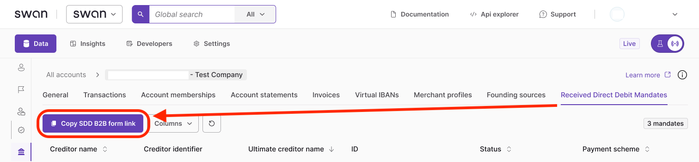
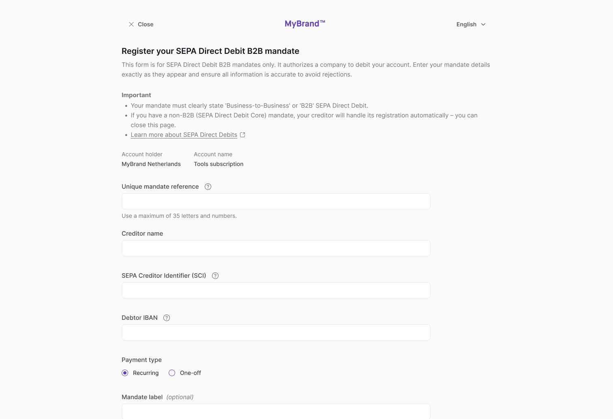

# Add a payment mandate

Add <Term id="sdd">SEPA Direct Debit</Term> B2B (Business-to-Business) received <Term id="payment-mandates">payment mandates</Term> [with the API](#api) or by [sending a link](#link) to an account member so they can register the mandate themselves.

:::caution B2B mandates only
This guide is for SEPA <Term id="direct-debit">Direct Debit</Term> B2B mandates only. These mandates are required to authorize a company to debit an account. If an account member completes a non-B2B Direct Debit mandate, their creditor will handle its registration automatically.
:::

When **Swan receives** [new SEPA Direct Debit instructions](/payments/concepts/direct-debit/received-instructions#received-instructions-new), the corresponding mandate is added **automatically**.

## Add with API {#api}

Add mandates programmatically using the `addReceivedSepaDirectDebitB2bMandate` mutation.

import InitiatePaymentsPrereqs from '../../partials/_initiate-payments-prereqs.mdx';

:::tip Prerequisites
<InitiatePaymentsPrereqs />
:::

### Guide {#guide}

1. Call the `addReceivedSepaDirectDebitB2bMandate` mutation.
1. Add the Unique Mandate Reference (`mandateReference`) and SEPA Creditor Identifier (`creditorIdentifier`). Both must follow the SEPA format (see the caution after this list).
1. Add the creditor's name, plus your Swan <Term id="ibans">IBAN</Term> and consent redirect URL.
1. Choose whether the mandate can be used once (`OneOff`) or multiple times (`Recurrent`).
1. Add the `AddReceivedSepaDirectDebitB2bMandateSuccessPayload`, including the `consentUrl`.
1. Add rejections (not shown).

:::caution SEPA format validation
Swan validates two fields against the SEPA format when a B2B mandate is submitted, and rejects values that don't comply:

- `creditorIdentifier` must follow the [SEPA Creditor Identifier (SCI)](/payments/concepts/merchants/sepa-direct-debit#sci) structure: an ISO two-letter country code, a two-digit checksum, a creditor business activity code, and a national identification feature.
- `mandateReference` must be a valid SEPA mandate reference of up to 35 characters.

This validation prevents mandates with incorrect data, which would otherwise cause `MandateInvalid` rejections on the resulting SEPA Direct Debit B2B <Term id="transactions">transactions</Term>.
:::

### Mutation {#mutation}

<a href="https://explorer.swan.io?query=bXV0YXRpb24gQWRkUmVjZWl2ZWRNYW5kYXRlIHsKICBhZGRSZWNlaXZlZFNlcGFEaXJlY3REZWJpdEIyYk1hbmRhdGUoCiAgICBpbnB1dDogewogICAgICBtYW5kYXRlUmVmZXJlbmNlOiAiJFlPVVJfVVJNIgogICAgICBjcmVkaXRvcklkZW50aWZpZXI6ICIkWU9VUl9TQ0kiCiAgICAgIGNyZWRpdG9yTmFtZTogIkthdGhlcmluZSBKb2huc29uIgogICAgICBpYmFuOiAiJFNXQU5fSUJBTiIKICAgICAgc2VxdWVuY2U6IE9uZU9mZgogICAgICBjb25zZW50UmVkaXJlY3RVcmw6ICIkWU9VUl9SRURJUkVDVF9VUkwiCiAgICB9CiAgKSB7CiAgICAuLi4gb24gQWRkUmVjZWl2ZWRTZXBhRGlyZWN0RGViaXRCMmJNYW5kYXRlU3VjY2Vzc1BheWxvYWQgewogICAgICBfX3R5cGVuYW1lCiAgICAgIHJlY2VpdmVkRGlyZWN0RGViaXRNYW5kYXRlIHsKICAgICAgICBzdGF0dXNJbmZvIHsKICAgICAgICAgIHN0YXR1cwogICAgICAgICAgLi4uIG9uIFJlY2VpdmVkRGlyZWN0RGViaXRNYW5kYXRlU3RhdHVzSW5mb0NvbnNlbnRQZW5kaW5nIHsKICAgICAgICAgICAgX190eXBlbmFtZQogICAgICAgICAgICBjb25zZW50IHsKICAgICAgICAgICAgICBjb25zZW50VXJsCiAgICAgICAgICAgIH0KICAgICAgICAgICAgc3RhdHVzCiAgICAgICAgICB9CiAgICAgICAgICAuLi4gb24gUmVjZWl2ZWREaXJlY3REZWJpdE1hbmRhdGVTdGF0dXNJbmZvRW5hYmxlZCB7CiAgICAgICAgICAgIF9fdHlwZW5hbWUKICAgICAgICAgICAgZW5hYmxlZEF0CiAgICAgICAgICAgIHN0YXR1cwogICAgICAgICAgfQogICAgICAgIH0KICAgICAgfQogICAgfQogIH0KfQo%3D&tab=api" className="explorer-badge">Open in API Explorer</a>

```graphql {4-9,12,17,20} showLineNumbers
mutation AddReceivedMandate {
  addReceivedSepaDirectDebitB2bMandate(
    input: {
      mandateReference: "$YOUR_URM"
      creditorIdentifier: "$YOUR_SCI"
      creditorName: "Katherine Johnson"
      iban: "$SWAN_IBAN"
      sequence: OneOff
      consentRedirectUrl: "$YOUR_REDIRECT_URL"
    }
  ) {
    ... on AddReceivedSepaDirectDebitB2bMandateSuccessPayload {
      __typename
      receivedDirectDebitMandate {
        statusInfo {
          status
          ... on ReceivedDirectDebitMandateStatusInfoConsentPending {
            __typename
            consent {
              consentUrl
            }
            status
          }
          ... on ReceivedDirectDebitMandateStatusInfoEnabled {
            __typename
            enabledAt
            status
          }
        }
      }
    }
  }
}

```

import Environments from '../../../_shared/partials/_environments.mdx';

<Environments />

### Payload {#payload}

The payload shows the mandate was added successfully with the status `ConsentPending`, and provides the `consentUrl` (line 10).

Make sure to send the `consentUrl` to your user so they can provide <Term id="consent">consent</Term> for the mandate.

```json {7,10} showLineNumbers
{
  "data": {
    "addReceivedSepaDirectDebitB2bMandate": {
      "__typename": "AddReceivedSepaDirectDebitB2bMandateSuccessPayload",
      "receivedDirectDebitMandate": {
        "statusInfo": {
          "status": "ConsentPending",
          "__typename": "ReceivedDirectDebitMandateStatusInfoConsentPending",
          "consent": {
            "consentUrl": "https://identity.swan.io/consent?consentId=$YOUR_CONSENT_ID&env=Sandbox"
          }
        }
      }
    }
  }
}
```

## Send a SEPA B2B mandate registration link {#link}

Send a link to an account member with the `canInitiatePayments` [membership permission](/accounts/reference/memberships/membership-permissions#permissions) so they can complete the mandate registration.

### Step 1: Send link to account member {#send-link}

1. Go to **Dashboard** > **Data** > **Accounts**.
1. Click the account you need.
1. Go to the **Received Direct Debit Mandates** tab.
1. Click **Copy SDD B2B mandate form link**.
1. Share the link with an account member with the `canInitiatePayments` membership permission.



:::tip Save the link
Account members can save the link to register future mandates.
:::

### Step 2: Account member completes process {#complete-process}

1. The account member opens the link you provided.
1. They log into Swan's banking interface.
1. They enter their B2B mandate details exactly as shown on the original mandate.
1. They consent to adding the payment mandate with [Strong Customer Authentication](/users/concepts/consent/sca).


