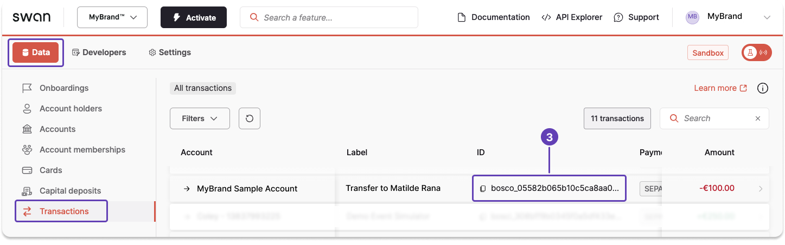
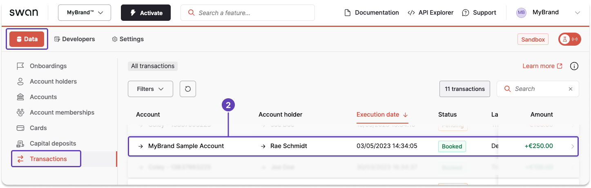
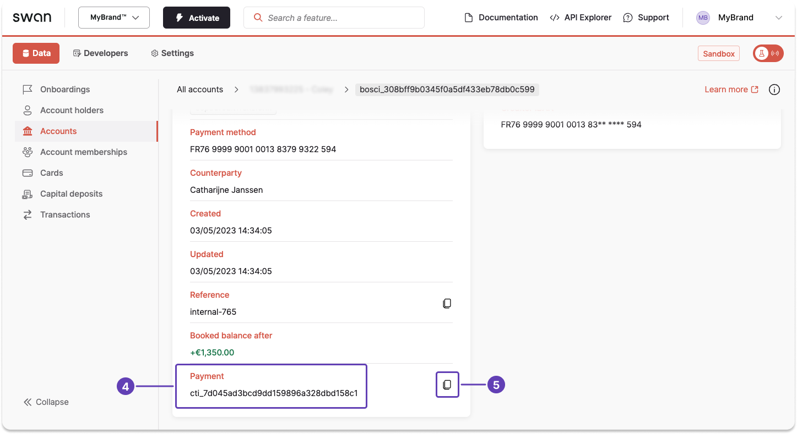

# Look up payments and transactions from the Dashboard

All <Term id="transactions">transaction</Term> and payment IDs for your project, and the details of each transaction, are on your Dashboard under **Data** > **Transactions**. Swan's Web Banking interface also lists transactions if you're using it.

## Transaction IDs {#transaction-id}

1. On your Dashboard, go to **Data** > **Transactions**.
1. Find the transaction you need.
1. Scroll horizontally to locate the transaction ID, then click to copy.

## Payment IDs {#payment-id}

1. On your Dashboard, go to **Data** > **Transactions**.
1. **Open** a transaction connected to the payment you're searching for.
This redirects you to a transaction page for a specific account.

   

1. **Scroll** to the bottom of the page.
1. Locate the information named **Payment**.
1. Click to copy the payment ID.

## Transaction details {#transaction-info}

Open any transaction from **Data** > **Transactions** to review its details, including its [status](/payments/concepts/transactions/statuses#transactions-statuses) and the payment it belongs to.
