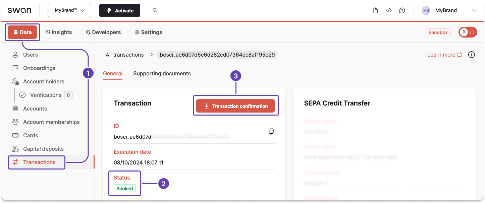

# Generate a transaction statement from the Dashboard

Download a transaction confirmation statement for an eligible <Term id="transactions">transaction</Term> from your Dashboard.

import Prereqs from './partials/_prereqs.mdx';

:::tip Prerequisites
<Prereqs />
:::

## Steps {#guide-dashboard}

1. On your Dashboard, go to **Data** > **Transactions**.
1. **Open the eligible transaction** for which you'd like to download a transaction confirmation statement (not shown). The transaction status must be `Booked`.
1. Click **Transaction confirmation**, triggering the generation and download of the document automatically.

The **Transaction confirmation** button doesn't appear for ineligible transactions. Review the [supported transaction types](/payments/guides/payment-operations/generate-transaction-statement#supported-types).
