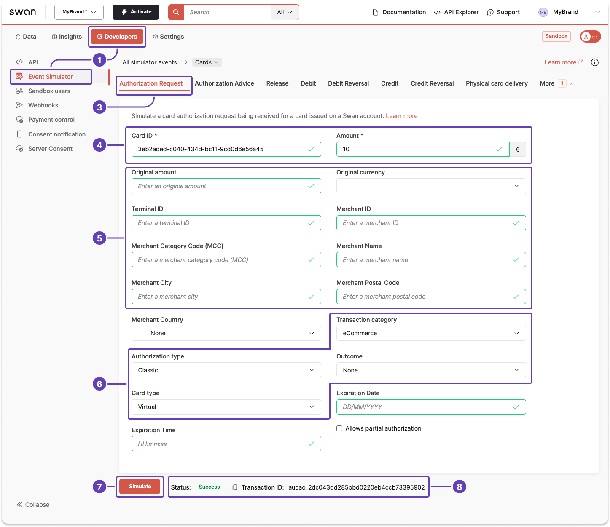
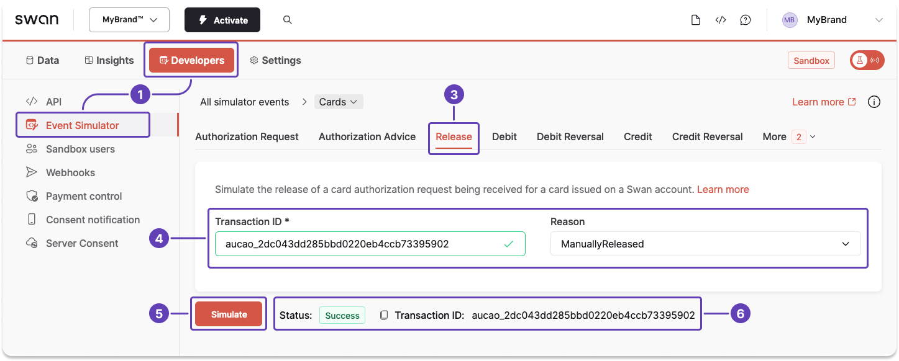

# Sandbox: card payments

When testing your integration, you might need to simulate certain events with the [Event Simulator](/build/tools/event-simulator).

:::tip 
Use the Event Simulator to **test other events** related to card payments, such as receiving incoming and outgoing card payments, reversing incoming and outgoing card payments, and more.
:::

## Simulate an authorization request {#simulate-authorization}

Simulate a merchant requesting authorization for a card payment by entering testing data.

1. Go to **Dashboard** > **Developers** > **Event Simulator**.
1. Go to **Cards**.
1. Go to the tab for an **authorization request**.
1. Enter required information: your Swan card ID and the amount you'd like to authorize.
1. Enter any testing data you'd like to include in the simulation, such as a <Term id="merchants">merchant</Term> or terminal ID, a valid merchant category code, a location, and more.
1. Change the transaction category, authorization type, outcome, and card type to test different situations.
1. Click **Simulate**.

The status changes to `Success`, and the simulated authorization appears on Swan's interfaces.

## Simulate a release {#simulate-release}

1. Go to **Dashboard** > **Developers** > **Event Simulator**.
1. Go to **Cards**.
1. Go to the tab for a **release**.
1. Enter the transaction ID and choose the reason the authorization is being released.
1. Click **Simulate**.

The status changes to `Success`, and the authorization is released.

## Simulate a debit without authorization {#simulate-debit-without-authorization}

Some merchants send a clearing debit with no matching authorization, for example offline or forced <Term id="transactions">transactions</Term>. Your integration must handle these debits, and you can reproduce them in the Sandbox.

1. Go to **Dashboard** > **Developers** > **Event Simulator**.
1. Go to **Cards** > **Card Transactions**.
1. Go to the tab for a **debit without authorization**.
1. Enter your Swan card ID, the amount, and any merchant information you'd like to include.
1. Click **Simulate**.

The status changes to `Success`, and a `CardOutDebit` transaction is created with the status `Booked`, without a linked `CardOutAuthorization`.

You can also call the `simulateOutgoingCardDebitWithoutAuthorization` mutation in the [Testing API](/build/tools/testing-api) with the same information.
