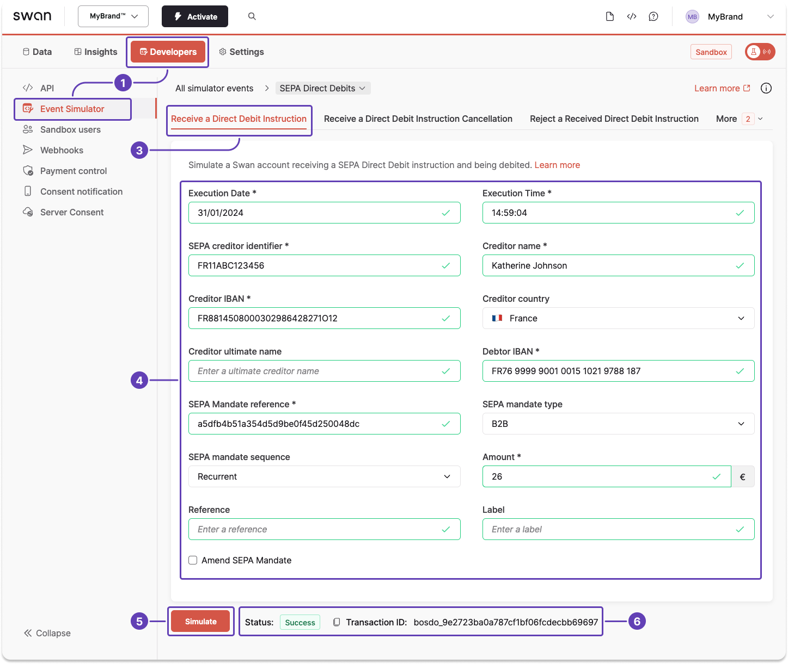

# Sandbox: SEPA Direct Debit

import TestingApiSimulatorIntro from './partials/_testing-api-simulator-intro.mdx';

<TestingApiSimulatorIntro />

## Simulate receiving a SEPA Direct Debit instruction {#simulate-sdd-in}

Simulating receiving a <Term id="sdd">SEPA Direct Debit</Term> creates a new <Term id="payments">payment</Term> as well as a `SepaDirectDebitOut` <Term id="transactions">transaction</Term>, which are both instantly visible on Swan's interfaces.

1. Go to **Dashboard** > **Developers** > **Event Simulator**.
1. Go to **SEPA <Term id="direct-debit">Direct Debits</Term>**.
1. Go to the tab to **receive a direct debit instruction**.
1. Complete the required fields, marked with an asterisk. The Event Simulator prefills working values; change them if needed. Optionally, add a reference and label to see how these elements are displayed within Swan.
1. Click **Simulate**.

The status changes to `Success`, and the simulated direct debit appears on Swan's interfaces.

:::tip 
Use the Event Simulator to **test other events** related to SEPA Direct Debit, such as canceling an incoming instruction, rejecting a received instruction, and more.
:::