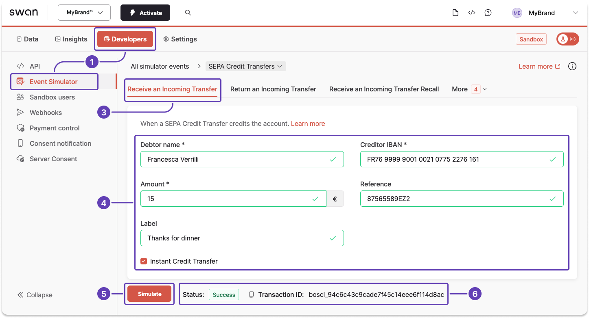

# Sandbox for SEPA Credit Transfers

import TestingApiSimulatorIntro from './partials/_testing-api-simulator-intro.mdx';

<TestingApiSimulatorIntro />

## Simulate receiving a SEPA Credit Transfer {#simulate-sct-in}

Simulating receiving a <Term id="credit-transfer">SEPA Credit Transfer</Term> creates a new <Term id="payments">payment</Term> as well as a `SepaCreditTransferIn` <Term id="transactions">transaction</Term>, which are both instantly visible on Swan's interfaces.

1. Go to **Dashboard** > **Developers** > **Event Simulator**.
1. Go to **SEPA Credit Transfer** (not shown).
1. Go to the tab to **receive an incoming transfer**.
1. Enter your testing data, including a debtor name, creditor <Term id="ibans">IBAN</Term>, and amount. Optionally, add a reference and label to see how these elements are displayed within Swan.
1. Click **Simulate**.
1. After clicking **Simulate**, notice the status change to `Success`, meaning you sent your simulated transfer successfully.

:::tip 
Use the Event Simulator to **test other events** related to SEPA Credit Transfers, such as receiving an incoming transfer recall request, rejecting an outgoing transfer, and more.
:::