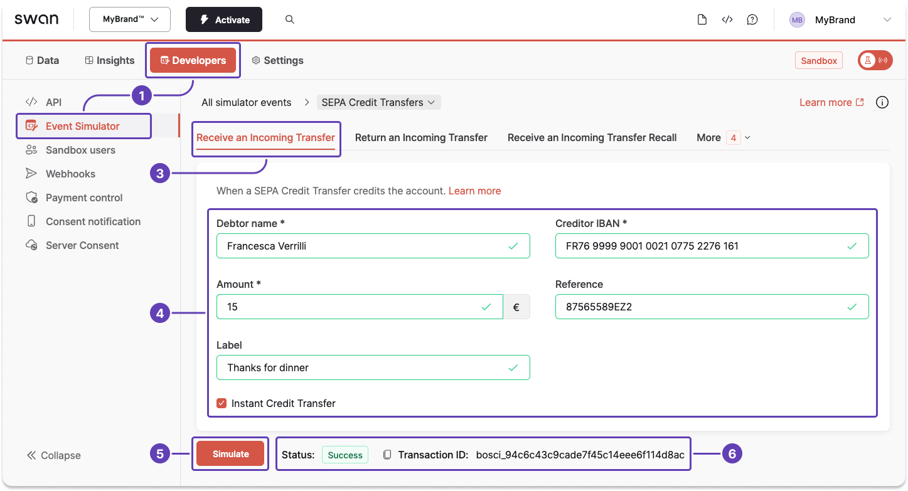

# Sandbox: SEPA Credit Transfers

import TestingApiSimulatorIntro from './partials/_testing-api-simulator-intro.mdx';

<TestingApiSimulatorIntro />

## Simulate receiving a SEPA Credit Transfer {#simulate-sct-in}

Simulating receiving a <Term id="credit-transfer">SEPA Credit Transfer</Term> creates a new <Term id="payments">payment</Term> as well as a `SepaCreditTransferIn` <Term id="transactions">transaction</Term>, both instantly visible on Swan's interfaces.

1. Go to **Dashboard** > **Developers** > **Event Simulator**.
1. Go to **SEPA Credit Transfer**.
1. Go to the tab to **receive an incoming transfer**.
1. Enter your testing data, including a debtor name, creditor <Term id="ibans">IBAN</Term>, and amount. Optionally, add a reference and label to see how these elements are displayed within Swan.
1. Click **Simulate**.

The status changes to `Success`, and the simulated transfer appears on Swan's interfaces.

:::tip 
Use the Event Simulator to **test other events** related to SEPA Credit Transfers, such as receiving an incoming transfer recall request, rejecting an outgoing transfer, and more.
:::

## Simulate Verification of Payee results {#simulate-vop}

In Sandbox, the `verifyBeneficiary` mutation returns a simulated result based on the beneficiary name.
VoP requirements otherwise match Live: company accounts default to optional VoP for bulk transfers and can [change the setting](/payments/guides/credit-transfers/sepa/update-vop-settings), while individual accounts always require it.

| Name is exactly | Returns result |
| --- | --- |
| "Match" | `Match` |
| "CloseMatch" | `CloseMatch` |
| "NoMatch" | `NoMatch` |
| "NotPossible" | `VerificationNotPossible` |

Any other beneficiary name returns `Match`.
If you pass a trusted beneficiary ID instead of a name, the simulation uses the trusted beneficiary's name.
