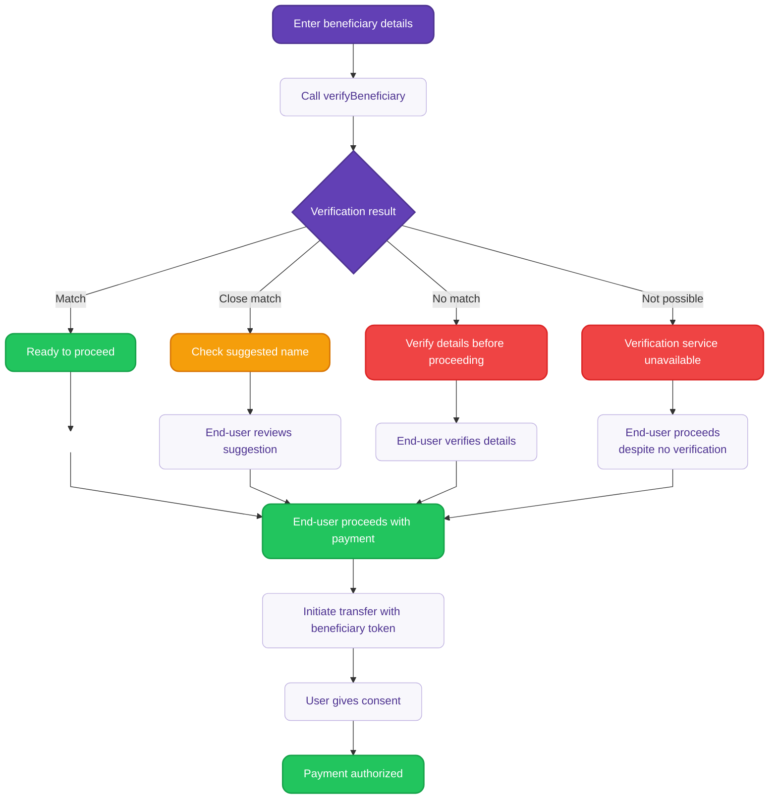

# Verify beneficiary details {#guide}

Use the `verifyBeneficiary` mutation to verify beneficiary details before initiating SEPA Credit Transfers.

This mutation gives you full control to customize how verification results are presented to end-users. This is required for bulk credit transfers.

:::tip Prerequisites
- You're planning to initiate an Instant SEPA Credit Transfer, SEPA Credit Transfer or Internal Credit Transfer.
- Authentication required with a **user access token** or **project access token**.
:::

<details>

<summary>Detailed verification flow diagram</summary>

<div className="invisible-subgraph">



</div>

</details>

## Step 1: Call verifyBeneficiary {#step-1}

Call the mutation with the beneficiary details ([`beneficiaryInput`](https://api-reference.swan.io/inputs/beneficiary-input/)) you want to verify. The mutation returns a verification result and a 24-hour token for use in payment initiation.

The `verifyBeneficiary` mutation accepts different types of beneficiary inputs:

- **SEPA beneficiary** (`sepa`): For external SEPA Credit Transfers using IBAN and name.
- **Swan account** (`swanAccount`): For internal transfers between Swan accounts. 
- **Trusted beneficiary** (`trustedBeneficiaryId`): For pre-verified beneficiaries saved in your account.

<a href="https://explorer.swan.io?query=bXV0YXRpb24gQmVuZWZpY2lhcnlWZXJpZmljYXRpb25NdXRhdGlvbiB7CiAgdmVyaWZ5QmVuZWZpY2lhcnkoCiAgICBpbnB1dDogewogICAgICBiZW5lZmljaWFyeTogewogICAgICAgIHNlcGE6IHsgaWJhbjogIklUMjNQMDMwMDIwMzI4MDYzMjEyMzU1Mzc0OCIsIG5hbWU6ICJDbG9zZU1hdGNoIiB9CiAgICAgIH0KICAgIH0KICApIHsKICAgIC4uLiBvbiBWZXJpZnlCZW5lZmljaWFyeVN1Y2Nlc3NQYXlsb2FkIHsKICAgICAgX190eXBlbmFtZQogICAgICBiZW5lZmljaWFyeVZlcmlmaWNhdGlvblRva2VuCiAgICAgIGV4cGlyZXNBdAogICAgICB2ZXJpZnlCZW5lZmljaWFyeVJlc3VsdCB7CiAgICAgICAgLi4uIG9uIFZlcmlmeUJlbmVmaWNpYXJ5Tm90UG9zc2libGUgewogICAgICAgICAgX190eXBlbmFtZQogICAgICAgICAgc3RhdHVzCiAgICAgICAgfQogICAgICAgIC4uLiBvbiBWZXJpZnlCZW5lZmljaWFyeU5vTWF0Y2ggewogICAgICAgICAgX190eXBlbmFtZQogICAgICAgICAgc3RhdHVzCiAgICAgICAgfQogICAgICAgIC4uLiBvbiBWZXJpZnlCZW5lZmljaWFyeU1hdGNoIHsKICAgICAgICAgIF9fdHlwZW5hbWUKICAgICAgICAgIHN0YXR1cwogICAgICAgIH0KICAgICAgICAuLi4gb24gVmVyaWZ5QmVuZWZpY2lhcnlDbG9zZU1hdGNoIHsKICAgICAgICAgIF9fdHlwZW5hbWUKICAgICAgICAgIG5hbWVTdWdnZXN0aW9uCiAgICAgICAgICBzdGF0dXMKICAgICAgICB9CiAgICAgICAgc3RhdHVzCiAgICAgIH0KICAgIH0KICB9Cn0K&tab=api" className="explorer-badge">Open in API Explorer</a>

```graphql {6-7}
mutation BeneficiaryVerificationMutation {
  verifyBeneficiary(
    input: { 
      beneficiary: { 
        sepa: { 
          iban: "IT23P0300203280632123553748", 
          name: "CloseMatch" 
        } 
      } 
    }
  ) {
    ... on VerifyBeneficiarySuccessPayload {
      __typename
      beneficiaryVerificationToken
      expiresAt
      verifyBeneficiaryResult {
        ... on VerifyBeneficiaryNotPossible {
          __typename
          status
        }
        ... on VerifyBeneficiaryNoMatch {
          __typename
          status
        }
        ... on VerifyBeneficiaryMatch {
          __typename
          status
        }
        ... on VerifyBeneficiaryCloseMatch {
          __typename
          nameSuggestion
          status
        }
        status
      }
    }
  }
}
```

## Step 2: Handle verification results {#step-2}

The mutation returns one of four possible verification results. **For an optimal user experience**, display the results and the recommended end-user action.

| Result | Description | Recommended<br/>end-user action |
| --- | --- | --- |
| `Match` | Exact match found between the provided details and account holder information. | Safe to proceed with the transfer. |
| `CloseMatch` | Close match with suggested correction from the beneficiary's bank. | Consider the suggested name correction before proceeding. |
| `NoMatch` | No match found between the provided details and account holder information. | Verify beneficiary details carefully before proceeding. |
| `VerificationNotPossible` | Beneficiary verification failed. Check the IBAN format or try again. | Verify beneficiary details carefully before proceeding. |

#### Returned parameters
- **`status`**: Verification result (see previous table).
- **`beneficiaryVerificationToken`**: A unique token identifying the VoP result, valid for use in subsequent credit transfer initiations.
- **`expiresAt`**: Token expiration timestamp (24 hours from generation).
- **`nameSuggestion`**: Available for `CloseMatch` results only.

**Example response for a close match:**

```json title="Payload" {5-6,9-10}
{
  "data": {
    "verifyBeneficiary": {
      "__typename": "VerifyBeneficiarySuccessPayload",
      "beneficiaryVerificationToken": "$YOUR_BENEFICIARY_VERIFICATION_TOKEN",
      "expiresAt": "2025-09-09T14:37:00.033Z",
      "verifyBeneficiaryResult": {
        "__typename": "VerifyBeneficiaryCloseMatch",
        "nameSuggestion": "Henri Dupont",
        "status": "CloseMatch"
      }
    }
  }
}
```

## Step 3: Use the verification token {#step-3}

Include the `beneficiaryVerificationToken` when initiating the credit transfer instead of providing full beneficiary details.

<a href="https://explorer.swan.io?query=bXV0YXRpb24gSW5pdGlhdGVDcmVkaXRUcmFuc2ZlcldpdGhWZXJpZmljYXRpb25Ub2tlbiB7CiAgaW5pdGlhdGVDcmVkaXRUcmFuc2ZlcnMoCiAgICBpbnB1dDogewogICAgICBhY2NvdW50SWQ6ICIkWU9VUl9BQ0NPVU5UX0lEIgogICAgICBjb25zZW50UmVkaXJlY3RVcmw6ICJodHRwczovL3d3dy5zd2FuLmlvLyIKICAgICAgY3JlZGl0VHJhbnNmZXJzOiB7CiAgICAgICAgYW1vdW50OiB7IHZhbHVlOiAiMTAwIiwgY3VycmVuY3k6ICJFVVIiIH0KICAgICAgICBiZW5lZmljaWFyeVZlcmlmaWNhdGlvblRva2VuOiAiJFlPVVJfQkVORUZJQ0lBUllfVkVSSUZJQ0FUSU9OX1RPS0VOIgogICAgICB9CiAgICB9CiAgKSB7CiAgICAuLi4gb24gSW5pdGlhdGVDcmVkaXRUcmFuc2ZlcnNTdWNjZXNzUGF5bG9hZCB7CiAgICAgIF9fdHlwZW5hbWUKICAgICAgYmVuZWZpY2lhcnlWZXJpZmljYXRpb25SZXN1bHRzIHsKICAgICAgICBzdGF0dXMKICAgICAgICAuLi4gb24gVmVyaWZ5QmVuZWZpY2lhcnlNYXRjaCB7CiAgICAgICAgICBfX3R5cGVuYW1lCiAgICAgICAgICBzdGF0dXMKICAgICAgICB9CiAgICAgICAgLi4uIG9uIFZlcmlmeUJlbmVmaWNpYXJ5Q2xvc2VNYXRjaCB7CiAgICAgICAgICBfX3R5cGVuYW1lCiAgICAgICAgICBzdGF0dXMKICAgICAgICAgIG5hbWVTdWdnZXN0aW9uCiAgICAgICAgfQogICAgICAgIC4uLiBvbiBWZXJpZnlCZW5lZmljaWFyeU5vTWF0Y2ggewogICAgICAgICAgX190eXBlbmFtZQogICAgICAgICAgc3RhdHVzCiAgICAgICAgfQogICAgICAgIC4uLiBvbiBWZXJpZnlCZW5lZmljaWFyeU5vdFBvc3NpYmxlIHsKICAgICAgICAgIF9fdHlwZW5hbWUKICAgICAgICAgIHN0YXR1cwogICAgICAgIH0KICAgICAgfQogICAgICBwYXltZW50IHsKICAgICAgICBzdGF0dXNJbmZvIHsKICAgICAgICAgIC4uLiBvbiBQYXltZW50Q29uc2VudFBlbmRpbmcgewogICAgICAgICAgICBfX3R5cGVuYW1lCiAgICAgICAgICAgIGNvbnNlbnQgewogICAgICAgICAgICAgIGNvbnNlbnRVcmwKICAgICAgICAgICAgfQogICAgICAgICAgfQogICAgICAgIH0KICAgICAgfQogICAgfQogICAgLi4uIG9uIEJlbmVmaWNpYXJ5VmVyaWZpY2F0aW9uVG9rZW5BbHJlYWR5Q29uc3VtZWRSZWplY3Rpb24gewogICAgICBfX3R5cGVuYW1lCiAgICB9CiAgICAuLi4gb24gSW50ZXJuYWxFcnJvclJlamVjdGlvbiB7CiAgICAgIF9fdHlwZW5hbWUKICAgIH0KICAgIC4uLiBvbiBGb3JiaWRkZW5SZWplY3Rpb24gewogICAgICBfX3R5cGVuYW1lCiAgICB9CiAgICAuLi4gb24gQWNjb3VudE5vdEZvdW5kUmVqZWN0aW9uIHsKICAgICAgaWQKICAgIH0KICB9Cn0K&tab=api" className="explorer-badge">Open in API Explorer</a>

```graphql {8}
mutation InitiateCreditTransferWithVerificationToken {
  initiateCreditTransfers(
    input: {
      accountId: "$YOUR_ACCOUNT_ID"
      consentRedirectUrl: "https://www.swan.io/"
      creditTransfers: {
        amount: { value: "100", currency: "EUR" }
        beneficiaryVerificationToken: "$YOUR_BENEFICIARY_VERIFICATION_TOKEN"
      }
    }
  ) {
    ... on InitiateCreditTransfersSuccessPayload {
      __typename
      beneficiaryVerificationResults {
        status
        ... on VerifyBeneficiaryMatch {
          __typename
          status
        }
        ... on VerifyBeneficiaryCloseMatch {
          __typename
          status
          nameSuggestion
        }
        ... on VerifyBeneficiaryNoMatch {
          __typename
          status
        }
        ... on VerifyBeneficiaryNotPossible {
          __typename
          status
        }
      }
      payment {
        statusInfo {
          ... on PaymentConsentPending {
            __typename
            consent {
              consentUrl
            }
          }
        }
      }
    }
    ... on BeneficiaryVerificationTokenAlreadyConsumedRejection {
      __typename
    }
    ... on InternalErrorRejection {
      __typename
    }
    ... on ForbiddenRejection {
      __typename
    }
    ... on AccountNotFoundRejection {
      id
    }
  }
}
```

The `InitiateCreditTransfersSuccessPayload` includes the `beneficiaryVerificationResults`, an array of `VerifyBeneficiaryResult` objects.

```json title="Payload" {7,9,16}
{
  "data": {
    "initiateCreditTransfers": {
      "__typename": "InitiateCreditTransfersSuccessPayload",
      "beneficiaryVerificationResults": [
        {
          "status": "CloseMatch",
          "__typename": "VerifyBeneficiaryCloseMatch",
          "nameSuggestion": "Henri Dupont"
        }
      ],
      "payment": {
        "statusInfo": {
          "__typename": "PaymentConsentPending",
          "consent": {
            "consentUrl": "https://identity.swan.io/consent?consentId=$YOUR_CONSENT_ID&env=Sandbox"
          }
        }
      }
    }
  }
}
```

## Token validation {#token-validation}

### Requirements
- Tokens are validated for authenticity, status, and expiration.
- Invalid, expired, or undecryptable tokens result in a `ValidationRejection`.
- A token is consumed after it has been used in one initiation. Already consumed tokens result in a `BeneficiaryVerificationTokenAlreadyConsumedRejection`.
- Tokens expire 24 hours after generation.
:::tip
The same token can be used multiple times in the same initiation. This means you can initiate multiple credit transfers to the same beneficiary, within the same API call.
:::

## Bulk payments {#bulk-payments}

For bulk credit transfers, each transfer in the batch **must** include a valid `beneficiaryVerificationToken` obtained through the `verifyBeneficiary` mutation. If any transfer in a batch is submitted with full beneficiary details instead of a token, the entire batch initiation will result in a `ForbiddenRejection`.

### Company opt-out for bulk transfers {#company-opt-out}

Company end-users can opt-out of VoP for bulk transfers through the `updateAccountSettings` mutation. Individual end-users cannot opt-out.

:::info
Company opt-out mutation coming soon.
:::

<!--
<a href="https://explorer.swan.io?query=bXV0YXRpb24gVXBkYXRlQWNjb3VudFNldHRpbmdzKCRpbnB1dDogVXBkYXRlQWNjb3VudFNldHRpbmdzSW5wdXQhKSB7CiAgdXBkYXRlQWNjb3VudFNldHRpbmdzKGlucHV0OiAkaW5wdXQpIHsKICAgIC4uLiBvbiBVcGRhdGVBY2NvdW50U2V0dGluZ3NTdWNjZXNzIHsKICAgICAgYWNjb3VudCB7CiAgICAgICAgc2V0dGluZ3MgewogICAgICAgICAgYWxsb3dCdWxrQ3JlZGl0VHJhbnNmZXJzV2l0aG91dEJlbmVmaWNpYXJ5VmVyaWZpY2F0aW9uCiAgICAgICAgfQogICAgICB9CiAgICB9CiAgICAuLi4gb24gQWNjb3VudE5vdEZvdW5kUmVqZWN0aW9uIHsKICAgICAgbWVzc2FnZQogICAgfQogICAgLi4uIG9uIEZvcmJpZGRlblJlamVjdGlvbiB7CiAgICAgIG1lc3NhZ2UKICAgIH0KICAgIC4uLiBvbiBBY2NvdW50SG9sZGVyTm90Rm91bmRSZWplY3Rpb24gewogICAgICBtZXNzYWdlCiAgICB9CiAgfQp9Cg%3D%3D&tab=api" className="explorer-badge">Open in API Explorer</a>

```graphql {2,6}
mutation UpdateAccountSettings($input: UpdateAccountSettingsInput!) {
  updateAccountSettings(
    input: {
      accountId: "$YOUR_ACCOUNT_ID"
      allowBulkCreditTransfersWithoutBeneficiaryVerification: true
      consentRedirectUrl: "https://mycompany.com/consent"
    }
  ) {
    ... on UpdateAccountSettingsSuccess {
      account {
        settings {
          allowBulkCreditTransfersWithoutBeneficiaryVerification
        }
      }
    }
    ... on AccountNotFoundRejection {
      message
    }
    ... on ForbiddenRejection {
      message
    }
    ... on AccountHolderNotFoundRejection {
      message
    }
  }
}
```

**Requirements**:
- Only available for Company account types.
- `consentRedirectUrl` required for the settings change flow.
-->

## Sandbox testing {#sandbox-testing}

In the Sandbox environment, the `verifyBeneficiary` mutation returns simulated verification results based on the beneficiary name pattern.

| Name is exactly | Returns result |
|------------------|----------------|
| "Match" | `Match` |
| "CloseMatch" | `CloseMatch` |
| "NoMatch" | `NoMatch` |
| "NotPossible" | `VerificationNotPossible` |

Any other beneficiary name returns a `Match` result.

**Examples:**
- Beneficiary name "Henri Dupont" returns a Match result.
- Beneficiary name "CloseMatch" returns a CloseMatch result.

:::tip
If a trusted beneficiary ID is used as input, the verification will be based on the Trusted Beneficiary name.
:::

### Testing bulk payments {#testing-bulk-payments}

<FieldRequirementsLegend />

#### Default sandbox requirements

| Account type | VoP for bulk transfers | BeneficiaryToken requirements |
| --- | --- | --- |
| **Company** | Opted out | <Opt /> |
| **Individual** | Opted in | <Req /> |