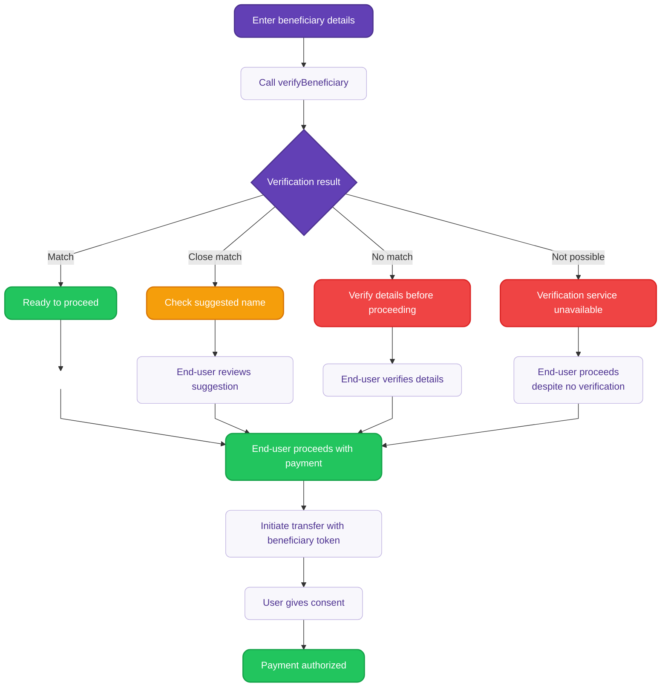

# Verify beneficiary details {#guide}

Use the `verifyBeneficiary` mutation to verify beneficiary details before initiating SEPA Credit Transfers.

This mutation gives you full control over the verification user experience. This approach is required for bulk credit transfers and recommended when you want to customize how verification results are presented to end-users.

:::tip Prerequisites
- You have a **company** or **individual** account with Swan.
- Your account has the **canViewAccount** and **canInitiatePayments** permissions.
- You're planning to initiate a SEPA Credit Transfer.
:::

<details>

<summary>Detailed verification flow diagram</summary>

<div className="invisible-subgraph">



</div>

</details>

### Step 1: Call verifyBeneficiary {#step-1}

**Required inputs:**
- `accountId`: The account from which the payment will be made.
- `iban`: The beneficiary's IBAN.
- `name`: The beneficiary's account holder name.

```graphql title="Mutation" {4-6}
mutation VerifyBeneficiary($input: VerifyBeneficiaryInput!) {
  verifyBeneficiary(input: $input) {
    ... on VerifyBeneficiarySuccessPayload {
      result
      beneficiaryVerificationToken
      verifiedBeneficiary {
        iban
        name
      }
    }
    ... on AccountNotFoundRejection {
      message
    }
    ... on ForbiddenRejection {
      message
    }
    ... on ValidationRejection {
      message
      fields {
        key
        message
      }
    }
  }
}
```

```json title="Variables"
{
  "input": {
    "accountId": "$YOUR_ACCOUNT_ID",
    "iban": "DE75512108001245126199",
    "name": "Company ABC"
  }
}
```

### Step 2: Handle verification results {#step-2}

The mutation returns one of four possible verification results. **All results must be displayed to the end-user**.

| Result | Description | End-user action |
| --- | --- | --- |
| `NoMatch` | No match found between provided details and account holder information | Verify beneficiary details carefully before proceeding |

Returned parameters:
- **`status`**: Verification result (see previous table).
- **`beneficiaryVerificationToken`**: A unique token identifying the VoP result, valid for use in subsequent credit transfer initiations.

**Example response for close match:**

```json title="Response"
{
  "data": {
    "verifyBeneficiary": {
      "verifyBeneficiaryResult": {
        "status": "CloseMatch",
        "nameSuggestion": "Company ABC Ltd"
      },
      "beneficiaryVerificationToken": "bvt_1234567890abcdef",
      "expiresAt": "2024-10-10T14:30:00Z"
    }
  }
}
```

## Step 3: Use verification token {#step-3}

Include the `beneficiaryVerificationToken` when initiating the credit transfer instead of providing full beneficiary details.

```graphql title="Mutation" {6}
mutation InitiateCreditTransfers($input: InitiateCreditTransfersInput!) {
  initiateCreditTransfers(input: $input) {
    ... on InitiateCreditTransfersSuccessPayload {
      payment {
        id
        beneficiaryVerificationResults {
          result
          verifiedBeneficiary {
            iban
            name
          }
        }
      }
    }
    ... on ValidationRejection {
      message
      fields {
        key
        message
      }
    }
    ... on BeneficiaryVerificationTokenAlreadyConsumedRejection {
      message
    }
  }
}
```

```json title="Variables" {7}
{
  "input": {
    "accountId": "$YOUR_ACCOUNT_ID",
    "creditTransfers": [
      {
        "amount": { "value": "100.00", "currency": "EUR" },
        "beneficiaryVerificationToken": "bvt_1234567890abcdef",
        "reference": "Invoice 2024-001"
      }
    ],
    "consentRedirectUrl": "https://mycompany.com/consent"
  }
}
```

The `InitiateCreditTransfersSuccessPayload` includes:
- **`beneficiaryVerificationResults`**: Array of `VerifyBeneficiaryResult` in the same order as the beneficiary inputs.
- Standard payment information.

## Token validation {#token-validation}

**Token requirements**:
- Tokens are validated for authenticity, status, and expiration.
- Invalid, expired, or undecryptable tokens result in a `ValidationRejection`.
- Already consumed tokens result in a `BeneficiaryVerificationTokenAlreadyConsumedRejection`.
- Tokens expire 24 hours after generation.

## Bulk payments {#bulk-payments}

For bulk credit transfers, each transfer in the batch **must** include a valid `beneficiaryVerificationToken` obtained through the `verifyBeneficiary` mutation. If any transfer in a batch is submitted with full beneficiary details instead of a token, the entire batch initiation will be rejected with a `ForbiddenRejection`.

### Company opt-out for bulk transfers {#company-opt-out}

Company end-users can opt-out of VoP for bulk transfers through the `updateAccountSettings` mutation. Individual end-users cannot opt-out.

```graphql title="Mutation"
mutation UpdateAccountSettings($input: UpdateAccountSettingsInput!) {
  updateAccountSettings(input: $input) {
    ... on UpdateAccountSettingsSuccessPayload {
      account {
        settings {
          allowBulkCreditTransfersWithoutBeneficiaryVerification
        }
      }
    }
    ... on AccountNotFoundRejection {
      message
    }
    ... on ForbiddenRejection {
      message
    }
    ... on WrongAccountHolderTypeRejection {
      message
    }
  }
}
```

```json title="Variables"
{
  "input": {
    "accountId": "$YOUR_COMPANY_ACCOUNT_ID",
    "allowBulkCreditTransfersWithoutBeneficiaryVerification": true,
    "consentRedirectUrl": "https://mycompany.com/consent"
  }
}
```

**Requirements**:
- Only available for Company account types.
- Requires both `canViewAccount` and `canInitiatePayments` permissions.
- `consentRedirectUrl` required for the settings change flow.

## Sandbox testing {#sandbox-testing}

In the Sandbox environment, the `verifyBeneficiary` mutation returns simulated verification results based on the beneficiary name pattern:

| Name starts with | Returns result |
|------------------|----------------|
| "Match" | `Match` |
| "Close" | `CloseMatch` |
| "No" | `NoMatch` |
| "Not" | `VerificationNotPossible` |

**Example**: Beneficiary name "Match Test User" returns a `Match` result.