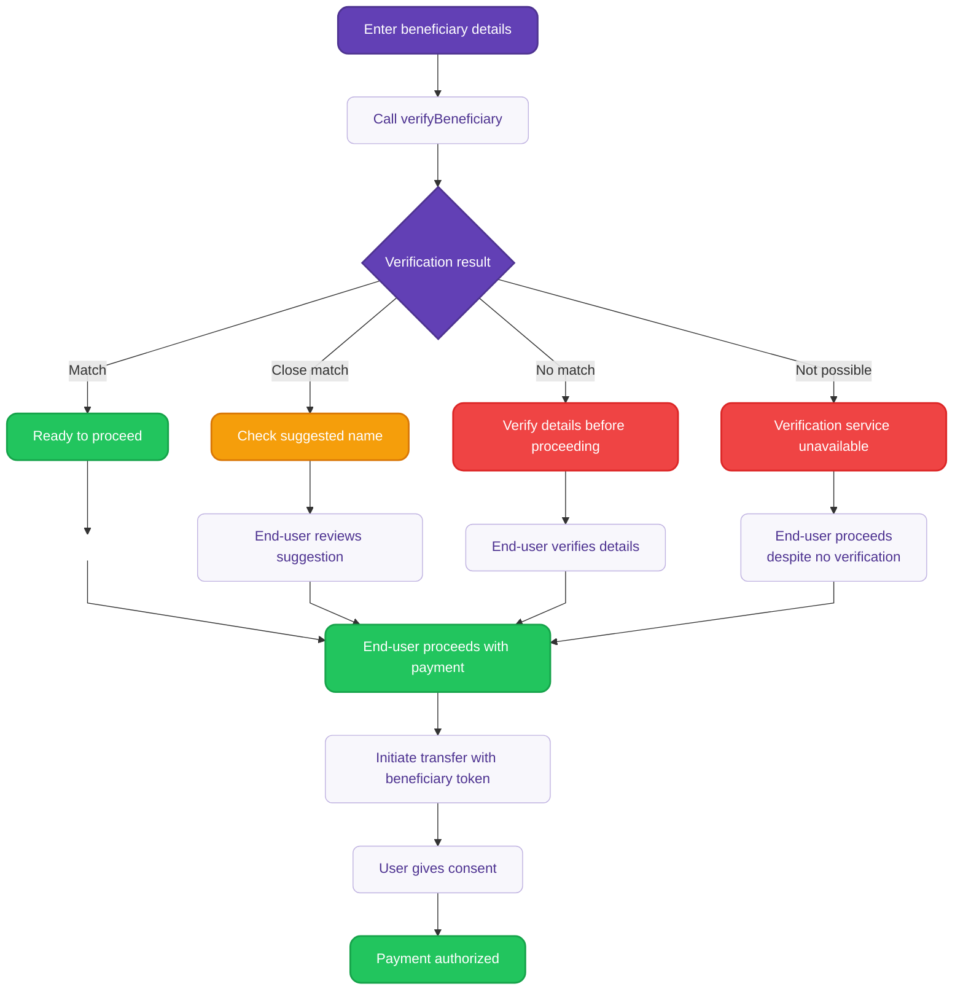

# Verify beneficiary details {#guide}

Use the `verifyBeneficiary` mutation to verify beneficiary details before initiating SEPA Credit Transfers.

This mutation gives you full control to customize how verification results are presented to end-users. This approach is required for bulk credit transfers.

:::tip Prerequisites
- You're planning to initiate an Instant SEPA Credit Transfer, SEPA Credit Transfer or Internal Credit Transfer.
- Authentication required with a **user access token** or **project access token**.
:::

<details>

<summary>Detailed verification flow diagram</summary>

<div className="invisible-subgraph">



</div>

</details>

## Step 1: Call verifyBeneficiary {#step-1}

Call the mutation with the account ID and beneficiary details ([`beneficiaryInput`](https://api-reference.swan.io/inputs/beneficiary-input/)) you want to verify. The mutation returns a verification result and a 24-hour token for use in payment initiation.

<a href="https://explorer.swan.io?query=bXV0YXRpb24gTXlNdXRhdGlvbiB7CiAgdmVyaWZ5QmVuZWZpY2lhcnkoCiAgICBpbnB1dDogewogICAgICBiZW5lZmljaWFyeTogewogICAgICAgIHNlcGE6IHsgaWJhbjogIklUMjNQMDMwMDIwMzI4MDYzMjEyMzU1Mzc0OCIsIG5hbWU6ICJNYXRjaCIgfQogICAgICB9CiAgICB9CiAgKSB7CiAgICAuLi4gb24gVmVyaWZ5QmVuZWZpY2lhcnlTdWNjZXNzUGF5bG9hZCB7CiAgICAgIF9fdHlwZW5hbWUKICAgICAgdmVyaWZ5QmVuZWZpY2lhcnlSZXN1bHQgewogICAgICAgIC4uLiBvbiBWZXJpZnlCZW5lZmljaWFyeU5vdFBvc3NpYmxlIHsKICAgICAgICAgIF9fdHlwZW5hbWUKICAgICAgICAgIHN0YXR1cwogICAgICAgIH0KICAgICAgICAuLi4gb24gVmVyaWZ5QmVuZWZpY2lhcnlOb01hdGNoIHsKICAgICAgICAgIF9fdHlwZW5hbWUKICAgICAgICAgIHN0YXR1cwogICAgICAgIH0KICAgICAgICAuLi4gb24gVmVyaWZ5QmVuZWZpY2lhcnlNYXRjaCB7CiAgICAgICAgICBfX3R5cGVuYW1lCiAgICAgICAgICBzdGF0dXMKICAgICAgICB9CiAgICAgICAgLi4uIG9uIFZlcmlmeUJlbmVmaWNpYXJ5Q2xvc2VNYXRjaCB7CiAgICAgICAgICBfX3R5cGVuYW1lCiAgICAgICAgICBzdGF0dXMKICAgICAgICAgIG5hbWVTdWdnZXN0aW9uCiAgICAgICAgfQogICAgICAgIHN0YXR1cwogICAgICB9CiAgICAgIGV4cGlyZXNBdAogICAgICBiZW5lZmljaWFyeVZlcmlmaWNhdGlvblRva2VuCiAgICB9CiAgfQp9Cg%3D%3D&tab=api" className="explorer-badge">Open in API Explorer</a>

```graphql {2}
mutation VerifyBeneficiary($input: VerifyBeneficiaryInput!) {
  verifyBeneficiary(input: $input) {
    ... on VerifyBeneficiarySuccessPayload {
      verifyBeneficiaryResult {
        status
        ... on VerifyBeneficiaryCloseMatch {
          nameSuggestion
        }
      }
      beneficiaryVerificationToken
      expiresAt
    }
    ... on AccountNotFoundRejection {
      message
    }
    ... on ForbiddenRejection {
      message
    }
    ... on ValidationRejection {
      message
      fields {
        key
        message
      }
    }
  }
}
```

```json title="Variables" {3,5-6}
{
  "input": {
    "accountId": "$YOUR_ACCOUNT_ID",
    "beneficiary": {
      "name": "Company ABC Ltd",
      "iban": "FR7699999001001383752268961"
    }
  }
}
```

## Step 2: Handle verification results {#step-2}

The mutation returns one of four possible verification results. **For an optimal User Experience**, results and the recommended follow-up actions should be displayed to the end-user.

| Result | Description | Recommended<br/>end-user action |
| --- | --- | --- |
| `Match` | Exact match found between the provided details and account holder information. | Safe to proceed with the transfer. |
| `CloseMatch` | Close match with suggested correction from the beneficiary's bank. | Review suggested name correction before proceeding. |
| `NoMatch` | No match found between the provided details and account holder information. | Verify beneficiary details carefully before proceeding. |
| `VerificationNotPossible` | Beneficiary verification failed. Check the IBAN format or try again. | Verify beneficiary details carefully before proceeding. |

Returned parameters:
- **`status`**: Verification result (see previous table).
- **`beneficiaryVerificationToken`**: A unique token identifying the VoP result, valid for use in subsequent credit transfer initiations.
- **`expiresAt`**: Token expiration timestamp (24 hours from generation).
- **`nameSuggestion`**: Available for `CloseMatch` results only.

**Example response for a close match:**

```json {5,6,8,9}
{
  "data": {
    "verifyBeneficiary": {
      "verifyBeneficiaryResult": {
        "status": "CloseMatch",
        "nameSuggestion": "Company ABC Ltd"
      },
      "beneficiaryVerificationToken": "bvt_1234567890abcdef",
      "expiresAt": "2024-10-10T14:30:00Z"
    }
  }
}
```

## Step 3: Use the verification token {#step-3}

Include the `beneficiaryVerificationToken` when initiating the credit transfer instead of providing full beneficiary details.

<a href="https://explorer.swan.io?query=bXV0YXRpb24gSW5pdGlhdGVDcmVkaXRUcmFuc2ZlcnMoJGlucHV0OiBJbml0aWF0ZUNyZWRpdFRyYW5zZmVyc0lucHV0ISkgewogIGluaXRpYXRlQ3JlZGl0VHJhbnNmZXJzKGlucHV0OiAkaW5wdXQpIHsKICAgIC4uLiBvbiBJbml0aWF0ZUNyZWRpdFRyYW5zZmVyc1N1Y2Nlc3NQYXlsb2FkIHsKICAgICAgYmVuZWZpY2lhcnlWZXJpZmljYXRpb25SZXN1bHRzIHsKICAgICAgICBzdGF0dXMKICAgICAgICAuLi4gb24gVmVyaWZ5QmVuZWZpY2lhcnlNYXRjaCB7CiAgICAgICAgICBfX3R5cGVuYW1lCiAgICAgICAgICBzdGF0dXMKICAgICAgICB9CiAgICAgIH0KICAgICAgcGF5bWVudCB7CiAgICAgICAgaWQKICAgICAgfQogICAgfQogICAgLi4uIG9uIFZhbGlkYXRpb25SZWplY3Rpb24gewogICAgICBtZXNzYWdlCiAgICAgIGZpZWxkcyB7CiAgICAgICAga2V5CiAgICAgICAgbWVzc2FnZQogICAgICB9CiAgICB9CiAgICAuLi4gb24gQmVuZWZpY2lhcnlWZXJpZmljYXRpb25Ub2tlbkFscmVhZHlDb25zdW1lZFJlamVjdGlvbiB7CiAgICAgIG1lc3NhZ2UKICAgIH0KICB9Cn0K&tab=api" className="explorer-badge">Open in API Explorer</a>

```graphql {2}
mutation InitiateCreditTransfers($input: InitiateCreditTransfersInput!) {
  initiateCreditTransfers(input: $input) {
    ... on InitiateCreditTransfersSuccessPayload {
      beneficiaryVerificationResults {
        status
        ... on VerifyBeneficiaryMatch {
          __typename
          status
        }
      }
      payment {
        id
      }
    }
    ... on ValidationRejection {
      message
      fields {
        key
        message
      }
    }
    ... on BeneficiaryVerificationTokenAlreadyConsumedRejection {
      message
    }
  }
}
```

```json title="Variables" {7}
{
  "input": {
    "accountId": "$YOUR_ACCOUNT_ID",
    "creditTransfers": [
      {
        "amount": { "value": "100.00", "currency": "EUR" },
        "beneficiaryVerificationToken": "bvt_1234567890abcdef",
        "reference": "Invoice 2024-001"
      }
    ],
    "consentRedirectUrl": "https://mycompany.com/consent"
  }
}
```

The `InitiateCreditTransfersSuccessPayload` includes:
- **`beneficiaryVerificationResults`**: Array of `VerifyBeneficiaryResult` ordered by result types.
- Standard payment information.

## Token validation {#token-validation}

**Token requirements**:
- Tokens are validated for authenticity, status, and expiration.
- Invalid, expired, or undecryptable tokens result in a `ValidationRejection`.
- A token is consumed after it has been used in one initiation. Already consumed tokens result in a `BeneficiaryVerificationTokenAlreadyConsumedRejection`.
- Tokens expire 24 hours after generation.
:::tip
Note that the same token can be used multiple times in the same initiation (meaning multiple credit transfers to the same beneficiary, within the same API call).
:::

## Bulk payments {#bulk-payments}

For bulk credit transfers, each transfer in the batch **must** include a valid `beneficiaryVerificationToken` obtained through the `verifyBeneficiary` mutation. If any transfer in a batch is submitted with full beneficiary details instead of a token, the entire batch initiation will be rejected with a `ForbiddenRejection`.

### Company opt-out for bulk transfers {#company-opt-out}

Company end-users can opt-out of VoP for bulk transfers through the `updateAccountSettings` mutation. Individual end-users cannot opt-out.

:::info
Company opt-out mutation coming soon.
:::

<!--
<a href="https://explorer.swan.io?query=bXV0YXRpb24gVXBkYXRlQWNjb3VudFNldHRpbmdzKCRpbnB1dDogVXBkYXRlQWNjb3VudFNldHRpbmdzSW5wdXQhKSB7CiAgdXBkYXRlQWNjb3VudFNldHRpbmdzKGlucHV0OiAkaW5wdXQpIHsKICAgIC4uLiBvbiBVcGRhdGVBY2NvdW50U2V0dGluZ3NTdWNjZXNzIHsKICAgICAgYWNjb3VudCB7CiAgICAgICAgc2V0dGluZ3MgewogICAgICAgICAgYWxsb3dCdWxrQ3JlZGl0VHJhbnNmZXJzV2l0aG91dEJlbmVmaWNpYXJ5VmVyaWZpY2F0aW9uCiAgICAgICAgfQogICAgICB9CiAgICB9CiAgICAuLi4gb24gQWNjb3VudE5vdEZvdW5kUmVqZWN0aW9uIHsKICAgICAgbWVzc2FnZQogICAgfQogICAgLi4uIG9uIEZvcmJpZGRlblJlamVjdGlvbiB7CiAgICAgIG1lc3NhZ2UKICAgIH0KICAgIC4uLiBvbiBBY2NvdW50SG9sZGVyTm90Rm91bmRSZWplY3Rpb24gewogICAgICBtZXNzYWdlCiAgICB9CiAgfQp9Cg%3D%3D&tab=api" className="explorer-badge">Open in API Explorer</a>

```graphql {2,6}
mutation UpdateAccountSettings($input: UpdateAccountSettingsInput!) {
  updateAccountSettings(input: $input) {
    ... on UpdateAccountSettingsSuccess {
      account {
        settings {
          allowBulkCreditTransfersWithoutBeneficiaryVerification
        }
      }
    }
    ... on AccountNotFoundRejection {
      message
    }
    ... on ForbiddenRejection {
      message
    }
    ... on AccountHolderNotFoundRejection {
      message
    }
  }
}
```

```json title="Variables" {4}
{
  "input": {
    "accountId": "$YOUR_COMPANY_ACCOUNT_ID",
    "allowBulkCreditTransfersWithoutBeneficiaryVerification": true,
    "consentRedirectUrl": "https://mycompany.com/consent"
  }
}
```

**Requirements**:
- Only available for Company account types.
- `consentRedirectUrl` required for the settings change flow.
-->

## Sandbox testing {#sandbox-testing}

In the Sandbox environment, the `verifyBeneficiary` mutation returns simulated verification results based on the beneficiary name pattern:

| Name starts with | Returns result |
|------------------|----------------|
| "Match" | `Match` |
| "Close" | `CloseMatch` |
| "No" | `NoMatch` |
| "Not" | `VerificationNotPossible` |

**Example**: Beneficiary name "Match Test User" returns a `Match` result.

:::tip
Note that if a trusted beneficiary ID is used as input, the verification will be based on the Trusted Beneficiary name.
:::

### Testing bulk payments {#testing-bulk-payments}

<FieldRequirementsLegend />

By default, in Sandbox:

| Account type | VoP for bulk transfers | BeneficiaryTokens requirement |
| --- | --- | --- |
| **Company** | Opted out | <Opt /> |
| **Individual** | Opted in | <Req /> |