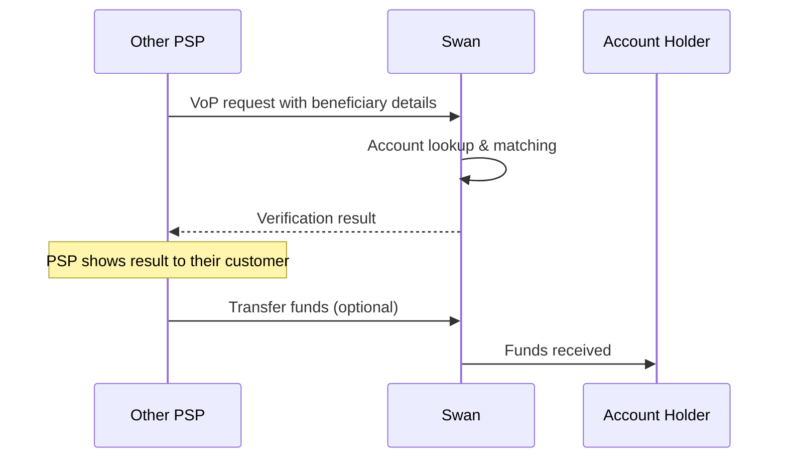

# Incoming Verification of Payee requests

Swan automatically responds to VoP requests from other Payment Service Providers (PSPs) when they verify details before sending transfers to Swan accounts.

:::info Regulatory requirement
Under the [European Instant Payments Regulation (IPR)](https://eur-lex.europa.eu/legal-content/EN/TXT/HTML/?uri=OJ:L_202400886), all PSPs in the SEPA zone must offer VoP services for incoming transfers starting October 5, 2025.
:::

## How incoming VoP works {#how-it-works}

When another PSP initiates a transfer to a Swan account, they first send a VoP request to verify the beneficiary details. Swan automatically processes these requests and returns a verification result.

### Process overview {#process-overview}

Swan operates as a responding PSP registered with the [EPC Directory Service (EDS)](https://www.europeanpaymentscouncil.eu/what-we-do/other-epc-activities/epc-directory-service).

:::note No action required
This process is automatic. Swan handles all incoming VoP requests; no implementation is required.
:::

## Supported identification types {#identification-types}

Swan supports the following payee identification types (refer to [Mambu's VoP identification types documentation](https://docs.numeral.io/docs/vop-identification-types#supported-identification-types-in-vop)) with Swan [Bank Identifier Code (BIC)](/topics/accounts/ibans/#local):

### Name {#name-type}
The name of the legal entity or of the individual:
- **Company IBAN**: `AccountHolder.companyName`.
- **Individual IBAN**: `AccountHolder.firstName` + `AccountHolder.lastName`.

### Tax number {#tax-number-type}
The number assigned by a tax authority to identify an organisation:
- **Company IBAN**: `AccountHolder.registration.taxIdentificationNumber`.
- **Individual IBAN**: Not applicable.

### Company identification {#company-identification-type}
The identification assigned to an organization by a national authority (e.g., corporate registration number):
- **Company IBAN**: `AccountHolder.registration`.
- **Individual IBAN**: Not applicable.

### SIREN {#siren-type}
The SIREN number is a 9-digit code assigned by INSEE, the French National Institute for Statistics and Economic Studies, to identify an organisation in France:
- **Company IBAN**: `AccountHolder.registration` (same as `company_identification`).
- **Individual IBAN**: Not applicable.

## Matching considerations {#matching-considerations}

### Account holder information accuracy {#correct-information}

To ensure successful incoming transfers, your users must provide senders with their exact account name and IBAN as they appear on their Swan account. Swan verifies incoming transfers against the legal name and details registered in the system.

**Key points to communicate to your users:**
- Use the complete legal name, including all registered middle names.
- Ensure all names are spelled correctly.
- For business accounts, use the full legal company name, not a trade or merchant name. 

You may share [our end-user support article](https://support.swan.io/hc/en-150/articles/30680956306333-Verification-of-Payee-VoP) to assist with user training.

**Example**: If a company's legal name is "MY COMPANY SAS" but they operate as "Awesome Company", senders must use "MY COMPANY SAS" for VoP requests to match. Similarly, if an account holder's name is "Henri Charles Dupont," senders should use the complete name, not just "Henri Dupont."

## VoP matching and results {#matching-and-results}

Swan returns verification results based on how closely the provided details match the account holder information. Understanding these results helps you anticipate what other PSPs experience when sending transfers to Swan accounts.

### Verification outcomes {#verification-outcomes}

Swan returns one of four possible results:

| Result type | When it occurs | Matching approach |
| --- | --- | --- |
| **Match** | Exact or very close match (100% similarity for names) | Name: Levenshtein distance ID numbers: Exact match |
| **Close match** | Similar but not identical (80-99% similarity for names) | Name: Levenshtein distance |
| **No match** | Significant differences (under 80% similarity for names) | Name: Levenshtein distance ID numbers: Exact match |
| **Impossible to match** | Account not found, unsupported ID type, account closed or suspended | Not applicable |

### Examples {#examples}

**Name matching examples:**

- "Henri Dupont" vs "Henri Dupont" → Match (100% similarity)
- "Henri Dupont" vs "Henri Dupond" → Close match (92% similarity)
- "Henri Dupont" vs "Henry Dupond" → Close match (83% similarity)
- "Henri Dupont" vs "Malika Ngoma" → No match (8% similarity)

**ID number matching examples:**
- Stored: "DE136695976", Received: "136695976" → **No match**
- Stored: "9234.56.788", Received: "923456788" → **No match**

## What this means for transfers {#transfer-implications}

Since VoP verification happens before the actual transfer, Swan cannot link incoming transfers to previous VoP requests. The requesting PSP decides whether to proceed based on the verification result - transfers can still arrive even after a "No match" result.

## Monitoring and logging {#monitoring}

Starting Q4 2025, Swan will log VoP requests and results to compile statistics and improve the matching algorithm configuration if necessary.

## Next steps {#next-steps}

→ Learn how to [verify beneficiary details](/preview/vop/guide-verify-beneficiary) using the `verifyBeneficiary` mutation  
→ Configure [bulk credit transfers with VoP](/preview/vop/bulk-credit-transfers) for high-volume use cases  
→ Understand the complete VoP ecosystem with [Verification of Payee overview](/preview/vop/verification-of-payee)