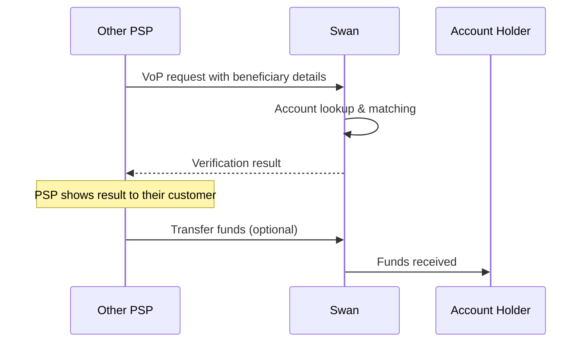

# Incoming Verification of Payee requests

Swan responds to VoP requests from other Payment Service Providers when they want to verify details before sending transfers to Swan accounts.

:::info Regulatory requirement
Under the [European Instant Payments Regulation (IPR)](https://eur-lex.europa.eu/legal-content/EN/TXT/HTML/?uri=OJ:L_202400886), all PSPs in the SEPA zone must offer VoP services for both outgoing and incoming transfers starting October 9, 2025.
:::

## How incoming VoP works {#how-it-works}

When another PSP initiates a transfer to a Swan account, they first send a VoP request to verify the beneficiary details. Swan automatically processes these requests and returns a verification result.

### Process overview {#process-overview}

Swan is listed as a responding PSP to the EPC Directory Service (EDS) on which the VoP scheme relies. Swan partners with Mambu Payments to compute and provide the VoP matching result.

In order to respond to an incoming VoP request, Mambu Payments supports three integration modes (refer to [Mambu's VoP documentation](https://docs.numeral.io/docs/respond-to-vop-requests)):
- Synchronised accounts.
- Account holder information requests to your system.
- Pass-through integration with your system.

Swan selected the "Account holder information requests to your system" integration mode to protect end users' data.

:::note No action required
This process is automatic - Swan handles all incoming VoP requests without requiring any implementation from partners.
:::

## Supported identification types {#identification-types}

Swan supports the following payee identification types (refer to [Mambu's VoP identification types documentation](https://docs.numeral.io/docs/vop-identification-types#supported-identification-types-in-vop)) with Swan BIC:

### Name {#name-type}
The name of the legal entity or of the individual:
- **Company IBAN**: AccountHolder.companyName.
- **Individual IBAN**: AccountHolder.firstName + AccountHolder.lastName.

### Tax number {#tax-number-type}
The number assigned by a tax authority to identify an organisation:
- **Company IBAN**: AccountHolder.registration.taxIdentificationNumber.
- **Individual IBAN**: Not applicable.

### Company identification {#company-identification-type}
The country authority given organisation identification (e.g., corporate registration number):
- **Company IBAN**: AccountHolder.registration.
- **Individual IBAN**: Not applicable.

### SIREN {#siren-type}
The SIREN number is a 9 digit code assigned by INSEE, the French National Institute for Statistics and Economic Studies, to identify an organisation in France:
- **Company IBAN**: AccountHolder.registration (same as company_identification).
- **Individual IBAN**: Not applicable.

## VoP matching algorithm {#matching-algorithm}

Accurate matching is crucial for a robust VoP implementation. Swan uses different matching approaches depending on the identification type.

### Exact matching {#exact-matching}

When the payee identification type is one of **tax_number**, **company_identification** or **siren**, Swan does not run the matching algorithm. Only result is **match** or **no match**.

**Examples:**

| ID stored | ID received | Matching result |
| --- | --- | --- |
| DE136695976 | 136695976 | No match |
| 9234.56.788 | 923456788 | No match |

### Name matching with Levenshtein distance {#name-matching}

When the payee identification type is **name**, Swan runs the matching algorithm with the Levenshtein distance. Result can be **match**, **close match** or **no match**.

Swan uses the **Levenshtein distance** to compare the name provided by the PSP to the data in the system. 

Levenshtein distance measures similarity by identifying the minimum number of single-character edits (insertions, deletions, or substitutions) required to transform one string into another. It is a straightforward measure of overall difference.

The distance calculated is then normalized and converted into a **matching score ranging from 0 to 100**, where a higher score indicates greater similarity (refer to [Mambu's VoP matching algorithm documentation](https://docs.numeral.io/docs/vop-matching-algorithm)).

#### Matching thresholds {#matching-thresholds}

Once a matching score is computed using the Levenshtein distance, Swan uses thresholds to translate the result in one of three distinct outcomes:

- **Match**: threshold at **95** - any score at or above this value will result in a match
- **Close match**: threshold between **80 and 95** - result will be a close match  
- **No match**: threshold lower to **80** - any score below this value will result in a no match

**Examples:**

| Name stored | Name received | Matching score based on Levenshtein | Matching result based on thresholds |
| --- | --- | --- | --- |
| François Dupont | John Doe | 26 | No match |
| François Dupont | France Dupont | 80 | Close match |
| François Dupont | François Dupond | 93 | Close match |
| François Dupont | François Dupont | 100 | Match |

## Verification not possible {#verification-not-possible}

It is possible to receive **Impossible to match** (refer to [Mambu's VoP failure codes documentation](https://docs.numeral.io/docs/vop-failure-codes-and-status-details)) when Swan did not manage to match data. It can be due to one of the following reasons:

- The payee identification type is not supported for VoP
- The IBAN is not present in Swan's system  
- The account is in statuses **Suspended**, **Closing** or **Closed**

## VoP and credit transfer {#vop-and-credit-transfer}

Since the VoP is performed prior to the credit transfer, and Swan has no knowledge of whether the user of the requesting PSP has made the transfer following the matching result, Swan is unable to link an incoming transfer to a VoP request.

## VoP historisation {#vop-historisation}

Although Swan is not currently able to link an incoming transfer to a VoP request, Swan plans to log requests and their results during Q4 2025 to compile statistics and improve the matching algorithm configuration if necessary.