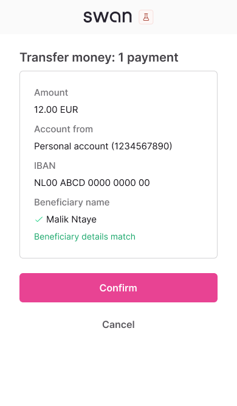
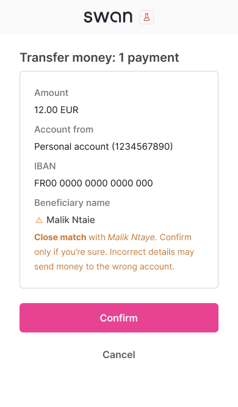

# Verification of Payee

Verify beneficiary details before sending SEPA Credit Transfers to reduce fraud and payment errors.

:::info Mandatory compliance
Required for all SEPA Credit Transfers and Instant SEPA Credit Transfers under the [European Instant Payments Regulation (IPR)](https://www.ecb.europa.eu/paym/integration/retail/instant_payments/html/instant_payments_regulation.en.html) published in March 2024, with a mandatory implementation deadline of **October 9, 2025**, for all Payment Service Providers (PSPs) in the Eurozone offering SEPA Credit Transfers.
:::

## Overview {#overview}

**Verification of Payee (VoP)** is a new European service that checks beneficiary details against account holder information before initiating SEPA Credit Transfers and Instant SEPA Credit Transfers. This service aims to reduce payment fraud and errors by confirming that the beneficiary details match the account holder registered with the beneficiary's bank.

### Key benefits {#benefits}

For your integration:
- **Reduced disputes**: Prevent misdirected payments and end-user support tickets.
- **Better user experience**: Build trust through transparent payment verification.
- **Operational efficiency**: Fewer payment failures and reversals to handle.

For your end-users:
- **Fraud protection**: Ensure the funds go to the intended recipient.
- **Error prevention**: Catch typos and formatting issues early.
- **Payment confidence**: Know transfers will reach the intended recipient.

### Geographic scope and timeline {#coverage}

VoP applies to all countries in the SEPA region. Payment Service Providers (PSPs) have varying implementation timelines based on their location:

| Payment Services Provider location | VoP mandatory date |
| --- | --- |
| 🇪🇺 [Eurozone](https://economy-finance.ec.europa.eu/euro/what-euro-area_en) | October 9, 2025 |
| 🌍 Non-Eurozone | January 9, 2027 |

The service is **free of charge** for Swan account holders as mandated by the regulation.

## How VoP works {#how-vop-works}

### High-level flow {#high-level-flow}

VoP happens before sending money to a beneficiary, through this process:

1. **VoP required**: All SEPA Credit Transfers and Instant SEPA Credit Transfers must be verified before authorization.
2. **Verification request**: Swan sends a VoP request to the beneficiary's bank with the IBAN and beneficiary name.
3. **Verification response**: The beneficiary's bank responds with the verification result.
4. **Result displayed**: VoP result and associated warnings are shown to the end-user.

Following the [European Payments Council (EPC)'s recommended matching rules](https://www.europeanpaymentscouncil.eu/sites/default/files/kb/file/2024-10/EPC288-23%20v1.0%20EPC%20Recommendations%20for%20the%20Matching%20Processes%20under%20the%20VOP%20Scheme%20Rulebook_0.pdf), the name is the first and last name of a natural person (individual), or the legal or commercial name of a legal person (company).

### VoP results {#vop-results}

The beneficiary's bank can return one of four verification results. **All results must be displayed to the end-user**. Swan will systematically display the VoP result and warning on the SCA consent screen.

<Tabs>
  <TabItem value="match" label="✅ Match" default>
    **Result**: Exact match found between provided details and account holder information
    
    **End-user action**: Safe to proceed with transfer
    
    **Mobile consent screen**:
    

      
    

  </TabItem>
  
  <TabItem value="close" label="⚠️ Close match">
    **Result**: Close match with suggested correction from beneficiary's bank
    
    **End-user action**: Review suggested name correction before proceeding
    
    **Mobile consent screen**:
    

      
    

  </TabItem>
  
  <TabItem value="no-match" label="❌ No match">
    **Result**: No match found between provided details and account holder information
    
    **End-user action**: Verify beneficiary details carefully before proceeding
    
    **Mobile consent screen**:
    

      
    

  </TabItem>
  
  <TabItem value="not-possible" label="❌ Verification not possible">
    **Result**: IBAN verification failed. Check the IBAN format, try again, or contact the recipient's bank if the issue persists.
    
    **End-user action**: Verify beneficiary details carefully before proceeding
    
    **Mobile consent screen**:
    

      
    

  </TabItem>
</Tabs>

:::tip VoP enables informed decisions
Verification of Payee provides verification results so end-users can make informed decisions, but doesn't block payments from proceeding.
:::

### Standing Orders {#standing-orders}

VoP applies to Standing Orders with two key differences:

1. **Initial verification only**: VoP happens at the scheduling stage when creating the Standing Order.
2. **Existing Standing Orders**: Previously authorized Standing Orders don't need to be verified - only new Standing Orders created on or after October 9, 2025, will require VoP.

## Integration flows for VoP {#integration-flows}

Swan provides two integration options based on your user experience (UX) needs and development limitations to ensure a compliant integration.

  

    

      

        <h3>🟡 Option 1: Default verification</h3>
      

      

        
<strong>Swan automatically verifies beneficiary details when the end-user initiates a credit transfer</strong>

        <ul>
          <li>No additional development required for single SEPA Credit Transfers.</li>
          <li>Swan displays VoP results and warnings in the consent screen.</li>
          <li>Best for: Quick compliance and existing integrations.</li>
        </ul>
      

    

  

  

    

      

        <h3>🟢 Option 2: Custom verification</h3>
      

      

        
<strong>Use [the `verifyBeneficiary` mutation](guide-verify-beneficiary) for full control over verification presentation</strong>

        <ul>
          <li>Complete control over VoP results presentation.</li>
          <li>Custom error handling and user guidance.</li>
          <li>Required for bulk payments.</li>
          <li>Best for: Enhanced UX and high-volume use cases.</li>
        </ul>
        
<a href="guide-verify-beneficiary">Learn how to verify beneficiary details →</a>

      

    

  

### Supported payment types {#payment-support}

<SupportStatusLegend />

| Payment Type | 🟡 Option 1: Default | 🟢 Option 2: Custom | VoP requirements |
| --- | :---: | :---: | --- |
| **Single Credit Transfers** | <Supported /> | <Supported /> | Required |
| **Bulk Credit Transfers** | <Unsupported /> | <Supported /> | Required (unless the company account [opts out](/preview/vop/guide-verify-beneficiary#company-opt-out)) |
| **Standing Orders** | <Supported /> | <Supported /> | Required at initiation stage |

## Option 1: Default verification {#option-1}

For single credit transfers, you don't have to do anything - Swan will run the VoP check at the initiation of the credit transfer and display the VoP result in the consent screen.

Option 1 is [not available for Bulk Credit Transfers](#payment-support). Instead, **Option 2** is designed to handle high-volume payments efficiently and aligns with standard market practices.

## Option 2: Custom verification {#option-2}

Call [the `verifyBeneficiary` mutation](/preview/vop/guide-verify-beneficiary#step-1) before initiating SEPA Credit Transfers to get full control over the verification user experience. You can decide the level of friction here, but we recommend having clear warnings and CTAs to verify or edit beneficiary details based on the verification result.

```mermaid
flowchart TD
    subgraph Option2 ["🟢 Recommended"]
        direction TB
        A2["User enters beneficiary details"] --> B2["Beneficiary verification (VoP)<br/>using the verifyBeneficiary mutation"]
        B2 --> C2["Custom UX handling"]
        C2 --> D2["User submits payment"]
        D2 --> E2["Call initiateCreditTransfers with beneficiaryToken"]
        E2 --> F2["Consent screen with VoP result"]
        F2 --> G2["Payment authorized"]
        G2 --> H2["Transfer completed"]
    end
    
    classDef default fill:#ffffff,stroke:#6240b5,stroke-width:1px,color:#271a48,rx:8,ry:8
    classDef input fill:#6240b5,stroke:#4e3391,stroke-width:2px,color:#ffffff,rx:12,ry:12
    classDef process fill:#f8f7fc,stroke:#c0b3e1,stroke-width:1px,color:#4e3391,rx:8,ry:8
    classDef success fill:#22c55e,stroke:#16a34a,stroke-width:2px,color:#ffffff,rx:12,ry:12
    classDef transfer fill:#22c55e,stroke:#16a34a,stroke-width:2px,color:#ffffff,rx:12,ry:12
    classDef custom fill:#6240b5,stroke:#4e3391,stroke-width:2px,color:#ffffff,rx:8,ry:8
    classDef subgraph2 fill:#f0f9f0,stroke:#d4edda,stroke-width:2px,rx:16,ry:16
    
    class A2 input
    class B2,D2,E2,F2 process
    class C2 custom
    class G2 success
    class H2 transfer
    class Option2 subgraph2
```

### Verification flow {#verification-flow}

1. **Verify beneficiary**: Call [the `verifyBeneficiary` mutation](/preview/vop/guide-verify-beneficiary#step-1) - include the [beneficiary details](guide-verify-beneficiary#step-1) to check against.
2. **Receive the verification result**: Match, Close match, No Match, or Verification not possible. A unique [`BeneficiaryVerificationToken`](/preview/vop/guide-verify-beneficiary#step-3) is also returned.
3. **Inform the end-user**: Display appropriate messaging and optional actions based on the verification result.
4. **User proceeds**: The end-user can choose to proceed with the payment regardless of the result.
5. **Use token**: Add the `beneficiaryVerificationToken` to the `CreditTransferInput` in [the `initiateCreditTransfers` mutation](/topics/payments/credit-transfers/sepa/guide-initiate-ct).
6. **User gives consent**: Complete the payment authorization.

[View detailed implementation →](/preview/vop/guide-verify-beneficiary)

#### Custom UX examples {#custom-ux-examples}

Examples of how to present VoP verification results in your web banking interface during the "Custom UX handling" step. You can decide the level of friction and optional actions to display.

<Tabs>
  <TabItem value="match" label="✅ Match" default>
    **Recommended actions**: None required - proceed with payment
    
    
  </TabItem>
  
  <TabItem value="close" label="⚠️ Close match">
    **Recommended actions**: 
    - Display the suggested name correction.
    - Offer to update the beneficiary name.
    - Allow proceeding with the original or suggested name.
    
    
  </TabItem>
  
  <TabItem value="no-match" label="❌ No match">
    **Recommended actions**: 
    - Clear warning about the mismatch.
    - Option to edit the beneficiary details.
    - Option to verify the IBAN with recipient.
    - Allow proceeding with caution.
    
    
  </TabItem>
  
  <TabItem value="not-possible" label="❌ Verification not possible">
    **Recommended actions**: 
    - Explain verification is unavailable.
    - Suggest checking the IBAN format.
    - Option to contact the recipient's bank.
    - Allow proceeding with caution.
    
    
  </TabItem>
</Tabs>

## Bulk payments {#bulk-payments}

For bulk credit transfers, each transfer in the batch must include [a valid `BeneficiaryVerificationToken`](/preview/vop/guide-verify-beneficiary#step-3) obtained through the `verifyBeneficiary` mutation. If any transfer in a batch is submitted with full beneficiary details instead of a token, the entire batch initiation will be rejected with a `ForbiddenRejection`.

### Company opt-out for bulk transfers {#company-opt-out}

Company end-users can [opt-out of VoP](/preview/vop/guide-verify-beneficiary#company-opt-out) for bulk transfers through the `updateAccountSettings` mutation. Individual end-users cannot opt-out.

### Default requirements by account type

| Account type | VoP for bulk transfers | BeneficiaryToken requirements |
| --- | --- | --- |
| **Company** | Opted out | Optional |
| **Individual** | Opted in | Required |

### Restrictions
- Only available for company account types.
- Requires both `canViewAccount` and `canInitiatePayments` permissions.
- No SCA required for changing this setting.

For detailed information about permissions and token usage, see [Token usage permissions](/preview/vop/guide-verify-beneficiary#token-permissions).

## Next step {#next-steps}

→ Learn how to [verify beneficiary details](/preview/vop/guide-verify-beneficiary) using the `verifyBeneficiary` mutation.