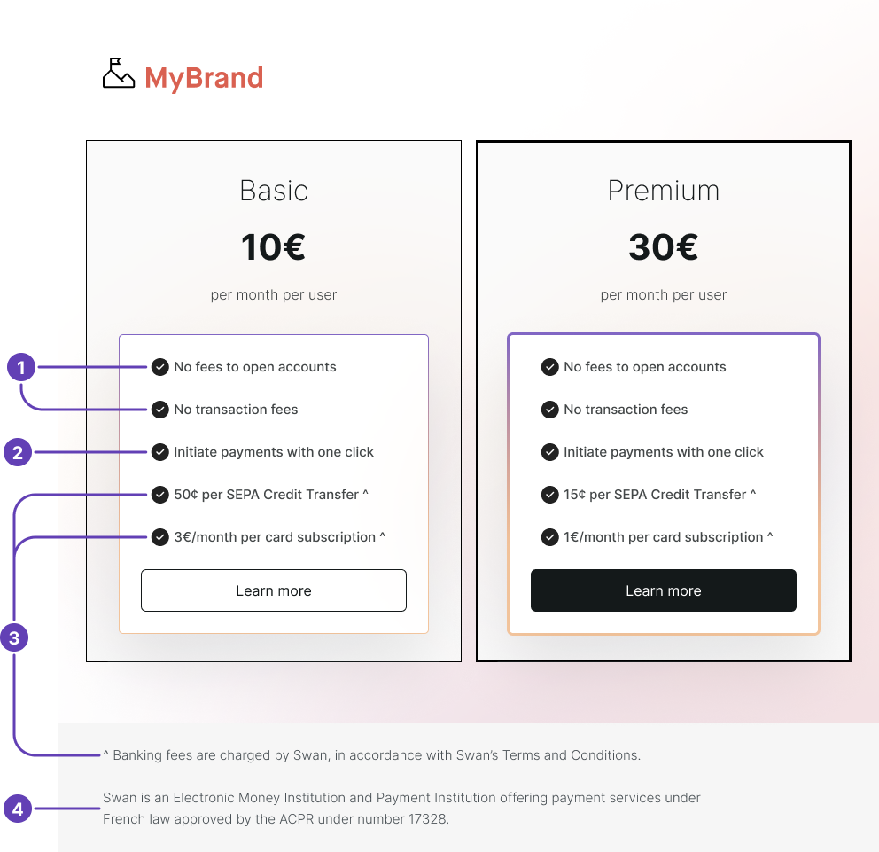

# Build a compliant billing offer

Build a compliant billing offer, charging qualified fees to your end users **with or without customization**.

:::tip Customization
You can customize certain banking fees to adapt your billing offer to your product and user type.
Learn more about [**customizing your offer**](#customize-offer) at the end of this page.
:::

## Overview {#overview}

All banking fees are legally framed and supervised by a regulator.
In France, the regulator is the *Autorité de Contrôle Prudentiel et de Résolution*.
Some fees are capped or forbidden because they are considered abusive, depending on the account holder's status.
Therefore, only regulated entities can bill banking fees because they're subject to the regulator's supervision.

Swan Partners aren't [acting as regulated financial entities](../../../partnership/index.mdx), so you **can't bill directly** for banking fees—even if your product provides support associated with these fees.
In other words, you can't include banking fees in your pricing offer as fees you charge your users. 

If the product you've built brings value (for example, in the preparation of payment orders), you're authorized to bill for this functionality under the appropriate denomination.
In order to do so, your product must add value for your client.

:::caution Verifying your offer
Swan must **verify your billing offer**, whether standard or customized, regarding the payment-related options before you go live to confirm you aren't billing for unauthorized fees.
:::

### Authorizations {#authorizations}

1. You can charge your customers for all the functionalities not considered banking fees.
1. If your product improves or eases the preparation of payment orders, you can bill that function directly.
1. You can *present* the functionalities considered as banking fees to your customers.

### Restrictions {#restrictions}

1. You can't charge your customers for banking-related fees. For example, you can't charge fees for opening an account, scheduling a payment, or using a card.
1. You can't present your offer with wording reserved by law to the banking and payment services bill. The banking fee descriptions are harmonized by law to help all users understand them clearly. Using this wording is exclusively dedicated to the presentation of banking fees.

:::info Example
Your product helps detect the amount to be paid, the execution date, and the counterparts of an operation.
It fills out the payment order to be sent by your customer.

- <Yes /> You can bill for the functionalities of detecting the data and filling out the payment order.
- <No /> You can't bill for the execution of the payment order itself, or for the opening of the account.
:::

## Fees

### <Yes /> Billable fees {#classifications-yes}

Some fees **aren't classified** as banking fees.
As a Swan Partner, you **can bill** for the following fees:

1. Fees connected to collecting debts.
1. Preparation of payment orders.
1. Fee for shipping a debit card.
1. Improper use of the account.

### <No /> Non-billable fees {#classifications-no}

Many fees **are classified** as banking fees and are therefore **non-billable**.
As a Swan Partner, you **can't bill** for the following fees.

| Category | Fee |
| --- | --- |
| Accounts | <ul><li>Account administration</li><li>Account funding by credit card</li><li>Fee per inactive account</li><li>Fee for closing an account</li><li>Monthly provision of a statement of transactions carried out on the account, in paper format</li><li>Document search fee (drafting a circulation letter for a legal entity holder)</li></ul> |
| Cards | <ul><li>Deferred debit card</li><li>Immediate debit card</li><li>Provision of a credit card</li><li>Provision of a debit card</li><li>Payment by card</li><li>Payment card with systematic authorization</li></ul> |
| Credit transfers | <ul><li>Fees per instant transfer</li><li>Receipt of a non-SEPA transfer</li><li>Transfer</li></ul> |
| Direct debits | <ul><li>Stop fees for direct debit</li></ul> |
| Subscription | <ul><li>Subscription to remote banking services</li><li>Subscription to products including account status SMS alerts (per alert)</li><li>Subscription to products including account status SMS alerts (per month)</li></ul> |
| Other | <ul><li>Cash withdrawal</li><li>Payment acquisition services (Swan's merchant offer to accept payments)</li></ul> |
| Incident fees *(also classified as banking fees)* | <ul><li>Intervention fee</li><li>Fee for the notification letter for unauthorized account in debt</li><li>Fee for non execution of a standing order due to lack of funds</li><li>Fee for direct debit rejections due to an insufficient balance</li><li>Stop fees for the card</li><li>Processing of judicial or administrative seizures, notice to third party holders</li><li>Charges for seizure of account</li><li>Fee for information missing or incorrect related to a transfer</li><li>Charges for notifying the *Banque de France* of a decision to withdraw a credit card</li></ul> |

## Customizing your offer {#customize-offer}

:::info Subject to approval
You need Swan's approval to customize your billing, as it changes your billing setup. To request it, contact your Strategic Account Manager (SAM).
:::

As a Swan Partner, you decide whether to pay all the banking fees related to your users' operations, or to let Swan charge your users directly.

Swan is always the entity charging the fees—**you never charge these banking fees directly**.

By default, Swan's banking fees are charged according to the following table.
All fees **charged to you** could be **charged to your users instead** with a customized billing offer.
Please note that **you are ultimately responsible** for any outstanding payments owed by your users.

| Fees charged to | Fee |
| --- | --- |
| Swan Partners (you) | <ul><li>Fee per account</li><li>Fee per SEPA Credit Transfer</li><li>Fee per card transaction</li><li>Card issuing and shipping</li></ul> |
| Account holders (your users) | <ul><li>SEPA Direct Debit transactions</li><li>Checks</li><li>Accepting online payments with cards</li><li>Fees for International Credit Transfers</li><li>Incident fees</li></ul> |

### Presenting your customized offer {#customize-offer-present}

How you present your customized billing offer must respect certain guidelines.

Your pricing offer must be **transparent to your users**, allowing them to **compare pricing** for various payment products on the market.

1. If you decide to cover your users' fees, you can mention it.
    - For example, you might say *No fees to open accounts* or *No transaction fees*.
1. If your product helps prepare payment orders, you can mention it.
    - For example, you might say *Initiate payments with one click*.  
1. If you choose to mention Swan's banking fees, you must indicated that fees are charged by Swan.
    - For example, you could add a symbol (^) referring the user to the following information somewhere on the offer page: *Fees charged by Swan, according to Swan's Terms and Conditions*.
1. If Swan's fees are mentioned, the following information about Swan must be included in the footer of your offer page: *Swan is an Electronic Money institution and Payment institution offering payment services under French law approved by the ACPR under number 17328.*

:::info Fee labels
**Fee labels**, meaning how fees are displayed to account holders on Web Banking, transaction histories, and account statements, aren't customizable.
When customizing your offer, **you must keep Swan's standardized wording**; you can't change fee wording when presenting your offer.

Please refer to your most recent Swan Terms and Conditions for standardized fee wording.
:::

