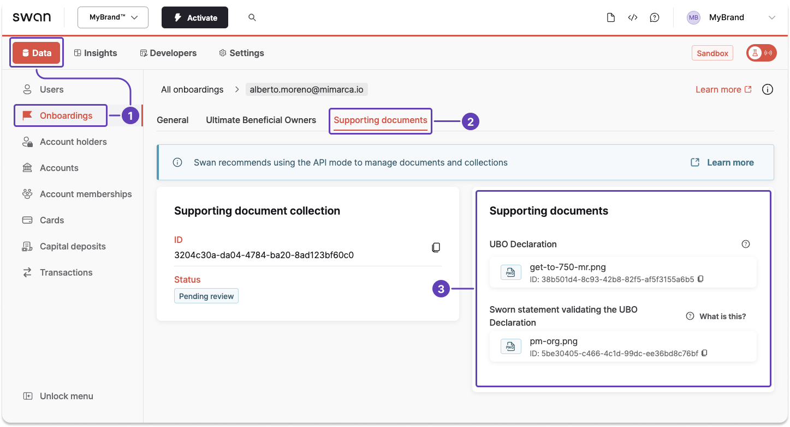

# Get information about a collection or document

You can get information about a collection or a document from your Dashboard or using the API.
Use the following guides according to whether the collection or a document concerns a **transaction** or an **account onboarding**.

## Transaction documents {#guide-transactions}

There are two methods you can use to get information about a collection or a document related to a [transaction](../../payments/index.mdx#transactions):

1. Get information about individual documents from your **Dashboard**.
1. **Call the API** to get information about collections and documents.

:::info Collect documents with the API
You can only call the API to get information about supporting documents for transactions if you [collect documents with the API](./index.mdx#collect-documents).
:::

### Dashboard {#transactions-dashboard}

Use the Dashboard to review information about a transaction document.

1. Go to **Data** > **Transactions**.
1. Open a transaction, then go to **Supporting documents**.
1. Review all available information about your documents. 


### API {#transactions-api}

1. First, [retrieve the required transaction ID](../../payments/overview/guide-get-transaction-id.mdx).
1. Call the `transaction` query.
1. Enter the transaction ID retrieved in step 1 (line 2).
1. Include [`purposeDetails`](/topics/accounts/documents/#document-purposes-types) under `requiredSupportingDocumentPurposes` to see what's needed if the purpose is `Other` (line 14).
1. Add all other objects you need to review (for example `SupportingDocumentStatusInfo`) (lines 16-19).

#### Query {#transaction-api-query}

<a href="https://explorer.swan.io?query=cXVlcnkgZ2V0VHJhbnNhY3Rpb25Db2xsZWN0aW9uSW5mbyB7CiAgdHJhbnNhY3Rpb24oaWQ6ICIkVFJBTlNBQ1RJT05fSUQiKSB7CiAgICAuLi4gb24gU0VQQUNyZWRpdFRyYW5zZmVyVHJhbnNhY3Rpb24gewogICAgICBpZAogICAgICBzdXBwb3J0aW5nRG9jdW1lbnRDb2xsZWN0aW9ucyB7CiAgICAgICAgZWRnZXMgewogICAgICAgICAgbm9kZSB7CiAgICAgICAgICAgIHN0YXR1c0luZm8gewogICAgICAgICAgICAgIHN0YXR1cwogICAgICAgICAgICB9CiAgICAgICAgICAgIGlkCiAgICAgICAgICAgIHJlcXVpcmVkU3VwcG9ydGluZ0RvY3VtZW50UHVycG9zZXMgewogICAgICAgICAgICAgIG5hbWUKICAgICAgICAgICAgICBwdXJwb3NlRGV0YWlscwogICAgICAgICAgICB9CiAgICAgICAgICAgIHN1cHBvcnRpbmdEb2N1bWVudHMgewogICAgICAgICAgICAgIHN0YXR1c0luZm8gewogICAgICAgICAgICAgICAgc3RhdHVzCiAgICAgICAgICAgICAgICAuLi4gb24gU3VwcG9ydGluZ0RvY3VtZW50UmVmdXNlZFN0YXR1c0luZm8gewogICAgICAgICAgICAgICAgICBfX3R5cGVuYW1lCiAgICAgICAgICAgICAgICAgIHJlYXNvbkNvZGUKICAgICAgICAgICAgICAgICAgcmVhc29uCiAgICAgICAgICAgICAgICAgIHJlZnVzZWRBdAogICAgICAgICAgICAgICAgICBzdGF0dXMKICAgICAgICAgICAgICAgICAgZmlsZW5hbWUKICAgICAgICAgICAgICAgIH0KICAgICAgICAgICAgICB9CiAgICAgICAgICAgIH0KICAgICAgICAgIH0KICAgICAgICB9CiAgICAgIH0KICAgIH0KICB9Cn0K&tab=api" className="explorer-badge">Open in API Explorer</a>

```graphql {2-3,5,12-14,16-19,21} showLineNumbers
query getTransactionCollectionInfo {
  transaction(id: "$TRANSACTION_ID") {
    ... on SEPACreditTransferTransaction {
      id
      supportingDocumentCollections {
        edges {
          node {
            statusInfo {
              status
            }
            id
            requiredSupportingDocumentPurposes {
              name
              purposeDetails
            }
            supportingDocuments {
              statusInfo {
                status
                ... on SupportingDocumentRefusedStatusInfo {
                  __typename
                  reasonCode
                  reason
                  refusedAt
                  status
                  filename
                }
              }
            }
          }
        }
      }
    }
  }
}
```
#### Payload {#transactions-api-payload}

In this example, the collection status is `WaitingForDocument` (line 10).
The required document purpose is `ProofOfOriginOfFunds` (line 15).
[`purposeDetails`](/topics/accounts/documents/#document-purposes-types) is `null` here because this is a standard purpose (line 16).

```json {10,15,16} showLineNumbers 
{
  "data": {
    "transaction": {
      "id": "$TRANSACTION_ID",
      "supportingDocumentCollections": {
        "edges": [
          {
            "node": {
              "statusInfo": {
                "status": "WaitingForDocument"
              },
              "id": "$COLLECTION_ID",
              "requiredSupportingDocumentPurposes": [
                {
                  "name": "ProofOfOriginOfFunds",
                  "purposeDetails": null
                }
              ],
              "supportingDocuments": [
                {
                  "statusInfo": {
                    "status": "WaitingForUpload"
                  }
                }
              ]
            }
          }
        ]
      }
    }
  }
}
```

## Onboarding documents {#guide-onboarding}

There are two methods you can use to get information about a collection or a document related to an [account onboarding](../../onboarding/index.mdx):

1. Get information about individual documents from your **Dashboard**.
1. **Call the API** to get information about collections and documents.

### Dashboard {#onboarding-dashboard}

Use the Dashboard to review information about an onboarding document.

1. Go to **Data** > **Onboardings**.
1. Open an onboarding, then go to **Supporting documents**.
1. Review all available information about your documents. 



### API {#onboarding-api}

You can use either the user's onboarding ID or, if their onboarding is `Finalized`, their account holder ID, to get information about a supporting document collection or an individual document.

1. First, retrieve the required onboarding ID, either [with the API](../../onboarding/overview/guide-get-info.mdx) or from your **Dashboard** > **Data** > **Onboardings**.
1. Call the `onboarding` query.
1. Enter the onboarding ID retrieved in step 1 (line 2).
1. Include [`purposeDetails`](/topics/accounts/documents/#document-purposes-types) under `requiredSupportingDocumentPurposes` to see what's needed if the purpose is `Other` (line 7).
1. Add all other objects you need to review.
    - Example: add `supportingDocumentPurpose` to know which supporting document is required (line 10), as well as the `supportingDocuments` > `statusInfo` > `status` (lines 13-14) to retrieve the document's status.
    - Example: add `supportingDocuments` > `statusInfo` > `status` (lines 13-14) to get information about why a document was `Refused` (lines 15).

:::info Account holder ID
This guide uses the onboarding ID.
If the onboarding is `Finalized`, use the account holder ID to [call the `accountHolder` query](https://explorer.swan.io?query=cXVlcnkgQWNjb3VudEhvbGRlckRvY3VtZW50cyB7CiAgYWNjb3VudEhvbGRlcihpZDogIiRBQ0NPVU5UX0hPTERFUl9JRCIpIHsKICAgIHN1cHBvcnRpbmdEb2N1bWVudENvbGxlY3Rpb25zIHsKICAgICAgZWRnZXMgewogICAgICAgIG5vZGUgewogICAgICAgICAgaWQKICAgICAgICAgIHN1cHBvcnRpbmdEb2N1bWVudHMgewogICAgICAgICAgICBzdGF0dXNJbmZvIHsKICAgICAgICAgICAgICBzdGF0dXMKICAgICAgICAgICAgfQogICAgICAgICAgICBzdXBwb3J0aW5nRG9jdW1lbnRQdXJwb3NlCiAgICAgICAgICAgIHN1cHBvcnRpbmdEb2N1bWVudFR5cGUKICAgICAgICAgICAgdXBkYXRlZEF0CiAgICAgICAgICB9CiAgICAgICAgfQogICAgICB9CiAgICB9CiAgfQp9Cg%3D%3D&tab=api) instead.
:::

#### Query {#onboarding-api-query}

<a href="https://explorer.swan.io?query=cXVlcnkgZ2V0T25ib2FyZGluZ0NvbGxlY3Rpb25JbmZvIHsKICBvbmJvYXJkaW5nKGlkOiAiJE9OQk9BUkRJTkdfSUQiKSB7CiAgICBzdXBwb3J0aW5nRG9jdW1lbnRDb2xsZWN0aW9uIHsKICAgICAgaWQKICAgICAgcmVxdWlyZWRTdXBwb3J0aW5nRG9jdW1lbnRQdXJwb3NlcyB7CiAgICAgICAgbmFtZQogICAgICAgIHB1cnBvc2VEZXRhaWxzCiAgICAgIH0KICAgICAgc3VwcG9ydGluZ0RvY3VtZW50cyB7CiAgICAgICAgc3VwcG9ydGluZ0RvY3VtZW50UHVycG9zZQogICAgICAgIHN1cHBvcnRpbmdEb2N1bWVudFR5cGUKICAgICAgICB1cGRhdGVkQXQKICAgICAgICBzdGF0dXNJbmZvIHsKICAgICAgICAgIHN0YXR1cwogICAgICAgICAgLi4uIG9uIFN1cHBvcnRpbmdEb2N1bWVudFJlZnVzZWRTdGF0dXNJbmZvIHsKICAgICAgICAgICAgX190eXBlbmFtZQogICAgICAgICAgICBmaWxlbmFtZQogICAgICAgICAgICByZWFzb24KICAgICAgICAgICAgcmVhc29uQ29kZQogICAgICAgICAgICByZWZ1c2VkQXQKICAgICAgICAgICAgc3RhdHVzCiAgICAgICAgICB9CiAgICAgICAgfQogICAgICB9CiAgICB9CiAgfQp9Cg%3D%3D&tab=api" className="explorer-badge">Open in API Explorer</a>

```graphql {2,5-7,10,13-15} showLineNumbers
query getOnboardingCollectionInfo {
  onboarding(id: "$ONBOARDING_ID") {
    supportingDocumentCollection {
      id
      requiredSupportingDocumentPurposes {
        name
        purposeDetails
      }
      supportingDocuments {
        supportingDocumentPurpose
        supportingDocumentType
        updatedAt
        statusInfo {
          status
          ... on SupportingDocumentRefusedStatusInfo {
            __typename
            filename
            reason
            reasonCode
            refusedAt
            status
          }
        }
      }
    }
  }
}
```

#### Payload: `Validated` {#onboarding-api-payload-validated}

In this example, the required document purpose is `Other` (line 8)
[`purposeDetails`](/topics/accounts/documents/#document-purposes-types) is "Most recent business income tax return (aangifte inkomstenbelasting)" (line 9).
The document was received, reviewed, and `Validated` (line 18).


```json {8,9,18} showLineNumbers
{
  "data": {
    "onboarding": {
      "supportingDocumentCollection": {
        "id": "173e53a6-375d-48ac-8b8a-ddf77916bcb2",
        "requiredSupportingDocumentPurposes": [
          {
            "name": "Other",
            "purposeDetails": "Most recent business income tax return (aangifte inkomstenbelasting)"
          }
        ],
        "supportingDocuments": [
          {
            "supportingDocumentPurpose": "Other",
            "supportingDocumentType": null,
            "updatedAt": "2026-04-16T08:37:47.625Z",
            "statusInfo": {
              "status": "Validated"
            }
          }
        ]
      }
    }
  }
}
```

#### Payload: `Refused` {#onboarding-api-payload-refused}

In this example, the required document purpose is `UBODeclaration` (line 8). The document was `Refused` (line 18) because it was an `InvalidDocument` (line 22).
[`purposeDetails`](/topics/accounts/documents/#document-purposes-types) is `null` here because this is a standard purpose (line 9).

```json {8,9,18,22} showLineNumbers
{
  "data": {
    "onboarding": {
      "supportingDocumentCollection": {
        "id": "$ONBOARDING_ID",
        "requiredSupportingDocumentPurposes": [
          {
            "name": "UBODeclaration",
            "purposeDetails": null
          }
        ],
        "supportingDocuments": [
          {
            "supportingDocumentPurpose": "UBODeclaration",
            "supportingDocumentType": "UBODeclaration",
            "updatedAt": "2026-04-14T15:16:48.507Z",
            "statusInfo": {
              "status": "Refused",
              "__typename": "SupportingDocumentRefusedStatusInfo",
              "filename": "file_name.pdf",
              "reason": "",
              "reasonCode": "InvalidDocument",
              "refusedAt": "2026-04-14T15:16:48.507Z"
            }
          }
        ]
      }
    }
  }
}
```
