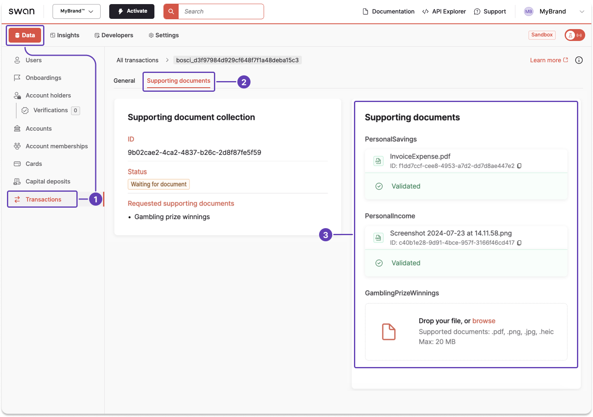
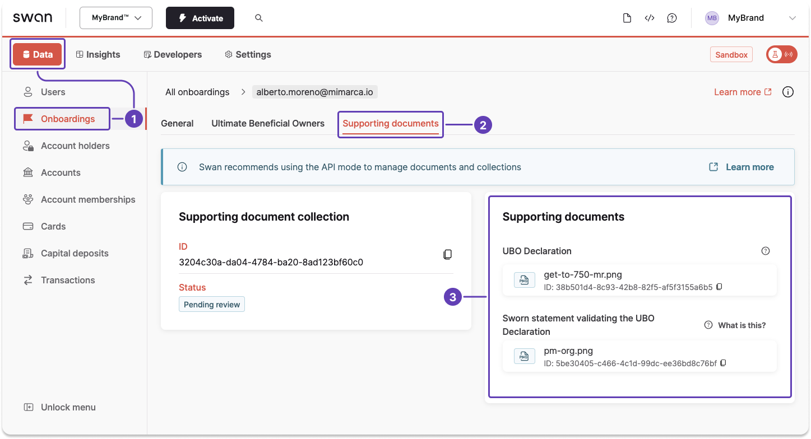

# Get information about a collection or document

You can get information about a collection or a document from your Dashboard or using the API.
Use the following guides according to whether the collection or a document concerns a **transaction** or an **account onboarding**.

## Transaction documents {#guide-transactions}

There are two methods you can use to get information about a collection or a document related to a [transaction](../../payments/index.mdx#transactions):

1. Get information about individual documents from your **Dashboard**.
1. **Call the API** to get information about collections and documents.

:::info Collect documents with the API
You can only call the API to get information about supporting documents for transactions if you [collect documents with the API](./index.mdx#collect-documents).
:::

### Dashboard {#transactions-dashboard}

Use the Dashboard to review information about a transaction document.

1. Go to **Data** > **Transactions**.
1. Open a transaction, then go to **Supporting documents**.
1. Review all available information about your documents. 



### API {#transactions-api}

1. First, [retrieve the required transaction ID](../../payments/overview/guide-get-transaction-id.mdx).
1. Call the `transaction` query.
1. Enter the transaction ID retrieved in step 1.
1. Add all objects you need to review.

#### Query {#transaction-api-query}

🔎 [Open the query in API Explorer](https://explorer.swan.io?query=cXVlcnkgZ2V0VHJhbnNhY3Rpb25Db2xsZWN0aW9uSW5mbyB7CiAgdHJhbnNhY3Rpb24oaWQ6ICIkVFJBTlNBQ1RJT05fSUQiKSB7CiAgICAuLi4gb24gU0VQQUNyZWRpdFRyYW5zZmVyVHJhbnNhY3Rpb24gewogICAgICBpZAogICAgICBzdXBwb3J0aW5nRG9jdW1lbnRDb2xsZWN0aW9ucyB7CiAgICAgICAgZWRnZXMgewogICAgICAgICAgbm9kZSB7CiAgICAgICAgICAgIHN0YXR1c0luZm8gewogICAgICAgICAgICAgIHN0YXR1cwogICAgICAgICAgICB9CiAgICAgICAgICAgIGlkCiAgICAgICAgICAgIHJlcXVpcmVkU3VwcG9ydGluZ0RvY3VtZW50UHVycG9zZXMgewogICAgICAgICAgICAgIG5hbWUKICAgICAgICAgICAgfQogICAgICAgICAgfQogICAgICAgIH0KICAgICAgfQogICAgfQogIH0KfQo%3D&tab=api)

```graphql {2-3,5,11-13,15-18,20} showLineNumbers
query getTransactionCollectionInfo {
  transaction(id: "$TRANSACTION_ID") {
    ... on SEPACreditTransferTransaction {
      id
      supportingDocumentCollections {
        edges {
          node {
            statusInfo {
              status
            }
            id
            requiredSupportingDocumentPurposes {
              name
            }
            supportingDocuments {
              statusInfo {
                status
                ... on SupportingDocumentRefusedStatusInfo {
                  __typename
                  reasonCode
                  reason
                  refusedAt
                  status
                  filename
                }
              }
            }
          }
        }
      }
    }
  }
}
```
#### Payload {#transactions-api-payload}

In this example, notice the collection status `WaitingForDocument` (line 11).
Swan needs documented proof of the gambling or prize winnings (line 16).

```json {11,16} showLineNumbers
{
  "data": {
    "transaction": {
      "id": "$TRANSACTION_ID",
      "supportingDocumentCollections": {
        "totalCount": 1,
        "edges": [
          {
            "node": {
              "statusInfo": {
                "status": "WaitingForDocument"
              },
              "id": "$COLLECTION_ID",
              "requiredSupportingDocumentPurposes": [
                {
                  "name": "GamblingPrizeWinnings"
                }
              ]
            }
          }
        ]
      }
    }
```

In this example, notice the `Refused` document `hotel-bill.pdf` with the `reasonCode` `TransactionNameMismatch`.

```json {11,16} showLineNumbers
{
  "data": {
    "transaction": {
      "id": "$TRANSACTION_ID",
      "supportingDocumentCollections": {
        "totalCount": 1,
        "edges": [
          {
            "node": {
              "statusInfo": {
                "status": "WaitingForDocument"
              },
              "id": "$COLLECTION_ID",
              "requiredSupportingDocumentPurposes": [
                {
                  "name": "GamblingPrizeWinnings"
                }
              ]
            }
          }
        ]
      }
    } 
```

## Onboarding documents {#guide-onboarding}

There are two methods you can use to get information about a collection or a document related to an [account onboarding](../../onboarding/index.mdx):

1. Get information about individual documents from your **Dashboard**.
1. **Call the API** to get information about collections and documents.

### Dashboard {#onboarding-dashboard}

Use the Dashboard to review information about an onboarding document.

1. Go to **Data** > **Onboardings**.
1. Open an onboarding, then go to **Supporting documents**.
1. Review all available information about your documents. 



### API {#onboarding-api}

You can use either the user's onboarding ID or, if their onboarding is `Finalized`, their account holder ID, to get information about a supporting document collection or an individual document.

1. First, retrieve the required onboarding ID, either [with the API](../../onboarding/overview/guide-get-info.mdx) or from your **Dashboard** > **Data** > **Onboardings**.
1. Call the `onboarding` query.
1. Enter the onboarding ID retrieved in step 1.
1. Add all objects you need to review.
    - Example: add `supportingDocumentPurpose` to know which supporting document is required (lines 6), as well as the `supportingDocuments` > `status` > `statusInfo` (lines 11-13) to retrieve the document's status.
    - Example: add `supportingDocuments` > `status` > `statusInfo` (lines 11-13) to get information about why a document was `Refused` (lines 15).

:::info Account holder ID
This guide uses the onboarding ID.
If the onboarding is `Finalized`, use the account holder ID to [call the `accountHolder` query](https://explorer.swan.io?query=cXVlcnkgQWNjb3VudEhvbGRlckRvY3VtZW50cyB7CiAgYWNjb3VudEhvbGRlcihpZDogIiRBQ0NPVU5UX0hPTERFUl9JRCIpIHsKICAgIHN1cHBvcnRpbmdEb2N1bWVudENvbGxlY3Rpb25zIHsKICAgICAgZWRnZXMgewogICAgICAgIG5vZGUgewogICAgICAgICAgaWQKICAgICAgICAgIHN1cHBvcnRpbmdEb2N1bWVudHMgewogICAgICAgICAgICBzdGF0dXNJbmZvIHsKICAgICAgICAgICAgICBzdGF0dXMKICAgICAgICAgICAgfQogICAgICAgICAgICBzdXBwb3J0aW5nRG9jdW1lbnRQdXJwb3NlCiAgICAgICAgICAgIHN1cHBvcnRpbmdEb2N1bWVudFR5cGUKICAgICAgICAgICAgdXBkYXRlZEF0CiAgICAgICAgICB9CiAgICAgICAgfQogICAgICB9CiAgICB9CiAgfQp9Cg%3D%3D&tab=api) instead.
:::

#### Query {#onboarding-api-query}

🔎 [Open the query in API Explorer](https://explorer.swan.io?query=cXVlcnkgZ2V0T25ib2FyZGluZ0NvbGxlY3Rpb25JbmZvIHsKICBvbmJvYXJkaW5nKGlkOiAiJE9OQk9BUkRJTkdfSUQiKSB7CiAgICBzdXBwb3J0aW5nRG9jdW1lbnRDb2xsZWN0aW9uIHsKICAgICAgaWQKICAgICAgc3VwcG9ydGluZ0RvY3VtZW50cyB7CiAgICAgICAgc3VwcG9ydGluZ0RvY3VtZW50UHVycG9zZQogICAgICAgIHN1cHBvcnRpbmdEb2N1bWVudFR5cGUKICAgICAgICB1cGRhdGVkQXQKICAgICAgICBzdGF0dXNJbmZvIHsKICAgICAgICAgIHN0YXR1cwogICAgICAgICAgLi4uIG9uIFN1cHBvcnRpbmdEb2N1bWVudFJlZnVzZWRTdGF0dXNJbmZvIHsKICAgICAgICAgICAgX190eXBlbmFtZQogICAgICAgICAgICBmaWxlbmFtZQogICAgICAgICAgICByZWFzb24KICAgICAgICAgICAgcmVhc29uQ29kZQogICAgICAgICAgICByZWZ1c2VkQXQKICAgICAgICAgICAgc3RhdHVzCiAgICAgICAgICB9CiAgICAgICAgfQogICAgICB9CiAgICB9CiAgfQp9Cg%3D%3D&tab=api)

```graphql {2,6,9-11,15} showLineNumbers
query getOnboardingCollectionInfo {
  onboarding(id: "$ONBOARDING_ID") {
    supportingDocumentCollection {
      id
      supportingDocuments {
        supportingDocumentPurpose
        supportingDocumentType
        updatedAt
        statusInfo {
          status
          ... on SupportingDocumentRefusedStatusInfo {
            __typename
            filename
            reason
            reasonCode
            refusedAt
            status
          }
        }
      }
    }
```

#### Payload: `Validated` {#onboarding-api-payload-validated}

In this example, the required document was received, reviewed, and `Validated`.

```json {9} showLineNumbers
{
  "data": {
    "onboarding": {
      "supportingDocumentCollection": {
        "id": "$COLLECTION_ID",
        "supportingDocuments": [
          {
            "statusInfo": {
              "status": "Validated"
            },
            "supportingDocumentPurpose": "GeneralAssemblyMinutes",
            "supportingDocumentType": MeetingMinutes,
            "updatedAt": "2024-04-04T14:42:10.492Z"
          }
        ]
      }
    }
  }
}
```

#### Payload: `Refused` {#onboarding-api-payload-refused}

In this example, the required document was `Refused` due to `CompanyNameMismatch`.

```json {12,16} showLineNumbers
{
  "data": {
    "onboarding": {
      "supportingDocumentCollection": {
        "id": "$COLLECTION_ID",
        "supportingDocuments": [
          {
            "supportingDocumentPurpose": "UBODeclaration",
            "supportingDocumentType": null,
            "updatedAt": "2025-01-09T14:45:14.216Z",
            "statusInfo": {
              "status": "Refused",
              "__typename": "SupportingDocumentRefusedStatusInfo",
              "filename": "file_name.pdf",
              "reason": "",
              "reasonCode": "CompanyNameMismatch",
              "refusedAt": "2025-01-09T14:45:14.214Z"
            }
          }
        ]
      }
    }
  }
}
```
