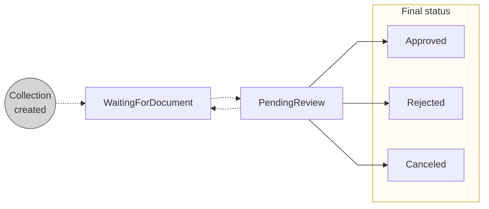
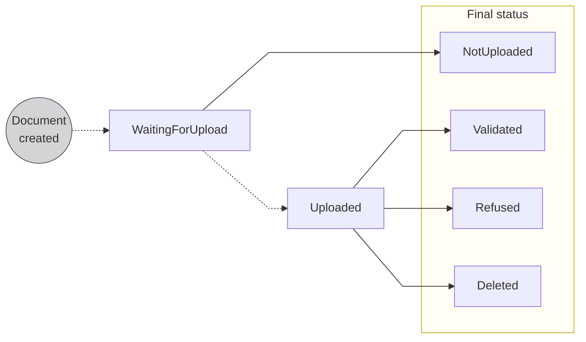

# Supporting documents

import SupportingDocumentCollectionDefinition from '../../definitions/_supporting-documents.mdx';

> <SupportingDocumentCollectionDefinition />

## Overview {#overview}

Swan is sometimes required to collect documents to verify **account holders** and **transaction details**.

Each **document** is uploaded individually into a **collection**.
After all required documents are uploaded, Swan **reviews the collection**.

Supporting document **collections are empty when created**.
Swan can upload some documents, and you can add documents to these collections as requested.
For each required document, you'll create a document within the collection.

### Options for collecting documents {#collect-documents}

There are two primary options to collect required supporting documents:

| Option | Explanation |
| --- | --- |
| **Use the API**  ✅ Recommended | <ol><li>No emails are exchanged.</li><li>You'll know every time a document is needed with webhook notifications.</li><li>You communicate with your end users to gather the required documents.</li><li>Choose the API or the Dashboard for most actions, including uploading documents.</li></ol> |
| Email communication | <ol><li>Swan communicates directly with you or your end users.</li><li>You or your end user receives an email.</li></ol> |

### Required documents {#required-documents}

Documents might be required to support verifying an account holder or proving the validity of a transaction.
The documents required vary significantly depending on why Swan needs to collect the documents, where your users are located, whether they're onboarding as individuals or companies, and more.

:::info Onboarding tip
For a better user experience, always include a [list of required documents](../../onboarding/overview/guide-get-list.mdx) when you create the onboarding link to onboard a new account holder.
:::

## Statuses {#statuses}

Collections and documents have unique statuses.

### Collection statuses {#collection-statuses}

| Collection status | Explanation |
|---|---|
| `Waiting for document` | Onboarding is created and ready for documents, or documents were submitted but Swan is requesting additional documents  **Next step**: moves to `Pending review` after onboarding is finalized |
| `Pending review` | Onboarding is finalized and a document review is needed  **Next step**: Can move to `Approved`, `Rejected`, or `Canceled` depending on partner actions and Swan decisions (or, if documents are insufficient → `Waiting for document`) |
| `Approved` | Swan approved the supporting document collection |
| `Rejected` | Swan rejected the supporting document collection |
| `Canceled` | Swan canceled the supporting document collection (this could also be at the partner's request) |

### Document statuses {#document-statuses}

| Document status | Explanation |
|---|---|
| `Waiting for upload` | URL to upload the document has been generated  **Next step**: <ul><li>If the document is uploaded → `Uploaded`</li><li>If the collection switches to a final status before the document is uploaded → `Not uploaded`</li></ul> |
| `Uploaded` | Document is uploaded; if a review is completed on the uploaded document, the status moves to `Validated`, `Refused`, or `Deleted` depending on Partner actions and Swan decisions |
| `Validated` | Swan approved the document |
| `Refused` | Swan refused the document |
| `Deleted` | Swan or the partner deleted the document |
| `Not uploaded` | URL was generated but collection was closed before a document was uploaded |

## Document purposes and types {#document-purposes-types}

For all supporting documents, there is a high-level **purpose** and a more specific **type** (`supportingDocumentPurpose` and `supportingDocumentType`).
Both purpose and type can be exposed in the onboarding success payload.

**Common purposes** (not exhaustive):

* `CompanyRegistration`
* `SignedStatus`
* `ProofOfAddress`
* `ProofOfIncome`
* `Other`

## Guides {#guides}

Use the following guides to manage required documents for the onboarding process.

* [Upload a document](./guide-upload.mdx)
* [Get information about a collection or document](./guide-get-info.mdx)
* [Request a collection review](./guide-request-collection-review.mdx)
* [Delete a document](./guide-delete.mdx)
* [Sandbox](./sandbox.mdx)