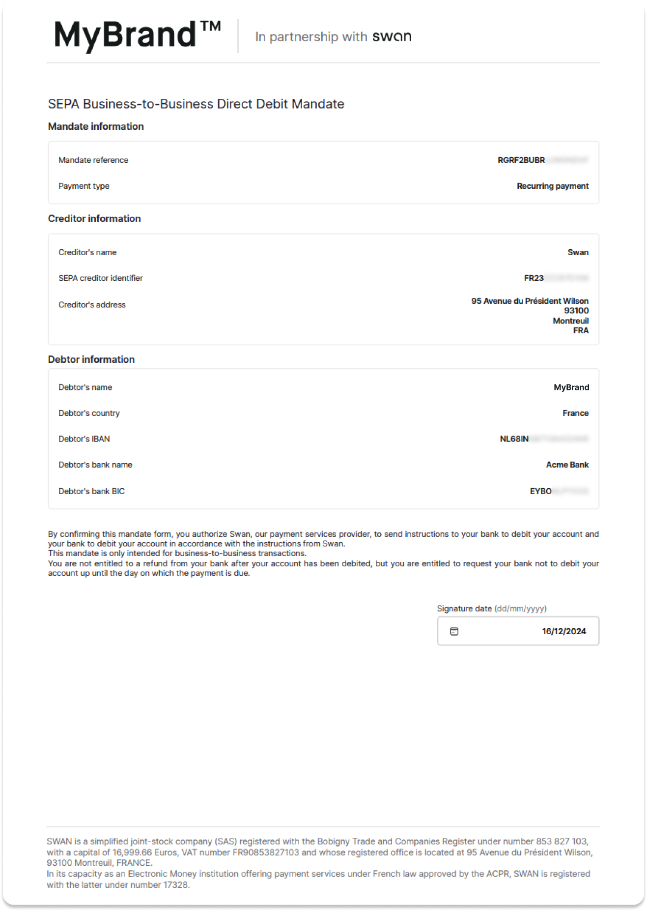

# Add a SEPA Direct Debit B2B funding source

Add a SEPA Direct Debit B2B funding source with the API.

:::tip Prerequisites
1. The non-Swan account used as the funding source belongs to the Swan account holder.
1. Call the mutation with a user access token associated with the account holder. The account holder needs to sign the direct debit mandate by consenting to the [sensitive operation](../../users/consent/index.mdx#sensitive) of adding a funding source.
1. The user adding the funding source is either an account member with the `canManageAccountMembership` and `canViewAccount` [permissions](../memberships/index.mdx#permissions), or the account holder.
:::

## Step 1: Add the funding source {#add-source}

1. Call the `addDirectDebitFundingSource` mutation.
1. Choose the `SepaDirectDebitB2b` scheme. Though `Core` is an option in the API, it's not actually available for account funding.
1. Add your `accountId`, `iban`, `consentRedirectUrl`, and a `name` for your funding source (name is primarily for your reference).
1. Add the `AddDirectDebitFundingSourceSuccessPayload` success payload.
1. Add the consent URL to the success payload: `fundingSource` > `DirectDebitFundingSource` > `paymentMandate` > `SEPAPaymentDirectDebitMandate` > `statusInfo` > `PaymentMandateConsentPendingStatusInfo` > `consent` > `consentUrl`.
1. Add rejections (not shown).

🔎 [Open the mutation in API Explorer](https://explorer.swan.io?query=bXV0YXRpb24gQWRkU2RkQjJiIHsKICBhZGREaXJlY3REZWJpdEZ1bmRpbmdTb3VyY2UoCiAgICBpbnB1dDogewogICAgICBzY2hlbWU6IFNlcGFEaXJlY3REZWJpdEIyYgogICAgICBhY2NvdW50SWQ6ICIkWU9VUl9BQ0NPVU5UX0lEIgogICAgICBpYmFuOiAiJFlPVVJfSUJBTiIKICAgICAgY29uc2VudFJlZGlyZWN0VXJsOiAiJFlPVVJfUkVESVJFQ1RfVVJMIgogICAgICBuYW1lOiAiWW91ciBmdW5kaW5nIHNvdXJjZSBuYW1lIgogICAgfQogICkgewogICAgLi4uIG9uIEFkZERpcmVjdERlYml0RnVuZGluZ1NvdXJjZVN1Y2Nlc3NQYXlsb2FkIHsKICAgICAgX190eXBlbmFtZQogICAgICBmdW5kaW5nU291cmNlIHsKICAgICAgICAuLi4gb24gRGlyZWN0RGViaXRGdW5kaW5nU291cmNlIHsKICAgICAgICAgIGlkCiAgICAgICAgICBuYW1lCiAgICAgICAgICBwYXltZW50TWFuZGF0ZSB7CiAgICAgICAgICAgIC4uLiBvbiBTRVBBUGF5bWVudERpcmVjdERlYml0TWFuZGF0ZSB7CiAgICAgICAgICAgICAgaWQKICAgICAgICAgICAgICBuYW1lCiAgICAgICAgICAgICAgc3RhdHVzSW5mbyB7CiAgICAgICAgICAgICAgICAuLi4gb24gUGF5bWVudE1hbmRhdGVDb25zZW50UGVuZGluZ1N0YXR1c0luZm8gewogICAgICAgICAgICAgICAgICBfX3R5cGVuYW1lCiAgICAgICAgICAgICAgICAgIGNvbnNlbnQgewogICAgICAgICAgICAgICAgICAgIGNvbnNlbnRVcmwKICAgICAgICAgICAgICAgICAgfQogICAgICAgICAgICAgICAgfQogICAgICAgICAgICAgIH0KICAgICAgICAgICAgfQogICAgICAgICAgfQogICAgICAgIH0KICAgICAgfQogICAgfQogICAgLi4uIG9uIEZvcmJpZGRlblJlamVjdGlvbiB7CiAgICAgIF9fdHlwZW5hbWUKICAgICAgbWVzc2FnZQogICAgfQogICAgLi4uIG9uIE5vdEZvdW5kUmVqZWN0aW9uIHsKICAgICAgaWQKICAgICAgbWVzc2FnZQogICAgfQogICAgLi4uIG9uIEFjY291bnRWZXJpZmljYXRpb25BbHJlYWR5UmVqZWN0ZWRSZWplY3Rpb24gewogICAgICBfX3R5cGVuYW1lCiAgICAgIG1lc3NhZ2UKICAgIH0KICAgIC4uLiBvbiBJQkFOTm90UmVhY2hhYmxlUmVqZWN0aW9uIHsKICAgICAgX190eXBlbmFtZQogICAgICBtZXNzYWdlCiAgICB9CiAgICAuLi4gb24gVmFsaWRhdGlvblJlamVjdGlvbiB7CiAgICAgIF9fdHlwZW5hbWUKICAgICAgbWVzc2FnZQogICAgICBmaWVsZHMgewogICAgICAgIGNvZGUKICAgICAgICBtZXNzYWdlCiAgICAgICAgcGF0aAogICAgICB9CiAgICB9CiAgfQp9Cg%3D%3D&tab=api)

```graphql {4,11,25} showLineNumbers
mutation AddSddB2b {
  addDirectDebitFundingSource(
    input: {
      scheme: SepaDirectDebitB2b
      accountId: "$YOUR_ACCOUNT_ID"
      iban: "$YOUR_IBAN"
      consentRedirectUrl: "$YOUR_REDIRECT_URL"
      name: "Your funding source name"
    }
  ) {
    ... on AddDirectDebitFundingSourceSuccessPayload {
      __typename
      fundingSource {
        ... on DirectDebitFundingSource {
          id
          name
          paymentMandate {
            ... on SEPAPaymentDirectDebitMandate {
              id
              name
              statusInfo {
                ... on PaymentMandateConsentPendingStatusInfo {
                  __typename
                  consent {
                    consentUrl
                  }
                }
              }
            }
          }
        }
      }
    }
  }
}

```

## Step 2: Consent to adding the funding source {#consent}

1. Share the `consentUrl` (line 14) with your Swan account holder so they can consent to adding the funding source.

Note you also receive a funding source ID (line 6) and a payment mandate ID (line 9).

```json {6,9,14} showLineNumbers
{
  "data": {
    "addDirectDebitFundingSource": {
      "__typename": "AddDirectDebitFundingSourceSuccessPayload",
      "fundingSource": {
        "id": "$YOUR_FUNDING_SOURCE_ID",
        "name": "Your funding source name",
        "paymentMandate": {
          "id": "$YOUR_PAYMENT_MANDATE_ID",
          "name": null,
          "statusInfo": {
            "__typename": "PaymentMandateConsentPendingStatusInfo",
            "consent": {
              "consentUrl": "https://identity.swan.io/consent?consentId=$CONSENT_ID&env=Sandbox"
            }
          },
          "mandateDocumentUrl": ""
        }
      }
    }
  }
}
```

## Step 3: Get the payment mandate {#get-mandate}

:::tip Funding source and mandate `Enabled`
After the account holder consents to the adding the funding source, the statuses for both the funding source and the direct debit mandate change to `Enabled`, and funds can be pulled into the Swan account.
:::

Get the `mandateDocumentUrl` in order to download the mandate to declare to the non-Swan account provider.

1. Call the `fundingSource` query.
1. Add the funding source ID (provided in the step 2 payload, line 6)
1. Add the `mandateDocumentUrl` to the payload (line 10).


🔎 [Open the query in API Explorer](https://explorer.swan.io?query=cXVlcnkgR2V0TWFuZGF0ZVVybCB7CiAgZnVuZGluZ1NvdXJjZShpZDogIiRZT1VSX0ZVTkRJTkdfU09VUkNFX0lEIikgewogICAgLi4uIG9uIERpcmVjdERlYml0RnVuZGluZ1NvdXJjZSB7CiAgICAgIGlkCiAgICAgIG5hbWUKICAgICAgcGF5bWVudE1hbmRhdGUgewogICAgICAgIC4uLiBvbiBTRVBBUGF5bWVudERpcmVjdERlYml0TWFuZGF0ZSB7CiAgICAgICAgICBpZAogICAgICAgICAgbmFtZQogICAgICAgICAgbWFuZGF0ZURvY3VtZW50VXJsCiAgICAgICAgfQogICAgICB9CiAgICB9CiAgfQp9Cg%3D%3D&tab=api)

```graphql {2,10} showLineNumbers
query GetMandateUrl {
  fundingSource(id: "$YOUR_FUNDING_SOURCE_ID") {
    ... on DirectDebitFundingSource {
      id
      name
      paymentMandate {
        ... on SEPAPaymentDirectDebitMandate {
          id
          name
          mandateDocumentUrl
        }
      }
    }
  }
}
```


## Step 4: Declare the mandate to the external account {#declare}

The account holder **must declare** the mandate to the provider of their non-Swan account.

1. Open the `mandateDocumentUrl` provided in the payload (line 9), which automatically triggers the download of the SEPA Direct Debit payment mandate document (as a PDF file).
1. Provide the payment mandate document to the account holder.
1. Instruct the account holder to declare the payment mandate to the provider of their non-Swan account.

```json {9} showLineNumbers
{
  "data": {
    "fundingSource": {
      "id": "$YOUR_FUNDING_SOURCE_ID",
      "name": "Your funding source name",
      "paymentMandate": {
        "id": "$YOUR_PAYMENT_MANDATE_ID",
        "name": "Your mandate name",
        "mandateDocumentUrl": "https://mandate.swan.io/$YOUR_FUNDING_SOURCE_ID/SANDBOX/FR23ZZZ87D106/UkdSRjJCVUJSSkpXR05EVkY=.pdf?Expires=1734430612&Signature=$SIGNATURE"
      }
    }
  }
}
```

