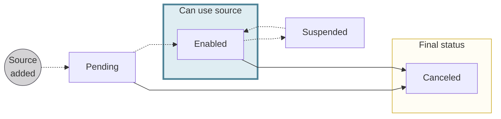
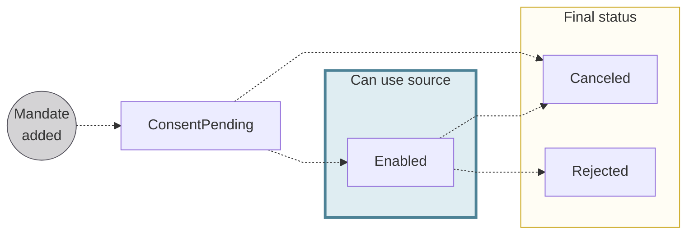

# Account funding

## Overview {#overview}

<mark>**Notes**</mark>

- A funding request can be scheduled up to 1 year ahead and at least 2 inter-bank business days ahead using the requestedExecutionAt input.

## Funding sources {#sources}

import AccountFundingDefinition from '../../definitions/_account-funding.mdx';

<AccountFundingDefinition />

Credit transfers and direct debit are both account funding **sources**.

### Credit transfers {#methods-ct}

You can fund your account with two types of credit transfers: SEPA Credit Transfer or Internal Credit Transfer.

Credit transfers are classified as **push payments**, meaning you send money *to* your Swan account *from* another source.
Push payments come with no risk because they can't be disputed.

:::info Use a credit transfer
Funding your account with a credit transfer is straightforward with no risk.
Therefore, there aren't guides dedicated to the topic; the following is all you need to know:

Use any bank account in your name to transfer money to your Swan account.
Your Swan IBAN is your identifier.
As soon as Swan receives the money, it's credited to your account immediately.

You'll see a `SepaCreditTransferIn` transaction on your account history for this transfer with the transaction status `Booked`.

**The remainder of this documentation concerns only direct debit account funding.**
:::

### Direct debit {#methods-dd}

You can fund your account with one pull option: SEPA Direct Debit.

SEPA Direct Debit B2B (business-to-business) can only be used to fund company accounts.
No refunds are authorized for the B2B funding method.

Direct debits are classified as **pull payments**, meaning the money was requested, then sent as a response by the debtor.
Pull payments come with risk because the debtor can dispute the payments.

:::caution Direct debit
Using direct debit to fund your account is more complex, so the majority of the documentation is dedicated to these funding sources.
:::

### Funding source statuses {#statuses}

| Digital card status | Explanation |
|---|---|
| `Pending` | Added a funding source with the `addDirectDebitFundingSource` mutation  **Next steps**: <mark>complete pending</mark> <ul><li>... consents, the status moves to `Enabled`</li><li>... doesn't consent, the status moves to `Canceled`</li></ul> |
| `Enabled` | Account funding source can be used |
| `Suspended` | Swan can suspend a funding source if there's suspicion of fraud; while suspended, the funding source can't be used |
| `Canceled` | Account funding source is canceled and no longer available for use |

## Payment mandates {#mandates}

import PaymentMandateDefinition from '../../definitions/_payment-mandate.mdx';

> <PaymentMandateDefinition />

Specifically for account funding, the Swan account holder gives Swan written permission to pull money from their non-Swan account.
For SEPA Direct Debit B2B, the signed payment mandate must be sent to the user's non-Swan banking institution.

In order for a SEPA Direct Debit B2B funding source to move to the status `Enabled`, the payment mandate must also have the status `Enabled`.

### Payment mandate statuses {#mandates-statuses}

| Digital card status | Explanation |
|---|---|
| `ConsentPending` | Payment mandate was added while [adding a direct debit funding source](./guide-add-source.mdx) with the `addDirectDebitFundingSource` mutation  **Next steps**: <ul><li>If the debtor consents to the mandate, the status moves to `Enabled`</li><li>If the debtor doesn't consent to the mandate, the status moves to `Canceled`</li></ul> |
| `Enabled` | Payment mandate can be used to fund the account |
| `Rejected` | <mark>Mandate was rejected....</mark> |
| `Canceled` | Payment mandate is canceled and no longer available for use  Account funding payment mandates expire 36 months after being created, or earlier if there's a suspicion of fraud |

## Rolling reserve {#rolling-reserve}

When using SEPA Direct Debit to fund your account, Swan reserves <mark>what percentage</mark> of your total transaction amount for three business days, after which the reserved amount is released to your account.
Reserved funds are typically released around 20:00 CET on the last day of the rolling reserve period.

import RollingReserveDefinition from '../../definitions/_rolling-reserve.mdx';

<RollingReserveDefinition />

## Settlement date and booked time {#settlement}

import SddBookedTime from '../../partials/_sdd-booked.mdx';

<SddBookedTime />

import DayTimeStandard from '../../partials/_day-time.mdx';

<DayTimeStandard />

## Guides {#guides}

- [Add a funding source](./guide-add-source.mdx)
- [Initiate a funding request](./guide-initiate-request.mdx)
- [Cancel a funding source](./guide-cancel-source.mdx)
- [Cancel a funding request](./guide-cancel-request.mdx)
- [Get information about a funding request](./guide-get-info.mdx)