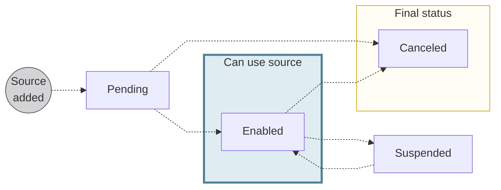
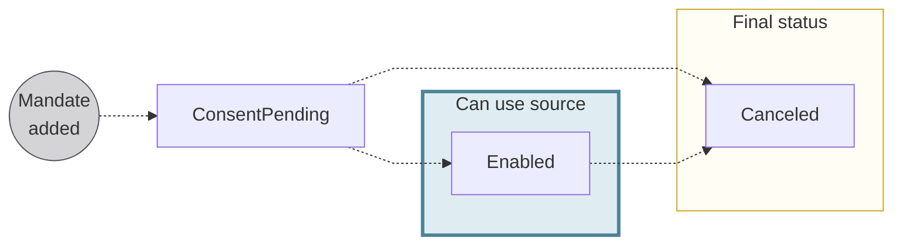
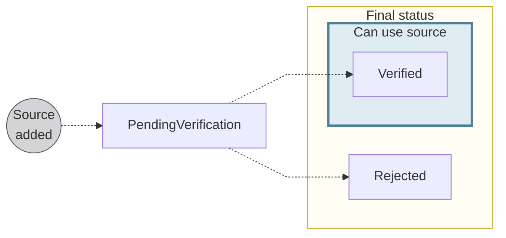
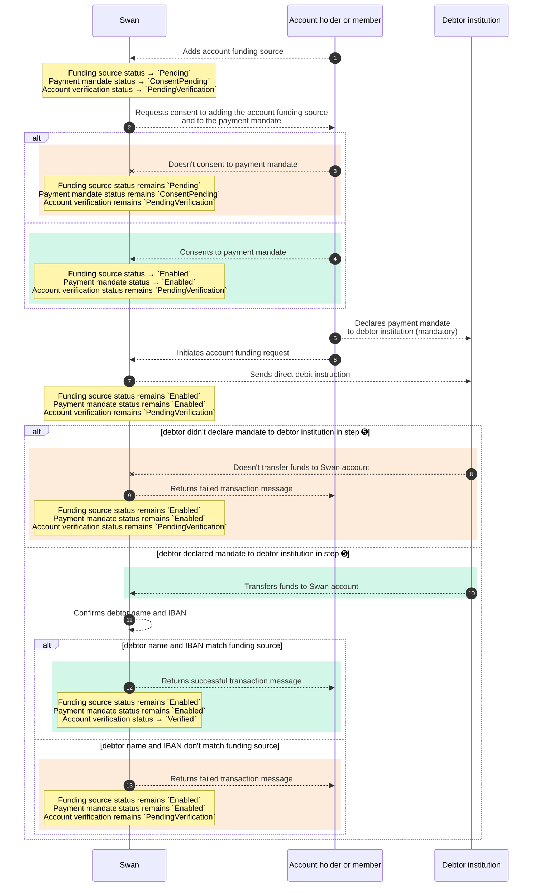

# Account funding

import AccountFundingDefinition from '../../definitions/_account-funding.mdx';

> <AccountFundingDefinition />

Account funding is essentially adding money to your Swan account.
You might use account funding if it's the first time you're sending money to your Swan account, or if you'd like to fund your Swan account on a recurring basis from an account at another financial institution.

## Funding sources {#sources}

Fund a Swan account with SEPA Direct Debit B2B.
You can also use credit transfers.

:::info Credit transfers
Funding your account with a credit transfer is straightforward with no risk.
You can use any type of [credit transfer](../../payments/credit-transfers/index.mdx) supported by Swan.
When funding an account with a credit transfer, a `SepaCreditTransferIn` transaction with the status `Booked` appears on your transaction history.
:::

### SEPA Direct Debit B2B {#methods-dd}

You can fund your account with one pull option: SEPA Direct Debit B2B (business-to-business).
SEPA Direct Debit B2B can only be used to fund company accounts, and no refunds are authorized for this funding source.

There are several steps to fund an account with SEPA Direct Debit B2B:

1. Add the SEPA Direct Debit B2B funding source.
1. Consent to adding the funding source.
1. Get the payment mandate with the API.
1. Declare the payment mandate to the external account provider.
1. Initiate an account funding payment request.

[Add a SEPA Direct Debit B2B funding source](./guide-add-source.mdx) discusses steps 1-4 in detail.
For more information about step 5, refer to the guide to [initiate a funding request](./guide-initiate-request.mdx).

:::caution SDD Core
SEPA Direct Debit Core isn't supported for account funding.
:::

### Funding source statuses {#funding-source-statuses}

| Funding source status | Explanation |
|:---:|---|
| `Pending` | A SEPA Direct Debit B2B funding source was added with the API mutation `addDirectDebitFundingSource`, but consent hasn't been received yet. |
| `Enabled` | The account funding source is consented to and can be used. |
| `Suspended` | Swan can suspend a funding source if there's suspicion of fraud. While suspended, the funding source can't be used. |
| `Canceled` | The account funding source is canceled and no longer available for use. Swan account holders and eligible account members can cancel a funding source. The associated payment mandate is also `Canceled`. |

*API Reference: [`FundingSourceStatusInfo`](https://api-reference.swan.io/interfaces/funding-source-status-info)*

## Payment mandates {#mandates}

import PaymentMandateDefinition from '../../definitions/_payment-mandate.mdx';

> <PaymentMandateDefinition />

For account funding, the Swan account holder or eligible account member gives Swan explicit permission to pull money from their non-Swan account.
For SEPA Direct Debit B2B the signed payment mandate or payment mandate information must be declared to the user's non-Swan banking institution.

Consenting to the direct debit mandate updates the status to `Enabled` for both the mandate and the funding source.

### Signing payment mandates {#mandates-signature}

The Swan account holder or eligible account member consents to the account funding source payment mandate through [Strong Customer Authentication (SCA)](../../users/consent/index.mdx#sca).
Swan takes the SCA validation time as the `signatureDate` for the payment mandate—even though the SCA isn't technically a signature.

Swan doesn't provide a method to collect a real signature.
As a Swan Partner, it's your responsibility to manage the real payment mandate signature, as you might be required to provide proof of signature if requested by the funding source's financial institution.

### Payment mandate statuses {#mandates-statuses}

| Payment mandate status | Explanation |
| :---: |---|
| `ConsentPending` | Payment mandate was added while [adding a direct debit funding source](./guide-add-source.mdx) with the `addDirectDebitFundingSource` mutation.  **Next steps**: <ul><li>If the debtor consents to the mandate, the status moves to `Enabled`.</li><li>If the debtor doesn't consent, the status remains `ConsentPending`.</li></ul> |
| `Enabled` | Payment mandate is active and valid, and the corresponding funding source (if also `Enabled`) can be used to fund the account.  *The account holder or eligible account member **must declare** the payment mandate to their debtor institution.*  |
| `Canceled` | When a funding source is `Canceled`, the associated payment mandate status also changes to `Canceled`. |
| `Rejected` | The `Rejected` status isn't used for account funding. |

*API Reference: [`PaymentMandateStatusInfo`](https://api-reference.swan.io/interfaces/payment-mandate-status-info)*

## Account verification for funding sources {#account-verification}

Swan is required to confirm that an account holder or eligible account member has access to the external account they'd like to use to fund a Swan account.
Swan refers to this process as account verification for funding sources.

:::note
Account verification for funding sources **isn't related** to [account holder verification status](../../onboarding/account-holders/index.mdx#verification-process-statuses) used during account onboarding, or the general [account status](../index.mdx#statuses).
:::

### Account verification statuses {#account-verification-statuses}

| Account verification status | Explanation |
|:---:|---|
| `PendingVerification` | The funding source was added, and account verification for the funding source is in progress.  *Please note that the funding source status can be `Enabled` even if the account verification status is `PendingVerification`.* |
| `Verified` | Swan verified that the external account used for funding is accessible to the account holder or eligible account member funding the Swan account. This typically means that a first account funding attempt was successful. |
| `Rejected` | Swan couldn't verify that the external account used for funding is accessible to the account holder or eligible account member funding the Swan account. |

*API Reference: [`AccountVerificationStatusInfo`](https://api-reference.swan.io/interfaces/account-verification-status-info)*

## Interaction between statuses {#status-interaction}

Account funding involves three distinct statuses: [funding sources](#funding-source-statuses), [payment mandates](#mandates-statuses), and [account verification](#account-verification-statuses).

Review the following sequence diagram to understand how statuses interact with each other.
Note one key action for the account holder or eligible account member: they **must declare the payment mandate** to their debtor institution ➎.

> ∗ When the debtor institution transfers funds to the Swan account, Swan confirms that the debtor name and IBAN match the name and IBAN provided for the funding source.
> If they don't match, 

## Rolling reserve {#rolling-reserve}

When using SEPA Direct Debit B2B to fund your account, Swan reserves 100% of your transaction for three business days, after which the reserved amount is released to your account.
Reserved funds are typically released around 20:00 Central European [Summer] Time (CET/CEST) on the last day of the rolling reserve period.
[Query the API](./guide-get-info.mdx#guide-release-date) for an account funding transaction release date.

import RollingReserveDefinition from '../../definitions/_rolling-reserve.mdx';

<RollingReserveDefinition />

## Settlement date and booked time {#settlement}

import SddBookedTime from '../../partials/_sdd-booked.mdx';

<SddBookedTime />

import DayTimeStandard from '../../partials/_day-time.mdx';

<DayTimeStandard />

## Scheduling funding requests {#scheduling}

If you use `requestedExecutionAt` when initiating your funding requests, you can schedule them up to one year in advance.
Your scheduled requests must be for at least two business days in the future.

## Guides {#guides}

- [Add a funding source](./guide-add-source.mdx)
- [Initiate a funding request](./guide-initiate-request.mdx)
- [Cancel a funding source](./guide-cancel-source.mdx)
- [Get information about a funding source and request](./guide-get-info.mdx)
    - Get information about a source
    - Get a list of sources
    - Get a funding transaction release date
- [Sandbox](./sandbox.mdx)