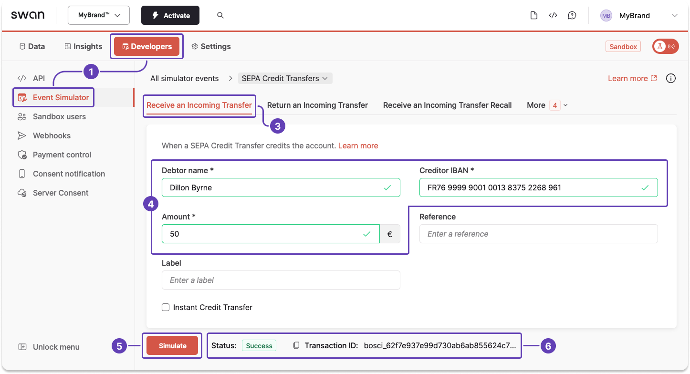
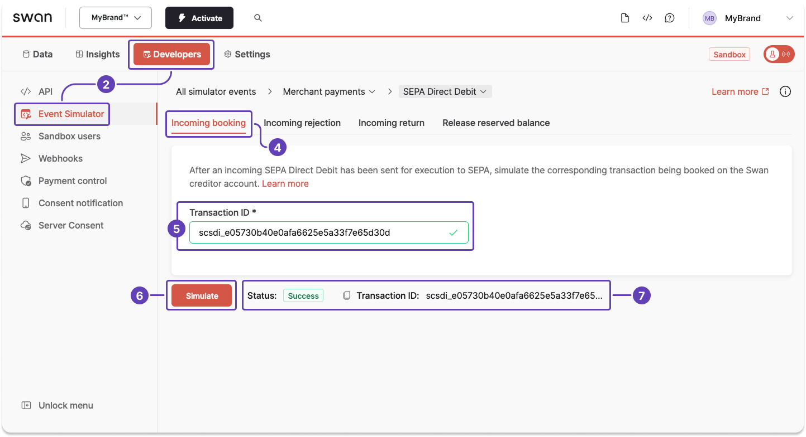

# Sandbox: Account funding

## Simulate funding an account with a credit transfer {#simulate-fund-credit-transfer}

In Sandbox, simulate receiving a credit transfer to fund an account with the [Event Simulator](../../../developers/tools/event-simulator.mdx) and a fake debtor.

1. Open the Event Simulator (**Dashboard** > **Developers** > **Event Simulator**).
1. Go to **SEPA Credit Transfers** (not shown).
1. Go to the **Receive an incoming transfer** tab.
1. Enter the debtor name, the creditor IBAN (your Swan IBAN), and the amount.
1. Click **Simulate**.
1. A success message appears, indicating that the transaction is `Booked` to your Sandbox account.

## Simulate booking an account funding direct debit transaction {#simulate-fund-direct-debit}

In Sandbox, simulate booking a direct debit account funding transaction with the [Event Simulator](../../../developers/tools/event-simulator.mdx).
Use the merchant payments section of the Event Simulator, even though it's an account funding exercise.

1. [Initiate a funding request](./guide-initiate-request.mdx), which creates a `Upcoming` transaction.
1. Open the Event Simulator (**Dashboard** > **Developers** > **Event Simulator**).
1. Go to **Merchant payments** > **SEPA Direct Debit** (not shown).
1. Go to the **Incoming booking** tab.
1. Enter the transaction ID from the funding request transaction initiated in step 1, provided in the payload.
1. Click **Simulate**.
1. A success message appears, indicating that the transaction is `Booked` to your Sandbox account.

:::info Rolling reserve
Funds are `Reserved` and subject to the [account funding rolling reserve policy](./index.mdx#rolling-reserve).
:::

