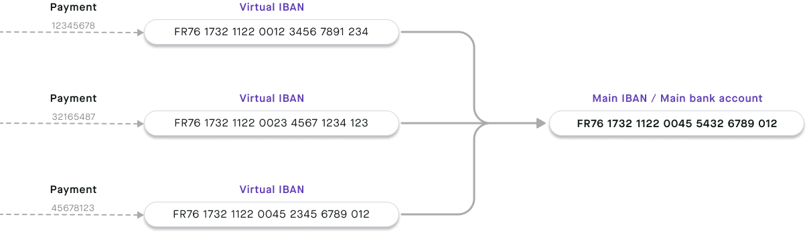

# IBANs

## Overview {#overview}

import IbanDefinition from '../../definitions/_iban.mdx';

<IbanDefinition />

With IBANs, you can send and receive SEPA Credit Transfers and SEPA Direct Debit transactions.

Swan provides two types of IBANs:

- **Main IBANs**: Each Swan account is assigned a single primary IBAN.
- **Virtual IBANs**: Swan accounts can add an unlimited number of virtual IBANs.

Additionally, Swan IBANs begin with one of several country prefixes, making them **local** to those countries.

### Verifying IBANs

Swan [verifies specific beneficiary IBANs](../../payments/credit-transfers/sepa/index.mdx#beneficiary-verification) to help reduce errors and potential fraud.

Additionally, the **format** of your IBANs must be correct when you use them with Swan's API.
Use the `ibanValidation` query the confirm that your [IBAN follows the expected format](./guide-validate.mdx).

## Local IBANs {#local}

Local IBANs aren't a different type of IBAN, but rather a **characteristic** of both main and virtual IBANs.
With local IBANs, you can choose (within regulations) the country prefix for your Swan IBANs.

The country prefix for local IBANs is determined by the [account country](../index.mdx#account-country).
Swan must comply with different requirements depending on local laws.
Bank Identifier Codes (BIC) are also unique to each account county.

Local IBANs are available for the following countries.
Refer to [Swan's public roadmap](https://swanio.notion.site/Swan-Public-Roadmap-385e4b2e91b3409786a6c8e885654a22) to see which local IBANs are on the way.

  
🇫🇷 **France →** IBAN: `FR76 1732 8844 00XX XXXX XXXX XYY` | BIC: `SWNBFR22`

  

French IBANs consist of 34 letters and numbers. 
Each set of characters represents a different account detail.

| Character set | Explanation |
| ---: | :--- |
| **FR** | France's country code |
| **76** | Check digits |
| **17328** | Swan's French bank code |
| **84400** | Swan's French branch code for main IBANs (virtual IBANs: **89900**) |
| **XXXX XXXX X** | 11-digit account number (not applicable for virtual IBANs) |
| **YY** | Two-digit RIB key RIB, or *relevé d'identité bancaire*, are [Swan's bank details PDF](../index.mdx#bank-details) |
| **SWNBFR22** | Swan's French Bank Identifier Code (BIC) |
  

  
🇩🇪 **Germany →** IBAN: `DEYY 1001 4000 XXXX XXXX XX` | BIC: `SWNBDEBB`

  

German IBANs consist of 22 letters and numbers. 
Each set of characters represents a different account detail.

| Character set | Explanation |
| ---: | :--- |
| **DE** | Germany's country code |
| **YY** | IBAN check digits |
| **1001 4000** | Swan's German bank code for main IBANs (virtual IBANs: **1001 4001**) |
| **XXXX XXXX XX** | 10-digit account number (not applicable for virtual IBANs) |
| **SWNBDEBB** | Swan's German Bank Identifier Code (BIC) |
  

  
🇳🇱 **Netherlands →** IBAN: `NLYY SWNB ZXXX XXXX XX` | BIC: `SWNBNL22`

  

Dutch IBANs consist of 18 letters and numbers. 
Each set of characters represents a different account detail.

| Character set | Explanation |
| ---: | :--- |
| **NL** | Netherland's country code |
| **YY** | IBAN check digits |
| **SWNB** | Swan's bank code |
| **Z** | IBAN type (1-4: main IBAN; 5-9: virtual IBAN) |
| **XXX XXXX XX** | 10-digit account number (not applicable for virtual IBANs) |
| **SWNBNL22** | Swan's Dutch Bank Identifier Code (BIC) |
  

  
🇪🇸 **Spain →** IBAN: `ESYY 6724 8440 ZZXX XXXX XXXX` | BIC: `SWNBESB2`

  

Dutch IBANs consist of 24 letters and numbers. 
Each set of characters represents a different account detail.

| Character set | Explanation |
| ---: | :--- |
| **ES** | Spain's country code |
| **YY** | IBAN check digits |
| **6724** | Swan's Spanish bank code |
| **8440** | Swan's Spanish branch code for main IBANs (virtual IBANs: **8990**) |
| **ZZ** | Bank check digits |
| **XX XXXX XXXX** | 10-digit account number (not applicable for virtual IBANs) |
| **SWNBESB2** | Swan's Spanish Bank Identifier Code (BIC) |
  

## Main IBANs {#main}

Every Swan account has one main IBAN.
All virtual IBANs are connected to the main IBAN.

Main IBANs are issued when the `PaymentAccountType` changes from `EMoney` to `PaymentService`, which happens after both the [account holder verification](../../onboarding/account-holders/index.mdx#verification-process) and [onboarding](../../onboarding/index.mdx) processes are complete.

Therefore, main IBANs aren't issued until your users **complete onboarding** and **verify their identities**.

The payment account type changes automatically to `PaymentService` when the onboarding status is `Finalized` and the identification status is `Verified`.
You don't need to do anything on your end to update the account type.

Note that the account's `PaymentLevel` can be `Limited` when issued the main IBAN.

## Virtual IBANs {#virtual}

You can create multiple virtual IBANs for one account, which can be used to accept payments.
Differentiate between main and virtual IBANs thanks to different branch codes.
Note that virtual IBANs can't be used to make payments.

To add virtual IBANs, the `PaymentAccountType` must be `PaymentService` and the `PaymentLevel` must be `Unlimited`.
Virtual IBANs can be canceled, but they can't be suspended.

View an account's virtual IBANs on your **Dashboard** > **Data** > **Accounts** > **Virtual IBANs**, or with the API by querying `account` > `virtualIbanEntries`.
If you use [Swan's Web Banking frontend](https://swan-io.github.io/swan-partner-frontend/specs/banking/account#virtual-ibans), your users can view their virtual IBANs on **Account** > **Virtual IBANs**.

Account holders can use virtual IBANs to receive SEPA Credit Transfers and to set up incoming SEPA Direct Debit transactions.

 

Consider two **possible use cases** for virtual IBANs:

1. Make paying invoices with credit transfers smoother. Provide a different virtual IBAN to each client. You'll know exactly who is paying you, plus when and how much, simplifying reconciliation.
1. Direct debit risk management becomes easier. Block direct debit on certain IBANs or generate dedicated virtual IBANs for a specific supplier.

## Guides {#guides}

- [Validate the format of an IBAN](./guide-validate.mdx)
- [Add a virtual IBAN](./guide-add-virtual.mdx)
- [Cancel a virtual IBAN](./guide-cancel-virtual.mdx)
- [Get information about an IBAN](./guide-get-info.mdx)