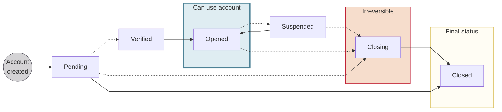

# Accounts overview

Use Swan accounts to receive and initiate payments, as well as deposit money.
All money moves through accounts, so if you're using Swan, you're using an account.

Swan accounts are based **in euros (€)** and are represented by an IBAN and a name.
Get information about the account with the `account` query, and update information such as the name with the `updateAccount` [mutation](https://explorer.swan.io?query=bXV0YXRpb24gQ2hhbmdlTGFuZ3VhZ2UgewogIHVwZGF0ZUFjY291bnQoCiAgICBpbnB1dDogeyBhY2NvdW50SWQ6ICIkWU9VUl9BQ0NPVU5UX0lEIiwgbmFtZTogIiRORVdfQUNDT1VOVF9OQU1FIiB9CiAgKSB7CiAgICAuLi4gb24gVXBkYXRlQWNjb3VudFN1Y2Nlc3NQYXlsb2FkIHsKICAgICAgX190eXBlbmFtZQogICAgICBhY2NvdW50IHsKICAgICAgICBuYW1lCiAgICAgICAgdXBkYXRlZEF0CiAgICAgIH0KICAgIH0KICB9Cn0K&tab=api).

:::info Creating accounts
Accounts, along with [account holders](../onboarding/account-holders/index.mdx), are created during the [account onboarding](../onboarding/index.mdx) process.
:::

## Account country {#account-country}

You **choose your account's country** during the **onboarding** process.
The account country then determines IBAN country codes.
For example, consider the sample mutation to [create an individual onboarding link](../onboarding/individual/guide-create.mdx#mutation).
The account country chosen on line 4 is France (`accountCountry: FRA`).
All IBANs associated with this account have the prefix `FR`.

Swan offers the following account countries:

import AccountCountryList from '../partials/_account-countries.mdx';

<AccountCountryList />

### Resident and non-resident accounts {#account-country-residence}

The account country **isn't always** the country where the account holder resides.
Your users can have a Swan account regardless of where they live as Swan supports accounts for both residents and non-residents.

- **Resident account**: The account holder lives in the account country.
- **Non-resident account**: The account holder lives outside the account country. These accounts often require reporting as a foreign account to the account holder's local tax authority.

:::caution Thorough account holder review
Opening accounts is subject to a [thorough verification](../onboarding/account-holders/index.mdx#verifying-account-holders), regardless of residence or account country.
:::

## Account language {#account-language}

Choose the account language when creating onboarding links for [individuals](../onboarding/individual/guide-create.mdx) and [companies](../onboarding/company/guide-create.mdx).

After the account is created, you can change the account language with the `updateAccount` [mutation](https://explorer.swan.io?query=bXV0YXRpb24gQ2hhbmdlTGFuZ3VhZ2UgewogIHVwZGF0ZUFjY291bnQoaW5wdXQ6IHsgYWNjb3VudElkOiAiJFlPVVJfQUNDT1VOVF9JRCIsIGxhbmd1YWdlOiBkZSB9KSB7CiAgICAuLi4gb24gVXBkYXRlQWNjb3VudFN1Y2Nlc3NQYXlsb2FkIHsKICAgICAgX190eXBlbmFtZQogICAgICBhY2NvdW50IHsKICAgICAgICBsYW5ndWFnZQogICAgICB9CiAgICB9CiAgfQp9Cg%3D%3D&tab=api), or the account holder can change the language on Swan's Web Banking interface, if you're using it.

## Balances {#balances}

Accounts at Swan are designed for debit balances only.
Swan account balances can **never go below zero**, meaning Swan rejects outgoing payments if the account's `Available` balance isn't sufficient to cover the total payment amount.
The only exception is the automatic [billing of banking fees](./billing/index.mdx#fees).

There are four different account balances.

| Balance | Includes | Equal to |
| :---: | --- | --- |
| `Booked` | Transactions that are already debited or credited | Sum of all `Booked` transactions |
| `Pending` | Transactions that were authorized but haven't been debited or credited yet | Sum of all `Pending` transactions |
| `Reserved` | Transactions that require [rolling reserve](https://docs.swan.io/concept/account-funding/rolling-reserve) according to the policy for that payment method  `Reserved` amount is included in the `Booked` balance | Sum of all `Booked` transactions for which the funds are still in rolling reserve |
| `Available` | Balance that is actually available to be used | `Booked` - (`Pending` + `Reserved`) |

<h3 id="example-insufficient-funds">Example: Insufficient funds</h3>

This example involves the balances `Booked`, `Pending`, and `Available`.

1. An account has a `Booked` balance of 142€.
1. There is a `Pending` outgoing transfer request for 42€ that is still being processed. Therefore, the `Available` balance is 100€ (142€ - 42€ = 100€).
1. This account doesn't have a sufficient balance to send an outgoing payment of more than its 100€ `Available` balance. Therefore, the payment is **rejected**.

<h3 id="example-rolling-reserve">Example: Rolling reserve</h3>

This example involves the balances `Booked`, `Reserved`, and `Available`.

1. A merchant's account has a `Booked` balance of 200€ thanks to [accepting a customer's payment](../merchants/sdd/index.mdx) through SEPA Direct Debit.
1. For this example, the rolling reserve is 15% over 15 business days (exact rolling reserve amounts can change based on your contract with Swan). Therefore, the `Reserved` balance is 30€ for 15 days.
1. The `Available` balance from this transaction is 170€ for the duration of the rolling reserve period (200€ - 30€ = 170€).
1. After 15 days, the `Reserved` balance is released and the full `Available` balance is 200€.

## Account documents {#documents}

### Account statements {#statements}

Each month, Swan **generates account statements** automatically for **all Swan accounts**.
Statements include all `Booked` transactions from the previous month.
Access account statements with the API, from your Dashboard, or, if you're using it, Swan's Web Banking interface.

Account statements are available in `.pdf` or `.csv` format by default.
Statements with more than 10,000 transactions are generated as `.csv` files, even if you request `.pdf`.

You can also access the raw data and generate custom statements.
For example, you might need a format Swan doesn't provide, or you might want customize the style. 
However, even if you use custom statements, Swan generates statements each month.
As a regulated financial institution, this is a compliance issue; if audited, Swan's account statement is the official version.

Account statements are accessible by calling the `account` query and adding the `statement` object.

### Bank details {#bank-details}

You can get a PDF containing your bank details using the API.
In French, this document is called a **RIB**, or a *relevé d'identité bancaire*.

For all accounts created after 16 November 2023, the PDF is generated automatically after the account's main IBAN is assigned, meaning the account must have the payment level `Unlimited` and the account type `Payment Services`.
Note that the automatic generation might take a few minutes.
The document is generated in the account language.

If an account's bank details PDF wasn't generated automatically, you can [trigger the API](./overview/guide-get-bank-details.mdx).

Bank detail PDFs include:

1. Your logo.
1. Account's main IBAN.
1. Bank code.
1. Your company's information.
1. Disclaimer: "In partnership with Swan".
    - The disclaimer is required because [Swan assumes responsibility](../../partnership/index.mdx#license) for all sensitive banking operations. It's similar to the [statement printed on physical cards](../cards/design/index.mdx#standard) indicating that cards are issued by Swan.
1. Title of the document.
1. BIC/SWIFT code.
1. Account holder's information.

## Closing accounts {#closure}

Swan accounts close for a variety of reasons.

1. You might need to close an account. If so, refer to the [guide to request account closure](./overview/guide-close.mdx).
1. Swan can choose to close accounts.
1. Swan can close accounts in response to a request from a third party.
1. Your users might want to close their account. If so, please encourage them to follow the process documented in Swan's end-user [Support Center](https://support.swan.io/hc/en-150/articles/14642306196765-Account-closure-process).

:::info Payment for accounts in closing
You only pay for accounts with the status `Opened`.
As soon as an account enters the closure process, the status changes to `Closing` and you're no longer charged for the account.
:::

### Swan closing accounts {#closure-swan}

Swan reserves the right to close accounts, and might decide to close an account for the following reasons:

1. The account holder's identity document looks fake, stolen, or altered; the device used to complete identity verification is altered; or the applicant seems to have performed identity verification against their will.
1. Suspicion of other fraudulent activity or activities that aren't compliant with Swan's policies.
1. The onboarding, identification verification, or Know Your Customer (KYC) process wasn't completed.
1. The Partner (you) is no longer working with Swan.

When closing accounts, Swan is required by law to provide a  **two-month notice** period.
More specifically, Swan waits 60 days after notifying the account holder to change the account status to `Closing`.
This provides the account holder with enough time to open an account at another financial institution before losing access to their Swan account.

Swan **can close accounts immediately** if the closure is due to fraud or a third-party request.

### Closure requested by a third party {#closure-third-party}

Swan can receive requests from third parties to close accounts.
For example, **liquidators** can request account closure if the account holder's company is being liquidated.
Additionally, **notaries** can request account closure in the case of the account holder's death.

Before accepting requests from third parties, Swan performs the following actions:

1. Swan confirms the request is **legitimate**. If the request is fraudulent, Swan doesn't comply.
1. Swan **checks the account balance**.
    - Zero balance: No action required.
    - Positive balance: Swan requests bank details from the third party, then transfers the funds.
    - Negative balance: Swan requests the third party transfer funds so the balance reaches zero.

When the account balance reaches zero, Swan changes the account status to `Closing` immediately for legitimate third-party requests.
Refer to the [account statuses](#statuses) section for an overview of what happens while an account is `Closing`.

## Account statuses {#statuses}

| Status | Explanation |
| --- | --- |
| `Closing` | While an account is closing, the following events occur:  <ol><li>All cards are canceled.</li><li>Incoming SEPA Credit Transfers are automatically returned.</li><li>All standing orders are canceled.</li><li>All SEPA Direct Debit mandates are canceled.</li><li>No new members can be added to the account.</li></ol>The account status remains `Closing` until:  <ul><li>The `Booked` balance is zero.∗</li><li>The last SEPA Direct Debit transaction happened more than 30 days ago.</li><li>The last SEPA Credit Transfer transaction happened more than 5 days ago.</li></ul> |
| `Closed` | For all `Closed` accounts, access and account statements remain available for one year through the API or with Swan's Web Banking interface. |

:::caution Remaining funds in Closing account ∗
As long as the `Booked` balance doesn't equal zero:

1. The account status can't pass from `Closing` to `Closed`.
1. The account holder can still log into their Swan Web Banking interface.
1. The account holder can send SEPA Credit Transfers.

If funds remain in a `Closing` account **after 10 years**, Swan transfers the funds to France's *Caisse des dépôts et consignations* (Deposits and Consignments Fund).
:::

## Guides {#guides}

- [Close an account](./overview/guide-close.mdx)
- [Generate an account statement](./overview/guide-generate-statement.mdx)
- [Get bank details PDF](./overview/guide-get-bank-details.mdx)
- Review the guide in IBANs: [Get information about an account](./ibans/guide-get-info.mdx)