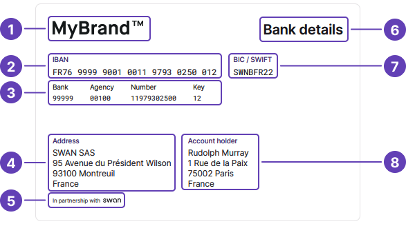
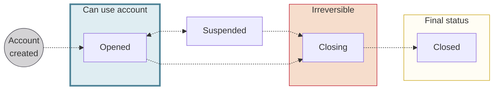

# Accounts

Use Swan accounts to receive and initiate payments, as well as deposit money.
All money moves through accounts, so if you're using Swan, you're using an account.

Swan accounts are based **in euros (€)** and are represented by an IBAN and a name.
Get information about the account with the `account` query, and update information such as the name with the `updateAccount` [mutation](https://explorer.swan.io?query=bXV0YXRpb24gQ2hhbmdlTGFuZ3VhZ2UgewogIHVwZGF0ZUFjY291bnQoCiAgICBpbnB1dDogeyBhY2NvdW50SWQ6ICIkWU9VUl9BQ0NPVU5UX0lEIiwgbmFtZTogIiRORVdfQUNDT1VOVF9OQU1FIiB9CiAgKSB7CiAgICAuLi4gb24gVXBkYXRlQWNjb3VudFN1Y2Nlc3NQYXlsb2FkIHsKICAgICAgX190eXBlbmFtZQogICAgICBhY2NvdW50IHsKICAgICAgICBuYW1lCiAgICAgICAgdXBkYXRlZEF0CiAgICAgIH0KICAgIH0KICB9Cn0K&tab=api).

:::info Creating accounts
Accounts, along with [account holders](../onboarding/account-holders/index.mdx), are created during the [account onboarding](../onboarding/index.mdx) process.
:::

## Account country {#account-country}

You **choose your account's country** during the **onboarding** process.
The account country then determines IBAN country codes.
For example, consider the sample mutation to [create an individual onboarding link](../onboarding/individual/guide-create.mdx#mutation).
The account country chosen on line 4 is France (`accountCountry: FRA`).
All IBANs associated with this account have the prefix `FR`.

Swan offers the following account countries:

import AccountCountryList from '../partials/_account-countries.mdx';

<AccountCountryList />

### Resident and non-resident accounts {#account-country-residence}

The account country **isn't always** the country where the account holder resides.
Your users can have a Swan account if they live anywhere in the European Union, as Swan allows accounts for both residents and non-residents of supported account countries.

- **Resident account**: The account holder lives in the account country.
- **Non-resident account**: The account holder lives outside the account country. These accounts often require reporting as a foreign account to the account holder's local tax authority.

:::caution Thorough account holder review
Opening accounts is subject to a [thorough verification](../onboarding/account-holders/index.mdx#verifying-account-holders), regardless of residence or account country.
:::

## Account language {#language}

Account holders choose their account language during onboarding.
You can also set the account language when creating onboarding links for [individuals](../onboarding/individual/guide-create.mdx) and [companies](../onboarding/company/guide-create.mdx).

Swan uses the account language for all **official documents** and **communications**.

After an account is created, you can [change the account language](https://explorer.swan.io?query=bXV0YXRpb24gQ2hhbmdlTGFuZ3VhZ2UgewogIHVwZGF0ZUFjY291bnQoaW5wdXQ6IHsgYWNjb3VudElkOiAiJFlPVVJfQUNDT1VOVF9JRCIsIGxhbmd1YWdlOiBkZSB9KSB7CiAgICAuLi4gb24gVXBkYXRlQWNjb3VudFN1Y2Nlc3NQYXlsb2FkIHsKICAgICAgX190eXBlbmFtZQogICAgICBhY2NvdW50IHsKICAgICAgICBsYW5ndWFnZQogICAgICB9CiAgICB9CiAgfQp9Cg%3D%3D&tab=api) with the `updateAccount` mutation.
If you use Swan's Web Banking interface, account holders can change their account language independently.

By default, **account memberships** inherit the same language as the account.
If account members choose a different preferred language than the account holder, however, they receive certain communications in their [account membership language](./memberships/index.mdx#language).

### Supported languages {#language-list}

Several account languages are available:

import Languages from '../partials/_available-languages.mdx';

<Languages />

import FinnishLimitations from '../partials/_finnish.mdx';

:::info Finnish (`fi`)
<FinnishLimitations />
:::

## Account type and level {#account-type-level}

Swan accounts are defined by a payment **level** and payment **account type**.
There are two possible values for each:

- [`PaymentLevel`](https://api-reference.swan.io/enums/payment-level) → `Limited` and `Unlimited`
- [`PaymentAccountType`](https://api-reference.swan.io/enums/payment-account-type/) → `EMoney` and `PaymentService`

Accounts start with the level `Limited` and the account type `EMoney`.
The level changes from `Limited` to `Unlimited` when the [account holder verification status](../onboarding/account-holders/index.mdx#verification-process#statuses) changes to `Verified`.
The account type changes from `EMoney` to `PaymentService` when the [account's main IBAN](./ibans/index.mdx#main) is available to the account holder.
Accounts with the level `Unlimited` and the account type `PaymentService` are fully functional accounts.

Swan accounts have different capabilities determined by the combination of these values.

| Level + Type | Capabilities |
| --- | --- |
| `Limited` + `EMoney` | ✓ The account can be used for certain actions, such as inviting account members and adding virtual cards.  ☒ Account holder verification isn't complete. ☒ The account's main IBAN isn't displayed. ☒ Payments can't be made from the account. |
| `Limited` + `PaymentService` | ✓ The account's main IBAN is displayed. ✓ Money can be added to the account.  ☒ Account holder verification isn't complete. ☒ Payments can't be made from the account. |
| `Unlimited` + `PaymentService` | ✓ Account holder verification status is `Verified`. ✓ Payments can be made from the account. ✓ The account's main IBAN is displayed. ✓ All accounts functions are possible. |

## Balances {#balances}

Accounts at Swan are designed for credit balances only.
Swan account balances can **never go below zero**, meaning Swan rejects outgoing payments if the account's `Available` balance isn't sufficient to cover the total payment amount.
The only exception is the automatic [billing of banking fees](./billing/index.mdx#fees-swan-standard).

There are four different account balances.

| Balance | Includes | Equal to |
| :---: | --- | --- |
| `Booked` | Transactions that are already debited or credited | Sum of all `Booked` transactions |
| `Pending` | Transactions that were authorized but haven't been debited or credited yet | Sum of all `Pending` transactions |
| `Reserved` | Transactions that require [rolling reserve](../../glossary.mdx#rolling-reserve) according to the policy for that payment method  `Reserved` amount is included in the `Booked` balance | Sum of all `Booked` transactions for which the funds are still in rolling reserve |
| `Available` | Balance that is actually available to be used | `Booked` + `Pending` - `Reserved`. Currently, 'Pending' is always negative, while 'Reserved' is consistently positive.|

<h3 id="example-insufficient-funds">Example: Insufficient funds</h3>

This example involves the balances `Booked`, `Pending`, and `Available`.

1. An account has a `Booked` balance of 142€.
1. There is a `Pending` outgoing transfer request for 42€ that is still being processed. Therefore, the `Available` balance is 100€ (142€ - 42€ = 100€).
1. This account doesn't have a sufficient balance to send an outgoing payment of more than its 100€ `Available` balance. Therefore, the payment is **rejected**.

<h3 id="example-rolling-reserve">Example: Rolling reserve</h3>

This example involves the balances `Booked`, `Reserved`, and `Available`.

1. A merchant's account has a `Booked` balance of 200€ thanks to [accepting a customer's payment](../merchants/online/sdd/index.mdx) through SEPA Direct Debit.
1. For this example, the rolling reserve is 15% over 15 business days (exact rolling reserve amounts can change based on your contract with Swan). Therefore, the `Reserved` balance is 30€ for 15 days.
1. The `Available` balance from this transaction is 170€ for the duration of the rolling reserve period (200€ - 30€ = 170€).
1. After 15 days, the `Reserved` balance is released and the full `Available` balance is 200€.

## Transactions {#transactions}

An account is essentially a list of transactions, and transactions directly impact account balances.

There are six possible statuses for Swan transactions.
Each payment method uses a **different combination** of these statuses with specific flows.
Refer to the schemas for [credit transfers](../payments/credit-transfers/index.mdx#statuses), [direct debits](../payments/direct-debit/index.mdx#statuses), and [cards](../payments/cards/index.mdx#statuses) for more information about statuses for that payment method.

import TransactionStatuses from '../partials/_transaction-statuses.mdx';

<TransactionStatuses />

## Account documents {#account-documents}

### Account statements {#account-statements}

Each month, Swan **generates account statements** automatically for **all Swan accounts** using Coordinated Universal Time +1 (UTC +1).
Statements include all `Booked` transactions from the previous month.

Access account statements with the API by calling the `account` query and adding the `statement` object.
They're also available from your **Dashboard** > **Data** > **Accounts**, and, if you're using it, Swan's Web Banking interface.

Account statements are available in `.pdf` or `.csv` format by default.
Statements with **more than 50,000 transactions** are generated as `.csv` files, even if you request `.pdf`.

All account statements have a `period` attribute.

- If `period` = `Monthly`, Swan generated the statement.
- If `period` = `Custom`, the statement was generated following your request.

#### Generating statements {#statements-generate}

You can [generate account statements](./overview/guide-generate-statement.mdx) for a period of up to **three months** with the `generateAccountStatement` mutation.
These statements always have `period` = `Custom`.

If you generate two statements with identical parameters (`language`, `openingDate`, `closingDate`), Swan only generates one statement.
For the second statement, Swan provides the link to the first statement generated.

If the `language` parameter changes, however, a new statement is generated in the updated language.

#### Producing custom statements {#statements-custom}

You can also access the raw data and **produce custom statements**.

For example, you might:

- Need a provide a format Swan doesn't support.
- Want to customize the style.
- Prefer to use a different timezone than Central European [Summer] Time (CET/CEST).

Note that even if you use custom statements, Swan generates statements each month.
If audited, Swan's account statement is the official version.

:::caution Custom statement approval
As a regulated financial institution, account statements fall under compliance rules.
You might need to **get your custom statements approved**. Please work with your dedicated Technical Account Manager before releasing a custom account statement.
:::

### Bank details document {#bank-details}

You can [get a PDF with your bank details](./overview/guide-get-bank-details.mdx) using the API and from Swan's interfaces.
Bank details are available for main and virtual IBANs.
In French, this document is called a **RIB**, or a *relevé d'identité bancaire*.

The PDF is generated automatically after the account's main IBAN is assigned, meaning the account must have the payment level `Unlimited` and the account type `PaymentService`.
Refer to the [account type and level section](#account-type-level) for more information about these values.

Note that the automatic generation might take a few minutes.
The document is generated in the [account language](#language).
If an account's bank details document wasn't generated automatically, call the API to generate it.

Bank details documents include:

1. Your logo.
1. Account's main IBAN.
1. Bank code.
1. Your company's information.
1. Disclaimer: "In partnership with Swan".
:::info Swan partnership disclaimer
The Swan partnership disclaimer is required because [Swan assumes responsibility](../../partnership/index.mdx#license) for all sensitive banking operations.
It's similar to the [statement printed on physical cards](../cards/design/index.mdx#standard) indicating that cards are issued by Swan.
:::

6. Title of the document.
1. BIC/SWIFT code.
1. Account holder's information.

### Transaction statements {#transaction-statements}

import TransactionStatements from '../partials/_transaction-statements.mdx';

<TransactionStatements />

Refer to the [transactions section](../payments/index.mdx#transactions-statements) for more information.

## Account statuses {#statuses}

| Status | Explanation |
| --- | --- |
| `Opened` | Account is open and can be used |
| `Suspended` | Swan can suspend an account if there's suspicion of fraud. While suspended, the account can't be used. |
| `Closing` | While an account is closing, the following events occur:  <ol><li>All cards are canceled.</li><li>Incoming SEPA Credit Transfers are automatically returned.</li><li>All standing orders are canceled.</li><li>All payment mandates for incoming SEPA Direct Debits are canceled, and any attempted incoming SEPA Direct Debit is rejected.</li><li>Your users must cancel all outgoing SEPA Direct Debits. Swan has no control over those payments mandates.</li></ol>The account status remains `Closing` until:  <ul><li>The `Booked` balance is zero.∗</li><li>The last incoming SEPA Credit Transfer happened more than 30 days ago.</li><li>The last outgoing SEPA Credit Transfer happened more than 5 days ago.</li></ul> |
| `Closed` | For all `Closed` accounts, access and account statements remain available for one year through the API or with Swan's Web Banking interface. |

:::caution Remaining funds in Closing account ∗
As long as the `Booked` balance doesn't equal zero:

1. The account status can't pass from `Closing` to `Closed`.
1. The account holder can still log into their Swan Web Banking interface.
1. The account holder can send SEPA Credit Transfers.

If funds remain in a `Closing` account **after 10 years**, Swan transfers the funds to France's *Caisse des dépôts et consignations* (Deposits and Consignments Fund).
:::

## Guides {#guides}

- [Generate an account statement](./overview/guide-generate-statement.mdx)
- [Get bank details PDF](./overview/guide-get-bank-details.mdx)
- [Get information about an account](./ibans/guide-get-info.mdx) (in IBAN section)