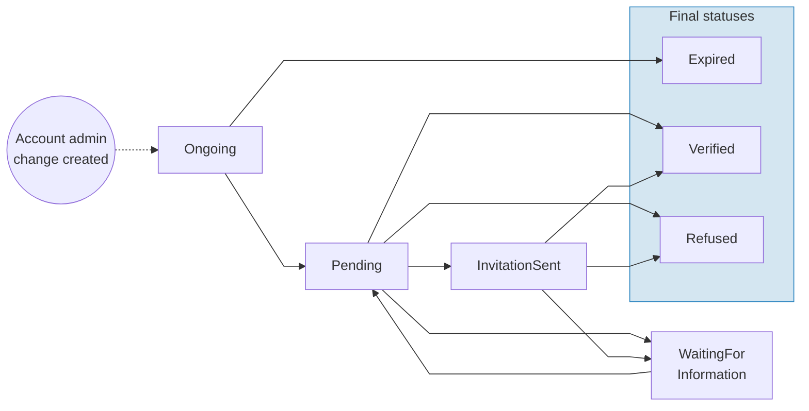

# Account administrator change

When a company needs to change the person who administers its Swan accounts, Swan provides a structured process called an **account administrator change**. This process collects information and documents about the new administrator, reviews them, and promotes the new administrator on all of the company's accounts once approved.

:::info
Account administrator changes are only available for **company** account holders. Individual accounts and self-employed account holders aren't eligible.
:::

## Overview

An account administrator change applies to **all accounts** belonging to the same account holder. There can only be one ongoing change per account holder at a time.

The process works as follows:

1. Swan's team creates the account administrator change request and generates a **form URL**.
1. Swan sends the form to the requester, who fills in the new administrator's details and uploads the required supporting documents.
1. After submission, Swan's KYC team reviews the request.
1. If everything is in order, the KYC team invites the new administrator to the accounts.
1. The new administrator accepts the invitation and verifies their identity.
1. Swan promotes the new administrator as the legal representative on all of the account holder's accounts.

The form is **unauthenticated**, meaning the requester doesn't need to be an existing account member. This allows third parties, such as a company secretary, to submit the request.

## Eligibility

To be eligible for an account administrator change, the account holder must meet all of the following conditions:

| Condition | Requirement |
| --- | --- |
| Account holder type | `Company` |
| Company subtype | `Company`, `Association`, `HomeOwnerAssociation`, or `Other` (not `SelfEmployed`) |
| Verification status | `Verified` |
| Existing change request | No ongoing account administrator change (status `Ongoing`, `Pending`, `WaitingForInformation`, or `InvitationSent`) |

## Statuses



| Status | Explanation |
| --- | --- |
| `Ongoing` | The change request was created. The requester must submit the form within **7 calendar days**. |
| `Pending` | Swan's KYC team is reviewing the submitted form. No action is required from the requester. |
| `WaitingForInformation` | The KYC team requested additional information or documents. The requester must provide the missing items. |
| `InvitationSent` | The KYC team invited the new administrator to the accounts. The new administrator must accept the invitation and verify their identity. |
| `Expired` | **Final.** The form wasn't submitted within 7 calendar days. The requester needs to start a new request. |
| `Verified` | **Final.** The KYC team approved the request and promoted the new administrator on all accounts. |
| `Refused` | **Final.** The KYC team refused the request. No changes were made. |

:::warning
When a change request expires, all form data becomes inaccessible. Swan doesn't retain the personal information entered on the expired form.
:::

## Reasons for change

When submitting the form, the requester selects a reason for the change. The reason determines which supporting documents are required.

| API value | Description |
| --- | --- |
| `CurrentAdministratorLeft` | The current administrator has left the company. |
| `InternalReorganization` | The change is due to an internal reorganization. |
| `AppointedByGeneralAssembly` | The new administrator was appointed by a general assembly. |
| `AppointedByBoardDecision` | The new administrator was appointed by a board decision. |
| `Other` | Other reason. |

## Required supporting documents

The required documents depend on the account holder's company type, whether the requester is the new administrator, and whether the new administrator is the company's legal representative.

### Core documents

This document is always required:

- **Company or association registration:** Proof of the company's or association's existence (`CompanyRegistration` or `AssociationRegistration`).

:::tip
For French companies with a valid registration number, Swan automatically retrieves the company registration document from the INPI registry.
:::

### Conditional documents

| Document | When it's required |
| --- | --- |
| `LegalRepresentativeProofOfIdentity` | The new administrator **isn't** the company's legal representative (the current legal representative's ID). |
| `PowerOfAttorney` | The new administrator **isn't** the company's legal representative. |
| `ProofOfIdentity` | The requester is **different** from the new administrator (requester's ID). |
| `GeneralAssemblyMinutes` | The company subtype is `Association` or `HomeOwnerAssociation` **and** the reason is `AppointedByGeneralAssembly`. |
| `AdministratorDecisionOfAppointment` | The company subtype is `Association` or `HomeOwnerAssociation` **and** the reason is `AppointedByBoardDecision`. |

## Requester and new administrator

The person filling out the form (the **requester**) can be the same person as the new administrator, or a different person.

- **Requester is the new administrator:** The requester provides the new administrator's details directly. No additional requester information is needed.
- **Requester is different from the new administrator:** The requester provides both their own details and the new administrator's details. An additional `ProofOfIdentity` document is required for the requester.

## API reference

:::info
The API operations listed on this page are coming soon. They'll be available starting **13 April 2026**.
:::

### Query

Use the `publicAccountAdminChange` query to retrieve the current state of an account administrator change by its ID.

```graphql
query publicAccountAdminChange($accountAdminChangeId: ID!) {
  publicAccountAdminChange(accountAdminChangeId: $accountAdminChangeId) {
    ... on AccountAdminChange {
      id
      status
      reason
      admin {
        firstName
        lastName
        email
      }
    }
    ... on NonOngoingAccountAdminChange {
      id
      status
    }
  }
}
```

The query returns one of two types:

- `AccountAdminChange`: the full object with all fields, returned when the status is `Ongoing`.
- `NonOngoingAccountAdminChange`: a limited object containing only `id` and `status`, returned for all other statuses. This protects personal information after the form is submitted.

### Mutations

| Mutation | Purpose |
| --- | --- |
| `publicUpdateAccountAdminChange` | Updates the account administrator change with new information (reason, admin details, requester details). Only works when the status is `Ongoing`. |
| `publicFinalizeAccountAdminChange` | Submits the completed form for review. Transitions the status from `Ongoing` to `Pending`. Requires all fields and documents to be provided. |

### Rejection types

| Rejection | Meaning |
| --- | --- |
| `AccountAdminChangeNotFoundRejection` | The account administrator change ID doesn't exist. |
| `AccountAdminChangeStatusNotEligibleRejection` | The current status doesn't allow this operation. |
| `AccountAdminChangeMissingInformationRejection` | Required fields are missing from the request. |
| `AccountAdminChangeMissingDocumentsRejection` | Required supporting documents haven't been uploaded. |

:::info
The supporting document collection associated with an account administrator change uses the type `AccountAdminChange`. Upload documents to this collection using the [supporting documents](/topics/accounts/documents/) flow.
:::

---

:::tip
Share the [Change your account's legal representative](https://support.swan.io/hc/en-150/articles/17763494332317-Change-your-account-s-legal-representative) Support Center article with your users. It explains the process from the account holder's perspective.
:::