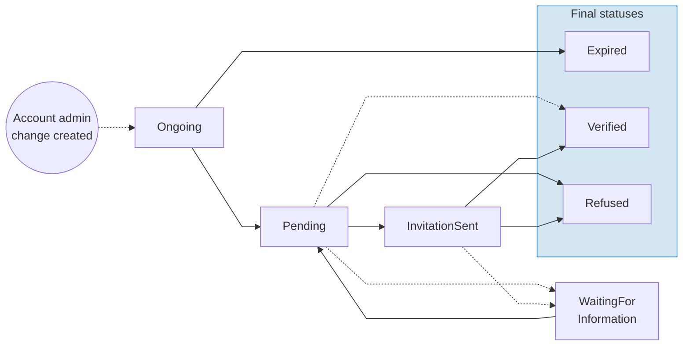

# Account administrator change

When a company needs to change the person who administers its Swan accounts, Swan provides a structured process called an **account administrator change**. This process collects information and documents about the new administrator, reviews them, and promotes the new administrator on all of the company's accounts once approved.

:::info
Account administrator changes are only available for **company** account holders. Individual accounts and self-employed account holders aren't eligible.
:::

## Overview

An account administrator change applies to **all accounts** belonging to the same account holder. There can only be one ongoing change per account holder at a time.

The form used to submit the request is **unauthenticated**, meaning the requester doesn't need to be an existing account member. This allows third parties, such as a company secretary, to submit the request.

## Process {#process}

### Step 1: Initiate the request {#initiate}

Contact Swan's support team via a **support ticket** with the account holder information (IBAN or account holder name).

- This process is not yet self-service in the Dashboard. All requests go through Swan support to keep all exchanges in a single Zendesk ticket.
- Swan processes the request, creates the account administrator change, and generates a **form URL**.
- Swan shares the form URL with you (the partner) to forward to the requester. Partners can't generate this URL themselves.
- The form URL is valid for **7 calendar days**. After expiry, the status moves to `Expired`, the supporting document collection is `Canceled`, and a new request must be initiated.

### Step 2: Submit the request form {#submit-form}

The requester opens the form URL and submits the following information:

- Requester details (if the requester is different from the new administrator).
- New account administrator details.
- Reason for the change.
- Required [supporting documents](#documents).

The form is unauthenticated, so it can be filled by any third party (for example, a company secretary or an outgoing legal representative who no longer has account access).

### Step 3: Swan reviews the request {#review}

After submission, the status moves to `Pending`. Swan's KYC team reviews the submitted documents.

- If additional information is needed, the status moves to `WaitingForInformation`. Swan generates a new dedicated document upload URL and shares it with you via the support ticket. The original form URL can no longer be used at this stage.
- After the additional documents are uploaded, the status returns to `Pending` and the review resumes.

### Step 4: New administrator receives an invitation {#invitation}

After documents are validated, Swan invites the new administrator to join all accounts belonging to the account holder. The invitation grants full permissions: `canViewAccount`, `canInitiatePayments`, `canManageAccountMemberships`, `canManageBeneficiaries`, and `canManageCards` (all `true`).

After accepting the invitation, the new administrator is automatically directed to Swan's identity verification flow. No manual link sharing is needed.

:::tip Invitation not received?
If the new administrator doesn't receive the invitation, you can resend it using the `sendAccountMembershipInviteNotification` mutation (up to 5 times per day, status must be `InvitationSent`), or contact Swan support via the support ticket.
:::

### Step 5: New administrator is promoted {#promotion}

Before promotion, the new administrator must have the required identification level for their IBAN country.

| IBAN country | Required identification level |
| --- | --- |
| France, Belgium, Italy, Netherlands, Spain | Expert |
| Germany | QES (Qualified Electronic Signature) |

How identification is handled depends on the new administrator's current level:

- **No prior identification:** The new administrator is guided through the appropriate identification process automatically after accepting the invitation.
- **Lower identification level than required:** Swan support reaches out with a link to complete the appropriate process. The status remains `InvitationSent` until the required level is achieved.
- **Already has the required level:** The process proceeds immediately to promotion.

Once the account membership is `Enabled` on all accounts, Swan promotes the new administrator as the account administrator. The status moves to `Verified` and the supporting document collection moves to `Approved`.

### Step 6: Clean up account access {#clean-up}

The previous administrator is **not** automatically removed or downgraded. Their membership and permissions remain unchanged.

The new administrator should review the previous administrator's access and decide how to proceed:

- [Disable the membership](./guide-disable.mdx) entirely.
- Keep the membership with full permissions.
- [Update the membership](./guide-update.mdx) to a limited role.

## Eligibility

To be eligible for an account administrator change, the account holder must meet all of the following conditions:

| Condition | Requirement |
| --- | --- |
| Account holder type | `Company` |
| Company subtype | `Company`, `Association`, `HomeOwnerAssociation`, or `Other` (not `SelfEmployed`) |
| Verification status | `Verified` |
| Existing change request | No ongoing account administrator change (status `Ongoing`, `Pending`, `WaitingForInformation`, or `InvitationSent`) |

## Statuses



| Status | Explanation |
| --- | --- |
| `Ongoing` | The change request was created. The requester must submit the form within **7 calendar days**. |
| `Pending` | Swan's KYC team is reviewing the submitted form. No action is required from the requester. |
| `WaitingForInformation` | Swan's KYC team requested additional information or documents. Swan shares a new supporting document collection URL with you to forward to the requester. The original form URL can no longer be used at this stage. |
| `InvitationSent` | Swan's KYC team invited the new administrator to the accounts. The new administrator must accept the invitation and verify their identity. This status is skipped if the new administrator already has access to the accounts. |
| `Expired` | **Final.** The form wasn't submitted within 7 calendar days. The requester needs to start a new request. |
| `Verified` | **Final.** The KYC team approved the request and promoted the new administrator on all accounts. |
| `Refused` | **Final.** The KYC team refused the request. No changes were made. |

:::warning
When a change request expires, all form data becomes inaccessible. Swan doesn't retain the personal information entered on the expired form.
:::

## Reasons for change

When submitting the form, the requester selects a reason for the change. The reason determines which supporting documents are required.

| API value | Description |
| --- | --- |
| `CurrentAdministratorLeft` | The current administrator has left the company. |
| `InternalReorganization` | The change is due to an internal reorganization. |
| `AppointedByGeneralAssembly` | The new administrator was appointed by a general assembly. |
| `AppointedByBoardDecision` | The new administrator was appointed by a board decision. |
| `Other` | Other reason. |

## Required supporting documents {#documents}

The required documents depend on the account holder's company type, whether the requester is the new administrator, and whether the new administrator is the company's legal representative.

### Core documents

This document is always required:

- **Company or association registration:** Proof of the company's or association's existence (`CompanyRegistration` or `AssociationRegistration`).

:::tip
For French companies with a valid registration number, Swan automatically retrieves the company registration document from the INPI registry.
:::

### Conditional documents

| Document | When it's required |
| --- | --- |
| `LegalRepresentativeProofOfIdentity` | The new administrator **isn't** the company's legal representative (the current legal representative's ID). |
| `PowerOfAttorney` | The new administrator **isn't** the company's legal representative. |
| `GeneralAssemblyMinutes` | The company subtype is `Association` or `HomeOwnerAssociation` **and** the reason is `AppointedByGeneralAssembly`. |
| `AdministratorDecisionOfAppointment` | The company subtype is `Association` or `HomeOwnerAssociation` **and** the reason is `AppointedByBoardDecision`. |

## Requester and new administrator

The person filling out the form (the **requester**) can be the same person as the new administrator, or a different person.

- **Requester is the new administrator:** The requester provides the new administrator's details directly. No additional requester information is needed.
- **Requester is different from the new administrator:** The requester provides both their own details and the new administrator's details.

## Canceling a request {#cancel}

Account administrator change requests can't be canceled directly via the API or Dashboard. You have two options:

- **Wait for expiry:** If the status is still `Ongoing`, the form URL expires automatically after 7 calendar days.
- **Contact Swan support:** If the status is `Pending` or `WaitingForInformation`, contact Swan support via the support ticket to request a refusal.

After expiry or refusal, a new request can be initiated.

## Limitations {#limitations}

| Limitation | Description |
| --- | --- |
| Account holder type | Only company account holders are eligible. |
| Concurrent requests | Only one active account administrator change per account holder at a time. |
| Form expiry | Form URL expires after 7 calendar days. |
| Scope | The change applies to all accounts under the same account holder. |
| Initiation | No self-service yet. Must be requested via a Swan support ticket. |
| Country-specific fields | Residency address and tax identification number are not collected in the form for DE, NL, and IT accounts. Partners must collect them separately. |
| Identity verification level | QES required for DE accounts. Expert required for FR, BE, IT, NL, and ES accounts. |

## API reference

:::info
The API operations listed on this page are coming soon. They'll be available starting **13 April 2026**.
:::

### Query

Use the `publicAccountAdminChange` query to retrieve the current state of an account administrator change by its ID.

```graphql
query publicAccountAdminChange($accountAdminChangeId: ID!) {
  publicAccountAdminChange(accountAdminChangeId: $accountAdminChangeId) {
    ... on AccountAdminChange {
      id
      status
      reason
      admin {
        firstName
        lastName
        email
      }
    }
    ... on NonOngoingAccountAdminChange {
      id
      status
    }
  }
}
```

The query returns one of two types:

- `AccountAdminChange`: the full object with all fields, returned when the status is `Ongoing`.
- `NonOngoingAccountAdminChange`: a limited object containing only `id` and `status`, returned for all other statuses. This protects personal information after the form is submitted.

### Mutations

| Mutation | Purpose |
| --- | --- |
| `publicUpdateAccountAdminChange` | Updates the account administrator change with new information (reason, admin details, requester details). Only works when the status is `Ongoing`. |
| `publicFinalizeAccountAdminChange` | Submits the completed form for review. Transitions the status from `Ongoing` to `Pending`. Requires all fields and documents to be provided. |

### Rejection types

| Rejection | Meaning |
| --- | --- |
| `AccountAdminChangeNotFoundRejection` | The account administrator change ID doesn't exist. |
| `AccountAdminChangeStatusNotEligibleRejection` | The current status doesn't allow this operation. |
| `AccountAdminChangeMissingInformationRejection` | Required fields are missing from the request. |
| `AccountAdminChangeMissingDocumentsRejection` | Required supporting documents haven't been uploaded. |

:::info
The supporting document collection associated with an account administrator change uses the type `AccountAdminChange`. Upload documents to this collection using the [supporting documents](/topics/accounts/documents/) flow.
:::

---

:::tip
Share the [Change your account's legal representative](https://support.swan.io/hc/en-150/articles/17763494332317-Change-your-account-s-legal-representative) Support Center article with your users. It explains the process from the account holder's perspective.
:::