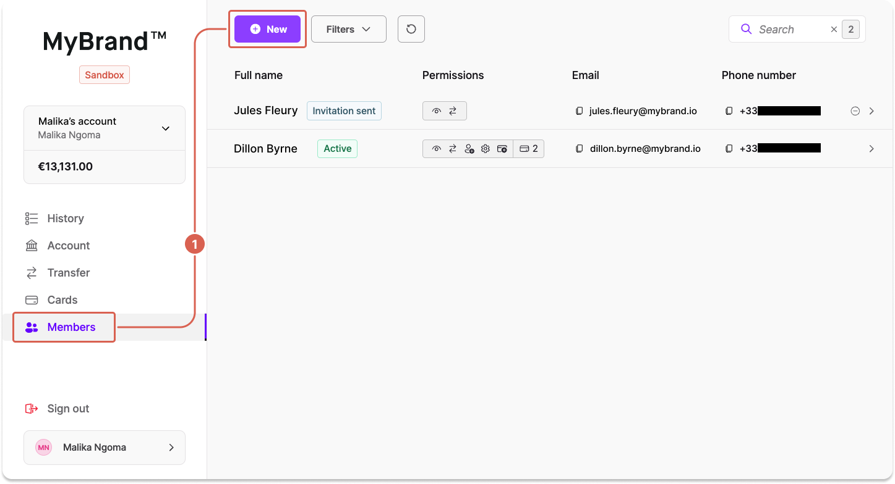
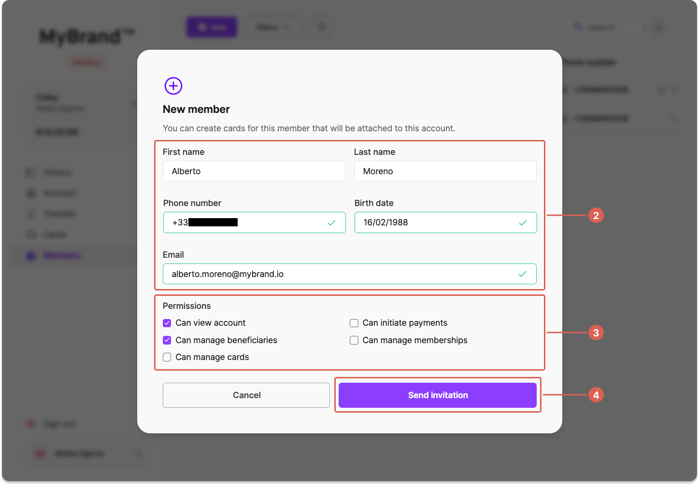

# Add a membership

Add a single account membership with the API or from Swan's Web Banking interface.

import PrerequisiteAddMembers from './partials/_add-member-prereq.mdx';

<PrerequisiteAddMembers />

## API guide {#api}

### Step 1: Add the account membership {#api-add}

1. Call the `addAccountMembership` mutation.
1. Add the account ID to which you're adding a invited account member (line 4).
1. In the `restrictedTo` object, add information about the invited account member (lines 6-9).
    - If you're only granting `canViewAccount` permissions, or you're [not granting any permissions](./index.mdx#permissions-none), the invited account member's `birthDate` isn't required.
    - Include a `+` in front of the phone number.
1. Choose `true` for the permissions you'd like to grant to the invited account member (lines 13-17).
1. Add the success payload, including any information you'd like to review (line 20).
1. Add the consent URL to the success payload (line 29): `statusInfo` > `AccountMembershipConsentPendingStatusInfo` > `consent` > `consentUrl`.
1. Add rejections (not shown).

:::note Can Manage Cards
The `CanManageCards` permissions is technically optional.
However, it's recommended to choose `true` or `false` for this permission anyway.
If you don't include the `CanManageCards` permission in your API call, it inherits the same value as `canManageAccountMembership`.
:::

🔎 [Open the mutation in API Explorer](https://explorer.swan.io?query=bXV0YXRpb24gQWRkTWVtYmVyIHsKICBhZGRBY2NvdW50TWVtYmVyc2hpcCgKICAgIGlucHV0OiB7CiAgICAgIGFjY291bnRJZDogIiRZT1VSX0FDQ09VTlRfSUQiCiAgICAgIHJlc3RyaWN0ZWRUbzogewogICAgICAgIGZpcnN0TmFtZTogIkp1bGVzIgogICAgICAgIGxhc3ROYW1lOiAiRmxldXJ5IgogICAgICAgIHBob25lTnVtYmVyOiAiKzMzNjAwMDAwMDAwIgogICAgICAgIGJpcnRoRGF0ZTogIllZWVktTU0tREQiCiAgICAgIH0KICAgICAgY29uc2VudFJlZGlyZWN0VXJsOiAiaHR0cHM6Ly9kb2NzLnN3YW4uaW8vIgogICAgICBlbWFpbDogImp1bGVzLmZsZXVyeUBteWJyYW5kLmlvIgogICAgICBjYW5Jbml0aWF0ZVBheW1lbnRzOiB0cnVlCiAgICAgIGNhbk1hbmFnZUFjY291bnRNZW1iZXJzaGlwOiBmYWxzZQogICAgICBjYW5NYW5hZ2VCZW5lZmljaWFyaWVzOiB0cnVlCiAgICAgIGNhbk1hbmFnZUNhcmRzOiBmYWxzZQogICAgICBjYW5WaWV3QWNjb3VudDogdHJ1ZQogICAgfQogICkgewogICAgLi4uIG9uIEFkZEFjY291bnRNZW1iZXJzaGlwU3VjY2Vzc1BheWxvYWQgewogICAgICBfX3R5cGVuYW1lCiAgICAgIGFjY291bnRNZW1iZXJzaGlwIHsKICAgICAgICBpZAogICAgICAgIHN0YXR1c0luZm8gewogICAgICAgICAgc3RhdHVzCiAgICAgICAgICAuLi4gb24gQWNjb3VudE1lbWJlcnNoaXBDb25zZW50UGVuZGluZ1N0YXR1c0luZm8gewogICAgICAgICAgICBfX3R5cGVuYW1lCiAgICAgICAgICAgIGNvbnNlbnQgewogICAgICAgICAgICAgIGNvbnNlbnRVcmwKICAgICAgICAgICAgICBzdGF0dXMKICAgICAgICAgICAgfQogICAgICAgICAgICBzdGF0dXMKICAgICAgICAgIH0KICAgICAgICB9CiAgICAgIH0KICAgIH0KICAgIC4uLiBvbiBCYWRBY2NvdW50U3RhdHVzUmVqZWN0aW9uIHsKICAgICAgaWQKICAgICAgbWVzc2FnZQogICAgfQogICAgLi4uIG9uIEZvcmJpZGRlblJlamVjdGlvbiB7CiAgICAgIF9fdHlwZW5hbWUKICAgICAgbWVzc2FnZQogICAgfQogICAgLi4uIG9uIEludmFsaWRQaG9uZU51bWJlclJlamVjdGlvbiB7CiAgICAgIF9fdHlwZW5hbWUKICAgICAgbWVzc2FnZQogICAgfQogICAgLi4uIG9uIFBlcm1pc3Npb25DYW5ub3RCZUdyYW50ZWRSZWplY3Rpb24gewogICAgICBfX3R5cGVuYW1lCiAgICAgIG1lc3NhZ2UKICAgIH0KICAgIC4uLiBvbiBWYWxpZGF0aW9uUmVqZWN0aW9uIHsKICAgICAgX190eXBlbmFtZQogICAgICBmaWVsZHMgewogICAgICAgIGNvZGUKICAgICAgICBtZXNzYWdlCiAgICAgICAgcGF0aAogICAgICB9CiAgICAgIG1lc3NhZ2UKICAgIH0KICB9Cn0K&tab=api)

```graphql {4,6-9,13-17,20,26,29} showLineNumbers
mutation AddMember {
  addAccountMembership(
    input: {
      accountId: "$YOUR_ACCOUNT_ID"
      restrictedTo: {
        firstName: "Jules"
        lastName: "Fleury"
        phoneNumber: "+33600000000"
        birthDate: "1992-04-23"
      }
      consentRedirectUrl: "https://docs.swan.io/"
      email: "jules.fleury@mybrand.io"
      canInitiatePayments: true
      canManageAccountMembership: false
      canManageBeneficiaries: true
      canManageCards: false
      canViewAccount: true
    }
  ) {
    ... on AddAccountMembershipSuccessPayload {
      __typename
      accountMembership {
        id
        statusInfo {
          status
          ... on AccountMembershipConsentPendingStatusInfo {
            __typename
            consent {
              consentUrl
              status
            }
            status
          }
        }
      }
    }
  }
}
```

### Step 2: Get consent to add member {#get-consent}

1. Get the `consentUrl`, included in the payload (line 11). Remember, the payload only provides the `consentUrl` if you added it in step 1.6.
1. Send the `consentUrl` to the account holder, the account's legal representative, or the account member with `canManageAccountMembership` permissions.
1. As soon as consent is provided, they're redirected to your `consentRedirectUrl` defined in the initial API call, which fetches an OAuth 2.0 authorization code and a user access token.
1. **Store** the invited account member's new `accountMembershipId`. You'll need it to bind the membership.

```json {6,8,11} showLineNumbers
{
  "data": {
    "addAccountMembership": {
      "__typename": "AddAccountMembershipSuccessPayload",
      "accountMembership": {
        "id": "$NEW_ACCOUNT_MEMBERSHIP_ID",
        "statusInfo": {
          "status": "ConsentPending",
          "__typename": "AccountMembershipConsentPendingStatusInfo",
          "consent": {
            "consentUrl": "https://identity.swan.io/consent?consentId=$CONSENT_ID&env=Sandbox",
            "status": "Created"
          }
        }
      }
    }
  }
}
```

### Step 3: Bind the invited account member {#bind-member}

import AddMemberBind from './partials/_add-member-bind.mdx';

<AddMemberBind />

## Web Banking guide {#guide-web-banking}

1. Go to **Web Banking** > **Members**, and click **+ New**.



2. Enter information about the account member you're inviting.
1. Choose their membership permissions.
1. Click **Send invitation**.

