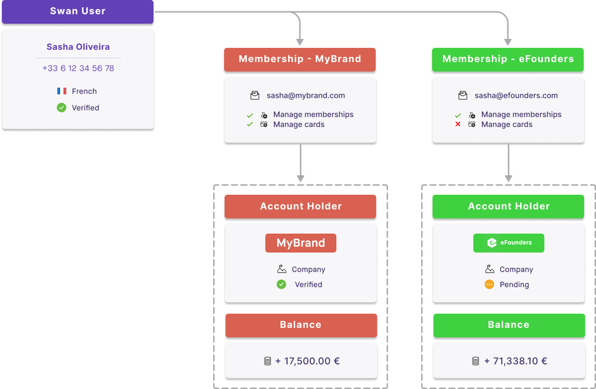
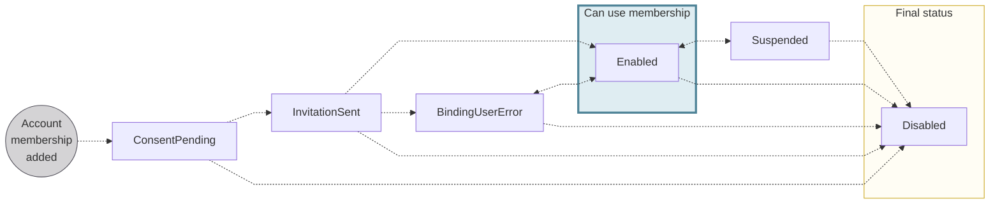
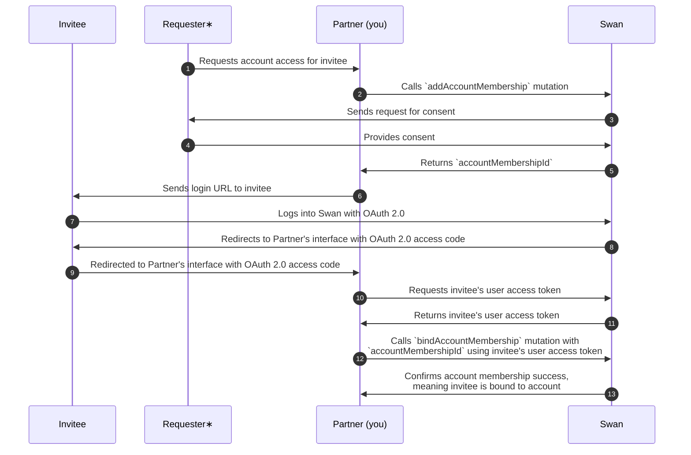

# Account memberships

import AccountMembershipDefinition from '../../definitions/_account-membership.mdx';

> <AccountMembershipDefinition />

## Overview {#overview}

The Swan user who performs the account's onboarding is the first account member and becomes the account's legal representative.
All Swan accounts have at least one account member: the legal representative, and they're considered the admin of the account.
The admin can then grant other Swan users permission to perform certain actions for the account; each of these users is an account member.

:::note Consider a real-life example
A grandparent wants their grandchild to have access to an account to purchase groceries.
The grandparent is the legal representative (and account member), and the grandchild, an account member.
:::

Account memberships are **especially useful for company accounts**.
The legal representative grants permissions to other employees.
Employees can then manage their own payments, such as software or sales expenses, independently.
The company's accountant can use their membership to access account statements.
With enough permissions, managers can add cards for their team.
How you use account memberships and the corresponding permissions is up to you—the possibilities are almost endless to fulfill your use case.

Swan users can have memberships to an **unlimited** number of Swan accounts.

Consider the following example, where Sasha Oliveira has account memberships to accounts for MyBrand and eFounders.
Sasha can access and manage memberships for both accounts, but only manage cards for one.

## Membership permissions {#permissions}

Account members can be assigned **different rights to an account**, allowing access to only the desired actions and information.
These rights are referred to as **permissions** in the Swan API and Web Banking interface.

Swan doesn't offer role-base access control (RBAC).
Instead, you choose exactly what each account member can see and do on a member-by-member basis.

| Permission | Account member can... |
| --- | --- |
| `canViewAccount` | View the account and information about the account, including main and virtual IBANs, beneficiaries, payment mandates, list of transactions and transaction details, and more |
| `canManageBeneficiaries` | Add or remove beneficiaries, save beneficiaries as trusted |
| `canInitiatePayments` | Initiate (send) transfers to trusted beneficiaries |
| `canManageAccountMembership` | Add, modify, or remove account memberships |
| `canManageCards` | View, add, and update their own cards and cards for account memberships they manage |

### Granting permissions {#permissions-grant}

In order to grant permissions to other account members, the account member must have the permission `canManageAccountMembership`.
They can only grant permissions they already have.

For example, if an account member doesn't have the `canManageCards` permission, they can't grant it to another account member.
If they try to grant the `canManageCards` permission anyway, the API returns a `PermissionCannotBeGrantedRejection` error.

### Managing cards {#permissions-cards}

Whether your **account members can manage cards** and **for whom** depends on both `canManageAccountMembership` and `canManageCards` permissions.

<table>
  <tr>
    <th>`canManage`...</th>
    <th>`AccountMembership` = true</th>
    <th>`AccountMembership` = false</th>
  </tr>
  <tr>
    <td>`Cards` = true</td>
    <td>✓ View, add, and update cards for self ✓ View, add, and update cards for others∗</td>
    <td>✓ View, add, and update cards for self ☒ Can't view, add, or update cards for others</td>
  </tr>
  <tr>
    <td>`Cards` = false</td>
    <td colspan="2">✓ View their own cards ☒ Can't add virtual cards for self ✓ If they have an existing virtual card, they can print a physical card for self ☒ Can't update any cards for self ☒ Can't view, add, or update cards for others</td>
  </tr>
  <tr>
    <td>`Cards` = not provided</td>
    <td>✓ View, add, and update cards for self ✓ View, add, and update cards for others</td>
    <td>✓ View, add, and update cards for self ☒ Can't view, add, or update cards for others</td>
  </tr>
</table>

∗ *others* → other account members

### No permissions {#permissions-none}

You can add account members without granting them any membership permissions.
For example, if you want to give a user a card associated with the account, but you don't want them to view account information or perform any actions for the account, you'd add an account membership with no permissions.

In this case, all membership permission booleans are `false`.
This type of invitation doesn't require consent from the account holder and skips the status `InvitationSent`.

## Membership language {#language}

You can choose and update the language used for account memberships.
The following communications use the account membership language:

1. The **email** your account members receive inviting them to accept an account membership.
1. The **letter** included with the account member's physical card.
1. When using their physical card, **payment terminals** and point of service (POS) screens.

By default, account memberships inherit the [same language as the account](../index.mdx#language).
It's possible, however, that not all account members prefer the language chosen by the account holder.

You can update the language for **each** account membership with the API.
If you use Swan's Web Banking interface, eligible account members can choose the preferred language when inviting new account members through the app.
Account members can also use the app to update their preferred language independently.

### Supported languages {#language-list}

Several languages are available for account memberships:

- Dutch (`nl`)
- English (`en`)
- French (`fr`)
- German (`de`)
- Italian (`it`)
- Portuguese (`pt`)
- Spanish (`es`)

:::caution Finnish (`fi`)
Swan's Web Banking interface and [Support Center](https://support.swan.io/hc/fi) are available in Finnish.
However, it isn't supported as an account membership language yet.

If the account language is Finnish, the account membership language defaults to English.
:::

### Physical cards & membership language {#language-cards}

The language used for physical cards **can't be updated**.
Language choice, just like the four-digit PIN, is coded on the card's chip.
The card's language can't be updated for a renewed card, either, because the expiring card's chip is replicated for the new card and can't be changed.

If an account member has a physical card that doesn't use their preferred language, you or the card holder needs to complete the following steps:

1. [Update the account membership language](./guide-update.mdx).
1. [Cancel the physical card](../../cards/physical/guide-cancel.mdx).
1. [Order a new physical card](../../cards/physical/guide-print.mdx).

## Account membership statuses {#statuses}

| Account membership status | Explanation |
|---|---|
| `ConsentPending` | Request to add an account membership was sent with the `addAccountMembership` mutation and is waiting for the account holder's consent.  Memberships with the status `ConsentPending` can't be updated. If there's an error in the invited account member's information, cancel the invitation and add a new membership with the `addAccountMembership` mutation.  **Next steps**:<ul><li>If the invited account member consents, the status moves to `InvitationSent`</li><li>If the invited account member doesn't consent, the status moves to `Disabled`</li></ul> |
| `InvitationSent` | An invitation was sent to the invited account member.  **Next steps**:<ul><li>If the invited account member accepts the invitation and provides personal information that **matches** the information Swan already has about them, the status moves to `Enabled`</li><li>If the invited account member accepts the invitation, but provides personal information that **doesn't match** the information Swan already has about them, the status moves to `BindingUserError`</li><li>If the invited account member declines the membership, the status moves to `Disabled`</li></ul> |
| `Enabled` | All user information matches, the account member has been awarded the correct [identification level](../../users/identifications/index.mdx#levels-processes), and the account member can use their account membership and corresponding permissions. |
| `BindingUserError` | The personal information you submitted about the invited account member doesn't match the information they provide during the [signup process](../../users/index.mdx#signup). The mismatch must be solved before continuing.  Refer to the section on binding user errors for more information. |
| `Suspended` | Account membership is suspended and not available for use.  Account memberships can be suspended for various reasons, including a request from you or the account's legal representative, or a Swan action in the case of suspicious activity.  **Next steps**:<ul><li>Restore the account membership's previous status with the API</li><li>Cancel the account membership with the API</li></ul> |
| `Disabled` | Account membership is disabled, is no longer available for use, and can't be restored. |

### Binding user errors {#binding-errors}

The information you submitted about the invited account member doesn't match the information they provide when [signing up for an account](../../users/index.mdx#signup), the account membership has the status `BindingUserError`.
The status also changes to `BindingUserError` if the user hasn't completed [identification](../../users/identifications/index.mdx).

At least one of the following booleans must be true for an account membership to have a binding error:

- `firstNameMatchError` → If `true`, mismatch with first or given name
- `lastNameMatchError` → If `true`, mismatch with last or family name
- `birthDateMatchError` → If `true`, mismatch with birth date
- `mobilePhoneMatchError` → If `true`, mismatch with mobile phone number
- `idVerifiedMatchError` → If `true`, membership doesn't have the right level of identification

Account members whose membership status is `BindingUserError` can still access basic account and card information, but they can't perform any [sensitive operations](../../users/consent/index.mdx#sensitive), such as making a transfer or viewing their card numbers.

Other account members with the `canManageAccountMembership` permission and status `Enabled` can fix the mismatch.
If fraud is suspected, suspend the membership instead.

## Removing identification {#remove-identification}

Verifying your account members' identity is a required step in most circumstances.
However, with a **detailed agreement with Swan**, you might be allowed to bypass identification for certain membership permissions.

Even with identification removed, only memberships with certain permissions can bypass identification.

| ✓ Can bypass identification | ☒ Can't bypass identification |
| :---: | :---: |
| `canViewAccount` `canManageCards` | `canManageAccountMembership` `canInitiatePayments` `canManageBeneficiaries` |

Note that memberships created before identification is removed still need to verify their identity.
Adding this configuration **isn't retroactive**. 
Contact your Technical Account Manager to ask about removing identification.

## Closed accounts and memberships {#closed}

When Swan [accounts are closed](../index.mdx#closure), the account memberships are impacted as well.

As soon as an [account status](../index.mdx#statuses) changes to `Closing`, account members can no longer manage account memberships and beneficiaries or initiate payments (except to empty the account).
When the account status changes to `Closed`, account members can view the account for one year, after which all memberships to the closed account are `Disabled`.

## Versioning {#versioning}

Account memberships have a `version` attribute.

When a new membership is added, the `version` is `0`, then increases by a factor of 1 with each change.
Changes includes including suspending, resuming, and updating the membership.

## Sequence diagram  {#diagrams-add}

> **Adding account memberships**

∗ The **requester** can be the account holder, the account's legal representative, or an account member with the `canManageAccountMembership` permission.
The requester provides consent (diagram line 4).

## Guides {#guides}

- [Add a membership](./guide-add-one.mdx)
- [Add multiple memberships](./guide-add-multiple.mdx)
- [Update a membership](./guide-update.mdx) (use to fix a user binding error)
- [Suspend (temporarily block) or resume a membership](./guide-suspend-resume.mdx)
- [Disable (permanently block) a membership](./guide-disable.mdx)