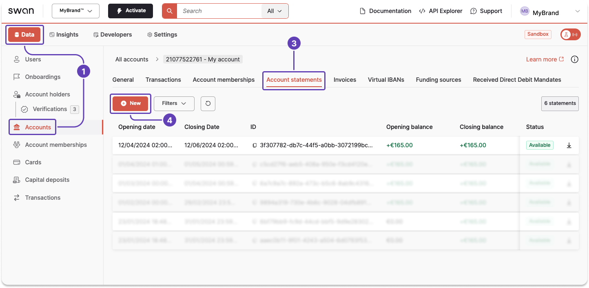
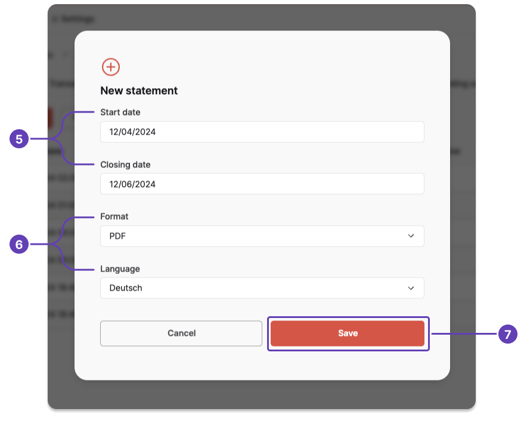

# Generate account statement

Generate an account statement for a custom time period **using the API** or on your **Dashboard**.

## API guide {#guide}

1. Call the `generateAccountStatement` mutation.
1. Add the `accountId`.
1. Add the `openingDate` and `closingDate` with the following format: `YYYY-MM-DDT00:00:00.000Z` (up to three months).
1. Set the `language` for your account statement, and choose `PDF` or `CSV` if you'd like.
1. Add all information you'd like to review about the statement (lines 11-21).

### Mutation {#mutation}

🔎 [Open the mutation in API Explorer](https://explorer.swan.io?query=bXV0YXRpb24gR2VuZXJhdGVBY2NvdW50U3RhdGVtZW50IHsKICBnZW5lcmF0ZUFjY291bnRTdGF0ZW1lbnQoCiAgICBpbnB1dDogewogICAgICBhY2NvdW50SWQ6ICIkQUNDT1VOVF9JRCIKICAgICAgb3BlbmluZ0RhdGU6ICIyMDI0LTA0LTEyVDAwOjAwOjAwLjAwMFoiCiAgICAgIGNsb3NpbmdEYXRlOiAiMjAyNC0wNi0xMlQwMDowMDowMC4wMDBaIgogICAgICBsYW5ndWFnZTogbmwKICAgICAgc3RhdGVtZW50VHlwZTogUERGCiAgICB9CiAgKSB7CiAgICBjbG9zaW5nRGF0ZQogICAgY3JlYXRlZEF0CiAgICBmZWVzIHsKICAgICAgY3VycmVuY3kKICAgICAgdmFsdWUKICAgIH0KICAgIGlkCiAgICBvcGVuaW5nRGF0ZQogICAgcGVyaW9kCiAgICBzdGF0dXMKICAgIHVwZGF0ZWRBdAogIH0KfQo%3D&tab=api)

```graphql {4-8} showLineNumbers
mutation GenerateAccountStatement {
  generateAccountStatement(
    input: {
      accountId: "$ACCOUNT_ID"
      openingDate: "2024-04-12T00:00:00.000Z"
      closingDate: "2024-06-12T00:00:00.000Z"
      language: nl
      statementType: PDF
    }
  ) {
    closingDate
    createdAt
    fees {
      currency
      value
    }
    id
    openingDate
    period
    status
    updatedAt
  }
}

```

### Payload {#payload}

The mutation returns all of the requested information.
Notice the `period` = `Custom` (line 12), indicating that you generated this account statement, not Swan.

```json {12} showLineNumbers
{
  "data": {
    "generateAccountStatement": {
      "closingDate": "2024-06-12T00:00:00.000Z",
      "createdAt": "2024-06-20T15:56:50.096Z",
      "fees": {
        "currency": "EUR",
        "value": "0"
      },
      "id": "$ACCOUNT_STATEMENT_ID",
      "openingDate": "2024-04-12T00:00:00.000Z",
      "period": "Custom",
      "status": "Available",
      "updatedAt": "2024-06-20T15:56:52.423Z"
    }
  }
}
```

## Dashboard {#dashboard}

You can also generate statements from your Dashboard.

1. Go to **Dashboard** > **Data** > **Accounts**.
1. Open the account for which you want to generate a statement (not pictured).
1. Go to the **Account statements** tab.
1. Click **+ New**



5. Enter the start date and closing date. The time period can only cover up to three months.
1. Choose the format and language.
1. Click **Save**.



Your new statement appears on your list of account statements with the status `Pending`.
After the status changes to `Available`, you can download your statement.