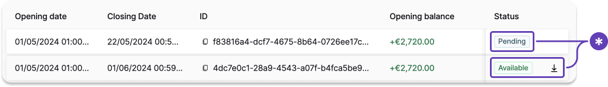

# Generate an account statement

Generate an account statement for a custom time period **using the API** or on your **Dashboard**.

:::info Account statements vs. transaction confirmations
Account statements include **all booked transactions** (SEPA Credit Transfers, SEPA Direct Debit, card transactions, fees, internal transfers, and all other transaction types). This is different from [transaction confirmation statements](https://docs.swan.io/topics/payments/overview/guide-generate-transaction-statement/), which only confirm specific SEPA Credit Transfer transactions.
:::

## API guide {#guide}

1. Call the `generateAccountStatement` mutation.
1. Add the `accountId` (line 4).
1. Add the `openingDate` and `closingDate` using format `YYYY-MM-DDT00:00:00.000Z` (lines 5-6).
   - Maximum period: three months.
1. Set the `language` for your account statement, and provide the file `format` (`PDF` or `CSV`) (lines 7-8).
1. Add all information you'd like to review about the statement (lines 11-27).

### Mutation {#mutation}

<a href="https://explorer.swan.io?query=bXV0YXRpb24gR2VuZXJhdGVBY2NvdW50U3RhdGVtZW50IHsKICBnZW5lcmF0ZUFjY291bnRTdGF0ZW1lbnQoCiAgICBpbnB1dDogewogICAgICBhY2NvdW50SWQ6ICIkQUNDT1VOVF9JRCIKICAgICAgb3BlbmluZ0RhdGU6ICIyMDI0LTA0LTEyVDAwOjAwOjAwLjAwMFoiCiAgICAgIGNsb3NpbmdEYXRlOiAiMjAyNC0wNi0xMlQwMDowMDowMC4wMDBaIgogICAgICBsYW5ndWFnZTogbmwKICAgICAgZm9ybWF0OiBQREYKICAgIH0KICApIHsKICAgIGNsb3NpbmdEYXRlCiAgICBjcmVhdGVkQXQKICAgIGZlZUNyZWRpdHMgewogICAgICBjdXJyZW5jeQogICAgICB2YWx1ZQogICAgfQogICAgZmVlRGViaXRzIHsKICAgICAgY3VycmVuY3kKICAgICAgdmFsdWUKICAgIH0KICAgIGlkCiAgICBvcGVuaW5nRGF0ZQogICAgcGVyaW9kCiAgICBzdGF0dXNJbmZvIHsKICAgICAgc3RhdHVzCiAgICB9CiAgICB1cGRhdGVkQXQKICB9Cn0K" className="explorer-badge">Open in API Explorer</a>

```graphql {4-8} showLineNumbers
mutation GenerateAccountStatement {
  generateAccountStatement(
    input: {
      accountId: "$ACCOUNT_ID"
      openingDate: "2024-04-12T00:00:00.000Z"
      closingDate: "2024-06-12T00:00:00.000Z"
      language: nl
      format: PDF
    }
  ) {
    closingDate
    createdAt
    feeCredits {
      currency
      value
    }
    feeDebits {
      currency
      value
    }
    id
    openingDate
    period
    statusInfo {
      status
    }
    updatedAt
  }
}
```

### Payload {#payload}

The mutation returns all of the requested information.

The `period` field shows `Custom` (line 16) for on-demand statements. Swan automatically generates statements with `period` values of `Monthly` or `Custom`.

The `statusInfo.status` shows `Pending` while Swan generates the statement (line 18).

```json {16,18} showLineNumbers
{
  "data": {
    "generateAccountStatement": {
      "closingDate": "2024-06-12T00:00:00.000Z",
      "createdAt": "2024-06-20T15:56:50.096Z",
      "feeCredits": {
        "currency": "EUR",
        "value": "5.50"
      },
      "feeDebits": {
        "currency": "EUR",
        "value": "12.00"
      },
      "id": "$ACCOUNT_STATEMENT_ID",
      "openingDate": "2024-04-12T00:00:00.000Z",
      "period": "Custom",
      "statusInfo": {
        "status": "Pending"
      },
      "updatedAt": "2024-06-20T15:56:52.423Z"
    }
  }
}
```

### Retrieve generated statement {#retrieve}

After generating the account statement, the `statusInfo` > `status` changes to `Generated`.
When the status is `Generated`, you can retrieve the download URL.

1. Call the `accountStatement` query.
1. Add the account statement `id` (line 2).
1. Add `statusInfo` for all statuses (line 8). The URL to download the statement is provided in `statusInfo` > `GeneratedStatusInfo` > `url` (line 12).

<a href="https://explorer.swan.io?query=cXVlcnkgR2V0QWNjb3VudFN0YXRlbWVudCB7CiAgYWNjb3VudFN0YXRlbWVudChpZDogIiRBQ0NPVU5UX1NUQVRFTUVOVF9JRCIpIHsKICAgIGNsb3NpbmdEYXRlCiAgICBjcmVhdGVkQXQKICAgIGlkCiAgICBvcGVuaW5nRGF0ZQogICAgcGVyaW9kCiAgICBzdGF0dXNJbmZvIHsKICAgICAgc3RhdHVzCiAgICAgIC4uLiBvbiBHZW5lcmF0ZWRTdGF0dXNJbmZvIHsKICAgICAgICBzdGF0dXMKICAgICAgICB1cmwKICAgICAgfQogICAgICAuLi4gb24gUGVuZGluZ1N0YXR1c0luZm8gewogICAgICAgIHN0YXR1cwogICAgICB9CiAgICAgIC4uLiBvbiBGYWlsZWRTdGF0dXNJbmZvIHsKICAgICAgICBzdGF0dXMKICAgICAgfQogICAgICAuLi4gb24gVm9pZGVkU3RhdHVzSW5mbyB7CiAgICAgICAgc3RhdHVzCiAgICAgICAgdXJsCiAgICAgIH0KICAgIH0KICAgIHVwZGF0ZWRBdAogIH0KfQo=" className="explorer-badge">Open in API Explorer</a>

```graphql {2,8,12} showLineNumbers
query GetAccountStatement {
  accountStatement(id: "$ACCOUNT_STATEMENT_ID") {
    closingDate
    createdAt
    id
    openingDate
    period
    statusInfo {
      status
      ... on GeneratedStatusInfo {
        status
        url
      }
      ... on PendingStatusInfo {
        status
      }
      ... on FailedStatusInfo {
        status
      }
      ... on VoidedStatusInfo {
        status
        url
      }
    }
    updatedAt
  }
}
```

#### Payload {#retrieve-payload}

The `period` field shows `Custom` (line 8) for on-demand statements.

Use the `url` to download the statement (line 12).

1. Copy the `url` from the payload.
1. Paste the `url` into your preferred browser and press enter.
1. The document downloads automatically.

```json {8,12} showLineNumbers
{
  "data": {
    "accountStatement": {
      "closingDate": "2024-06-12T00:00:00.000Z",
      "createdAt": "2024-06-20T15:56:50.096Z",
      "id": "$ACCOUNT_STATEMENT_ID",
      "openingDate": "2024-04-12T00:00:00.000Z",
      "period": "Custom",
      "statusInfo": {
        "__typename": "GeneratedStatusInfo",
        "status": "Generated",
        "url": "$DOWNLOAD_URL"
      },
      "updatedAt": "2024-06-20T15:56:58.234Z"
    }
  }
}
```

:::caution Account statement statuses
- **`Pending`**: The statement is being generated.
- **`Generated`**: The statement is ready to download. The `url` field contains the download link.
- **`Failed`**: Statement generation failed. Double-check your account ID and generate a new statement.
- **`Voided`**: The statement has been voided. A voided statement `url` is still available for reference.
:::

## Dashboard {#dashboard}

You can also generate statements from your Dashboard.

1. Go to **Dashboard** > **Data** > **Accounts**.
1. Open the account for which you want to generate a statement (not pictured).
1. Go to the **Account statements** tab.
1. Click **+ New**


5. Enter the opening date and closing date. The time period can cover **up to three months**.
1. Choose the format and language.
1. Click **Save**.


Your new statement appears on your list of account statements with the status `Pending`.
After the status changes to `Generated`, you can download your statement.

