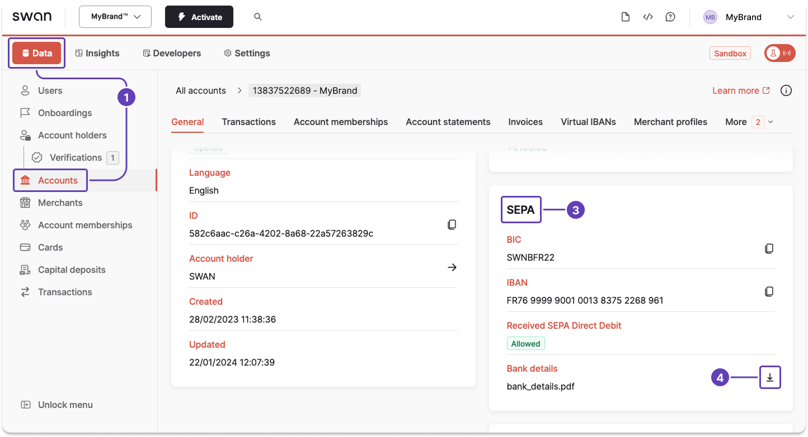
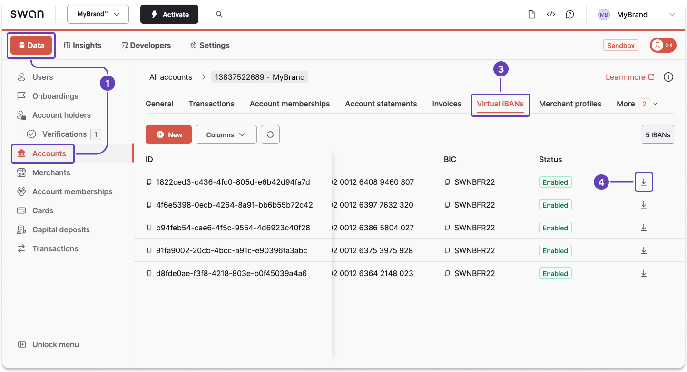

# Get bank details

Download a PDF of your [bank details](../index.mdx#bank-details) for the account's main IBAN, a list of virtual IBANs, or specific virtual IBANs with the API.
You can also download bank details from your Dashboard.

## Main IBAN {#guide-main}

1. Call the `account` query.
1. Enter the `accountId`.
1. Add `bankDetails` to receive a download URL in the payload.

<h3 id="query-main">Query</h3>

🔎 [Open the query in API Explorer](https://explorer.swan.io?query=cXVlcnkgZ2V0QmFua0RldGFpbHMgewogIGFjY291bnQoYWNjb3VudElkOiAiJFlPVVJfQUNDT1VOVF9JRCIpIHsKICAgIGJhbmtEZXRhaWxzCiAgfQp9Cg%3D%3D&tab=api)

```graphql {2} showLineNumbers
query getBankDetails {
  account(accountId: "$YOUR_ACCOUNT_ID") {
    bankDetails
  }
}
```
<h3 id="payload-main">Payload</h3>

1. The response includes the download URL (line 4), which begins with `bank-details.swan.io`.
1. Paste the URL into your browser, then press enter. This triggers the download of your PDF.

```json {4} showLineNumbers
{
  "data": {
    "account": {
      "bankDetails": "$DOWNLOAD_URL",
    }
  }
}
```

## List of virtual IBANs {#guide-virtual-list}

1. Call the `account` query.
1. Enter the `accountId`.
1. Add `virtualIbanEntries`.
1. Add [pagination](../../../developers/using-api/pagination.mdx). The sample query returns the `first` 5 entries (line 3).
1. Add `bankDetails` to receive a download URL in the payload (line 9).
1. Add all other information you'd like to retrieve.

<h3 id="query-list">Query</h3>

🔎 [Open the query in API Explorer](https://explorer.swan.io?query=cXVlcnkgZ2V0TGlzdFZpcnR1YWxCYW5rRGV0YWlscyB7CiAgYWNjb3VudChhY2NvdW50SWQ6ICIkWU9VUl9BQ0NPVU5UX0lEIikgewogICAgdmlydHVhbEliYW5FbnRyaWVzKGZpcnN0OiA1KSB7CiAgICAgIGVkZ2VzIHsKICAgICAgICBub2RlIHsKICAgICAgICAgIEJJQwogICAgICAgICAgSUJBTgogICAgICAgICAgYmFua0RldGFpbHMKICAgICAgICAgIGlkCiAgICAgICAgICBzdGF0dXMKICAgICAgICB9CiAgICAgIH0KICAgIH0KICB9Cn0K&tab=api)

```graphql {2,3,9} showLineNumbers
query getListVirtualBankDetails {
  account(accountId: "$YOUR_ACCOUNT_ID") {
    virtualIbanEntries(first: 5) {
      edges {
        cursor
        node {
          BIC
          IBAN
          bankDetails
          id
          status
        }
      }
    }
  }
}
```

<h3 id="payload-list">Payload</h3>

1. The response includes the download URL for each virtual IBAN (lines 10, 19), which begin with `bank-details.swan.io`.
1. Paste the URL into your browser, then press enter. This triggers the download of your PDF.

```json {10,19} showLineNumbers
{
  "data": {
    "account": {
      "virtualIbanEntries": {
        "edges": [
          {
            "node": {
              "BIC": "SWNBFR22",
              "IBAN": "$VIRTUAL_IBAN_1",
              "bankDetails": "$DOWNLOAD_URL_1",
              "id": "VIRTUAL_IBAN_ID_1",
              "status": "Enabled"
            }
          },
          {
            "node": {
              "BIC": "SWNBFR22",
              "IBAN": "$VIRTUAL_IBAN_2",
              "bankDetails": "$DOWNLOAD_URL_2",
              "id": "VIRTUAL_IBAN_ID_2",
              "status": "Enabled"
            }
          },
          {
            "node": {
              "BIC": "SWNBFR22",
              "IBAN": "$VIRTUAL_IBAN_3",
              "bankDetails": "$DOWNLOAD_URL_3",
              "id": "VIRTUAL_IBAN_ID_3",
              "status": "Enabled"
            }
          },
          {
            "node": {
              "BIC": "SWNBFR22",
              "IBAN": "$VIRTUAL_IBAN_4",
              "bankDetails": "$DOWNLOAD_URL_4",
              "id": "VIRTUAL_IBAN_ID_4",
              "status": "Enabled"
            },
          },
          {
            "node": {
              "BIC": "SWNBFR22",
              "IBAN": "$VIRTUAL_IBAN_5",
              "bankDetails": "$DOWNLOAD_URL_5",
              "id": "VIRTUAL_IBAN_ID_5",
              "status": "Enabled"
            }
          }
        ]
      }
    }
  }
}
```

## Specific virtual IBANs {#guide-virtual-specific}

1. Call the `account` query.
1. Enter the `accountId`.
1. Add `virtualIbanEntries`.
1. Add `filters`, then the IDs for the virtual IBAN for which you'd like bank details download URLs.
1. Add `bankDetails` to receive a download URL in the payload.
1. Add all other information you'd like to retrieve.

<h3 id="query-specific">Query</h3>

🔎 [Open the query in API Explorer](https://explorer.swan.io?query=cXVlcnkgZ2V0U3BlY2lmaWNWaXJ0dWFsQmFua0RldGFpbHNPbmUgewogIGFjY291bnQoYWNjb3VudElkOiAiJFlPVVJfQUNDT1VOVF9JRCIpIHsKICAgIHZpcnR1YWxJYmFuRW50cmllcyhmaWx0ZXJzOiB7IGlkczogIiRZT1VSX1ZJUlRVQUxfSUJBTl9JRCIgfSkgewogICAgICBlZGdlcyB7CiAgICAgICAgbm9kZSB7CiAgICAgICAgICBiYW5rRGV0YWlscwogICAgICAgIH0KICAgICAgfQogICAgfQogIH0KfQo%3D&tab=api)

```graphql title="One virtual IBAN ID" {2,3,6} showLineNumbers
query getSpecificVirtualBankDetailsOne {
  account(accountId: "$YOUR_ACCOUNT_ID") {
    virtualIbanEntries(filters: { ids: "$YOUR_VIRTUAL_IBAN_ID" }) {
      edges {
        node {
          bankDetails
        }
      }
    }
  }
}
```

🔎 [Open the query in API Explorer](https://explorer.swan.io?query=cXVlcnkgZ2V0U3BlY2lmaWNWaXJ0dWFsQmFua0RldGFpbHNNdWx0aXBsZSB7CiAgYWNjb3VudChhY2NvdW50SWQ6ICIkWU9VUl9BQ0NPVU5UX0lEIikgewogICAgdmlydHVhbEliYW5FbnRyaWVzKAogICAgICBmaWx0ZXJzOiB7IGlkczogWyIkWU9VUl9WSVJUVUFMX0lCQU5fSURfMSIsICIkWU9VUl9WSVJUVUFMX0lCQU5fSURfMiJdIH0KICAgICkgewogICAgICBlZGdlcyB7CiAgICAgICAgbm9kZSB7CiAgICAgICAgICBiYW5rRGV0YWlscwogICAgICAgIH0KICAgICAgfQogICAgfQogIH0KfQo%3D&tab=api)

```graphql title="Multiple virtual IBAN IDs" {2,4,8} showLineNumbers
query getSpecificVirtualBankDetailsMultiple {
  account(accountId: "$YOUR_ACCOUNT_ID") {
    virtualIbanEntries(
      filters: { ids: ["$YOUR_VIRTUAL_IBAN_ID_1", "$YOUR_VIRTUAL_IBAN_ID_2"] }
    ) {
      edges {
        node {
          bankDetails
        }
      }
    }
  }
}
```

<h3 id="payload-specific">Payload</h3>

1. The response includes the download URL (line 8), which begins with `bank-details.swan.io`.
1. Paste the URL into your browser, then press enter. This triggers the download of your PDF.

```json {8} showLineNumbers
{
  "data": {
    "account": {
      "virtualIbanEntries": {
        "edges": [
          {
            "node": {
              "bankDetails": "$DOWNLOAD_URL"
            }
          }
        ]
      }
    }
  }
}
```

## Dashboard {#dashboard}

You can also download bank details for main and virtual IBANs from your Dashboard.

<h3 id="dashboard-main">Main IBAN</h3>

1. Go to **Dashboard** > **Data** > **Accounts**.
1. Open the account for which you want to generate a statement (not pictured).
1. Scroll vertically to the **SEPA** section.
1. Click the **download icon** in the bank details row.



<h3 id="dashboard-virtual">Virtual IBANs</h3>

> It takes a few seconds after adding a virtual IBAN to be able to download the bank details PDF.

1. Go to **Dashboard** > **Data** > **Accounts**.
1. Open the account for which you want to generate a statement (not pictured).
1. Go to the **Virtual IBANs** tab.
1. Scroll horizontally, then click the **download icon** for the desired virtual IBAN.

