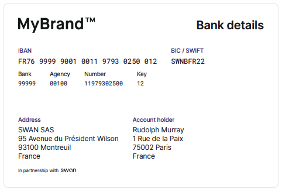

# Get bank details

Download a PDF of your bank details.



:::tip Prerequisites

1. The account's `accountId`, found on your **Dashboard** > **Accounts** page.
1. The account must have been created after 16 November 2023. If you'd like to get bank details for an older account, please skip to the [guide for older accounts](#details-old).
   :::

## API guide {#guide}

1. Call the `account` query.
1. Enter the `accountId`.
1. Add `bankDetails`.

### Query {#query}

🔎 [Open the query in API Explorer](https://explorer.swan.io?query=cXVlcnkgZ2V0QmFua0RldGFpbHMgewogIGFjY291bnQoYWNjb3VudElkOiAiJFlPVVJfQUNDT1VOVF9JRCIpIHsKICAgIGJhbmtEZXRhaWxzCiAgfQp9Cg%3D%3D&tab=api)

```graphql {2} showLineNumbers
query getBankDetails {
  account(accountId: "$YOUR_ACCOUNT_ID") {
    bankDetails
  }
}
```

### Response {#query}

1. The response includes the download URL (line 4), which begins with `bank-details.swan.io`.
1. Paste the URL into your browser, then press enter. This triggers the download of your PDF.

```json {4} showLineNumbers
{
  "data": {
    "account": {
      "bankDetails": "$DOWNLOAD_URL"
    }
  }
}
```

:::caution Null response
If the API returns a `null` response, the account was probably created before this feature was introduced.
Follow the guide for older accounts instead.
:::

## Guide for older accounts {#details-old}

If you'd like to get a bank details PDF for an older account, you have two options.

| Actors                         | Explanation                                                                                                                                                                                                                                                                                                                                                             |
| ------------------------------ | ----------------------------------------------------------------------------------------------------------------------------------------------------------------------------------------------------------------------------------------------------------------------------------------------------------------------------------------------------------------------- |
| You with the API               | <ol><li>Call the `updateAccount` mutation with the `accountId`.</li><li>"Change" the account language to the account's current language. This triggers the API to generate the PDF, even though the language doesn't change.</li></ol>                                                                                                                                  |
| Your end user with Web Banking | If you use **Swan's Web Banking interface**, your users can trigger the generation of their bank details PDF.<br /><br /><ol><li>Go to **Web Banking** > **Account** > **Settings**.</li><li>Click **Save** without changing anything, which triggers the API.</li><li>After a few minutes, the bank details PDF is available on **Account** > **Main IBAN**.</li></ol> |
