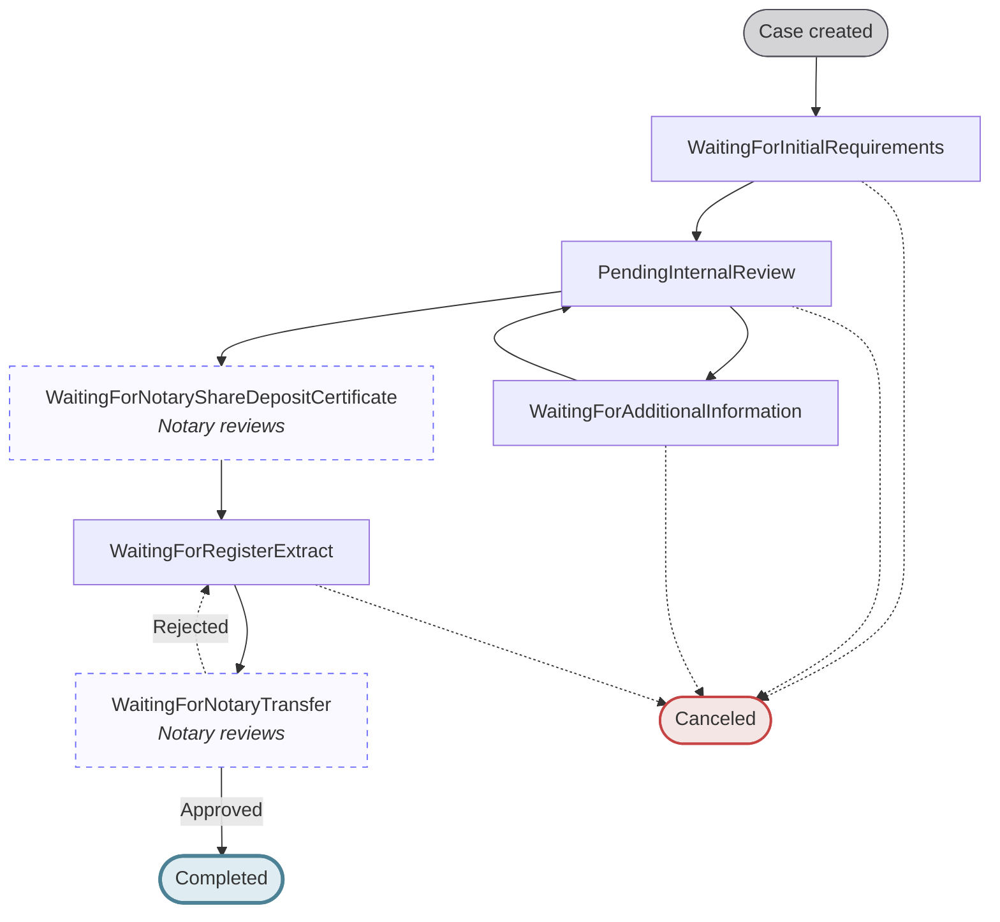
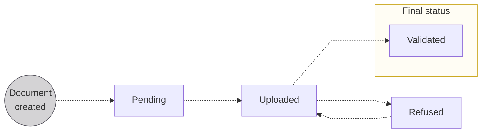
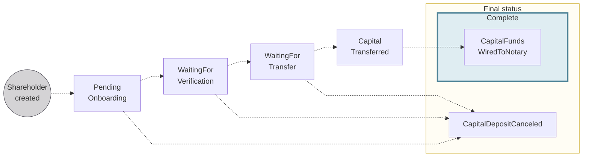
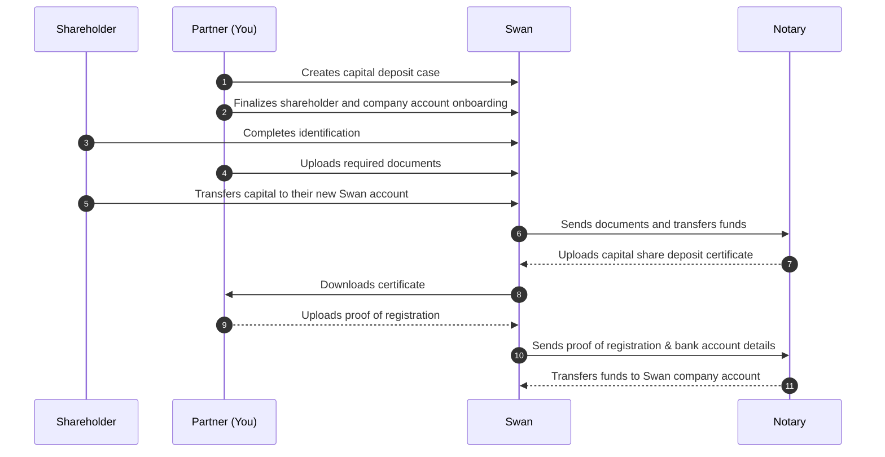

# Capital deposits

import CapitalDepositDefinition from "../definitions/_capital-deposit.mdx";

> <CapitalDepositDefinition />

When **creating a new company**, you're required to **deposit your share capital** before registering the company.

## Overview {#overview}

Several key stakeholders are involved in the capital deposit process: **you**; **your client**, their future company, and their shareholders; **Swan** (and Swan's API); and Swan's partner **notary**.

The capital deposit process consists of a few main actions:

- Creating a Swan capital deposit case to collect everything
- Creating Swan accounts
- Verifying identities
- Uploading documents
- Transferring funds

Learn more about the stakeholders and their interactions to complete a capital deposit on this page before continuing to the [guide for 🇫🇷 France](./france/guide.mdx).

## Capital deposit case {#case}

The [`CapitalDepositCase`](https://api-reference.swan.io/objects/capital-deposit-case) API object compiles all information for a capital deposit case, including:

1. Details about the future company
1. Company account
1. Shareholder information
1. Capital deposit documents

### Case statuses {#case-statuses}

| Case status | Explanation |
| --- | --- |
| `WaitingForInitialRequirements` | The case has been initiated and is waiting for shareholder verification, fund transfers, document uploads, and completion of company onboarding. |
| `PendingInternalReview` | Swan is reviewing the information and documents provided. |
| `WaitingForAdditionalInformation` | After review, Swan has requested additional details or corrections from the customer and is awaiting their response. |
| `WaitingForNotaryShareDepositCertificate` | **_Notary reviews_** _the deposited funds and submitted documents, then creates the certificate and uploads it to Swan_. |
| `WaitingForRegisterExtract` | The end-user uploads their register extract for notary review. |
| `WaitingForNotaryTransfer` | **_Notary reviews_** _the register extract_. If the document is rejected by either Swan or the notary, the case will move back to `WaitingForRegisterExtract`. |
| `Canceled` | The case was canceled before completion by either you or Swan. |
| `Completed` | Notary reviewed and approved all elements and transferred the funds to the new company; the process is complete. |

## Required documents {#documents}

Processing your capital shares deposit **requires several documents**.
These can be uploading using the API.
Documents must meet Swan's requirements; otherwise, the document will be assigned the status `Refused` and you'll need to upload the document again.

### List of required documents {#documents-list}

All documents are **mandatory** unless marked _if requested_.

<table>
  <tr>
    <th>Stakeholder </th>
    <th>Document</th>
    <th>API document type</th>
  </tr>
  <tr>
    <td rowspan="2">Individual shareholders</td>
    <td>Proof of address</td>
    <td>
      <code>ProofOfIndividualAddress</code>
       
      <em>
        Refer to <a href="../../partnership/document-center/proof-address">proof of address</a> for acceptable documents
      </em>
    </td>
  </tr>
  <tr>
    <td>
      Identity document proving the shareholder's identity (collected during identification)
    </td>
    <td>
      <code>ProofOfIdentity</code>
    </td>
  </tr>
  <tr>
    <td rowspan="2">Company shareholders</td>
    <td>
      Proof of registration of the company
    </td>
    <td>
      <code>RegisterExtract</code>
       
      <em>
        Refer to <a href="../../partnership/document-center/company-registration">proof of registration</a> for acceptable documents
      </em>
    </td>
  </tr>
  <tr>
    <td>
       Identity document proving the identity of the company shareholder's legal representative (collected during identification if they are an account member).
    </td>
    <td>
      <code>ProofOfIdentity</code>
    </td>
  </tr>
  <tr>
    <td rowspan="4">Future company</td>
    <td>Document available only after the notary validates the case, uploaded at a specific time during the capital deposit process</td>
    <td>
      <code>RegisterExtract</code>
    </td>
  </tr>
  <tr>
    <td>Draft of the articles of incorporation</td>
    <td>
      <code>ArticlesOfIncorporation</code>
    </td>
  </tr>
  <tr>
    <td>Lease agreement for official company address ∗</td>
    <td>
      <code>CompanyLeaseAgreement</code>
    </td>
  </tr>
  <tr>
    <td>Lease mandate from legal representative</td>
    <td>
      <code>PowerOfAttorney</code>
       
      <em>Template available in French</em>
    </td>
  </tr>
</table>

  
Specifications for **Future company** > **lease agreement** ∗

  

    
If a future company doesn't have a company lease agreement as proof of the official company address, other elements are required according to their situation.
      All identity documents must be in full color and include the front and back of the document.

    | Official company address is... | Elements required |
| --- | --- |
| Legal representative's address | <ul><li>Business address affidavit *(domiciliation statement)* from the legal representative</li><li>If the legal representative *isn't* a shareholder:<ul><li>Identity document for the legal representative</li><li>Proof of address for the legal representative</li></ul></li></ul> |
| Legal representative's address, but they're renting or hosted by someone else | <ul><li>Business address affidavit *(domiciliation statement)* from the host</li><li>If the legal representative *isn't* a shareholder:<ul><li>Identity document for the legal representative</li><li>Identity document for the host</li><li>Proof of address for the host</li></ul></li></ul> |
| Another company's office address | <ul><li>KBIS of host company issued within the last three months</li><li>Business address affidavit *(domiciliation statement)* from the host company's legal representative</li><li>Identity document for the legal representative who provided the business address affidavit</li></ul> |
  

### Document statuses {#documents-statuses}

| Document status | Explanation |
| --- | --- |
| `Pending`   | Place for the document is created, but the document isn't uploaded yet. |
| `Uploaded`  | Document successfully uploaded; you can change and re-upload the document as long it retains the status `Uploaded`  **Next step**: Swan reviews the document and either validates or refuses it. |
| `Validated` | Swan validated the document. |
| `Refused`   | Document doesn't meet requirements.  **Next step**: Upload a new document, then the status returns to `Uploaded`. |

## Shareholders {#shareholders}

A shareholder is a physical or legal person who deposits funds in exchange for ownership of the future company.
In order to deposit funds, the shareholder opens a **temporary** Swan payment account.

Because they're opening an account, each shareholder must go through the [onboarding](../onboarding/index.mdx), [identification](../users/identifications/index.mdx), and [account holder verification](../onboarding/account-holders/index.mdx#verification-process) processes.
After completing requirements, the shareholder's account is assigned an IBAN they can use to deposit funds.

As soon as the `CapitalDepositCase` is complete, the shareholder's temporary account **closes automatically**.

Shareholders must provide proof of their residence address.
Only official documents are validated.
Refer to the **list of acceptable documents** in the [Partnership Document Center](../../partnership/document-center/proof-address/index.mdx).

### Shareholder statuses {#shareholders-statuses}

| Shareholder status | Explanation |
| --- | --- |
| `PendingOnboarding` | Default status after the shareholder is created; shareholder must **complete their onboarding** and their **account must be created** to continue. |
| `WaitingForVerification` | Possible status if the account holder verification isn't complete at the moment the shareholder's account is created.  _Status bypassed if the [account holder status](../onboarding/account-holders/index.mdx#verification-process) is already `Verified`_. |
| `WaitingForTransfer` | Waiting for the shareholder to deposit the full share capital in their Swan account created during onboarding, which **must** be transferred from an account belonging to the shareholder. |
| `CapitalTransferred` | Waiting for the rest of the capital deposit case to be ready and the funds to be transferred to the notary. |
| `CapitalFundsWiredToNotary` | Still waiting for the rest of the capital deposit case to be ready, but now the funds are with the notary. |
| `CapitalDepositCanceled` | When a [`CapitalDepositCase` is `Canceled`](#case-statuses), the shareholder status changes to `CapitalDepositCanceled`.  If an account was already created for the shareholder, the account is also closed automatically. |

## Sequence diagram {#diagram}

## Updating a shareholder's deposit amount {#update-amount}

You can update a shareholder's deposit amount directly through the API.

import UpdateShareholderPrereqs from './partials/_update-shareholder-prereqs.mdx';

<UpdateShareholderPrereqs />

Updating a shareholder's deposit amount automatically triggers a recalculation of the total capital deposit amount for the case.

Follow the guide to [update a shareholder's capital deposit amount](./guide-update-shareholder-amount.mdx).

## Canceling a capital deposit {#cancel}

If needed, it's possible to cancel an ongoing capital deposit.

import CancelCase from './partials/_cancel-case.mdx';

<CancelCase />

Follow the guide to [cancel a capital deposit](./guide-cancel.mdx).