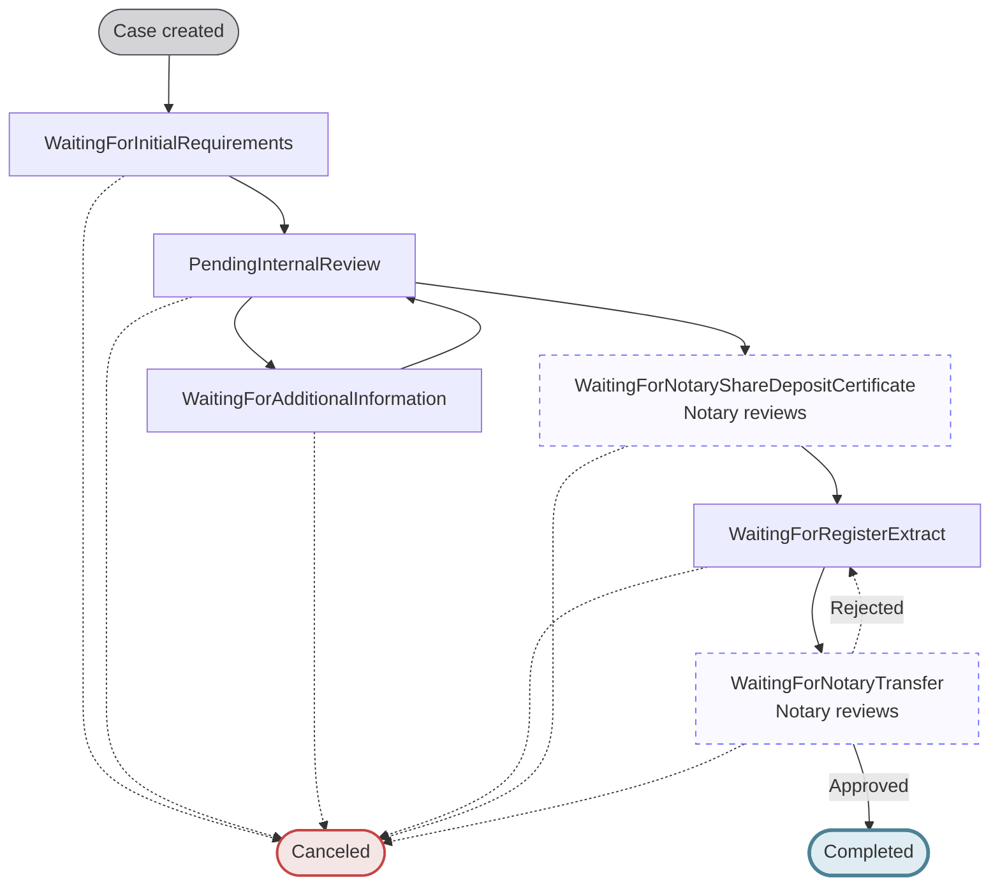
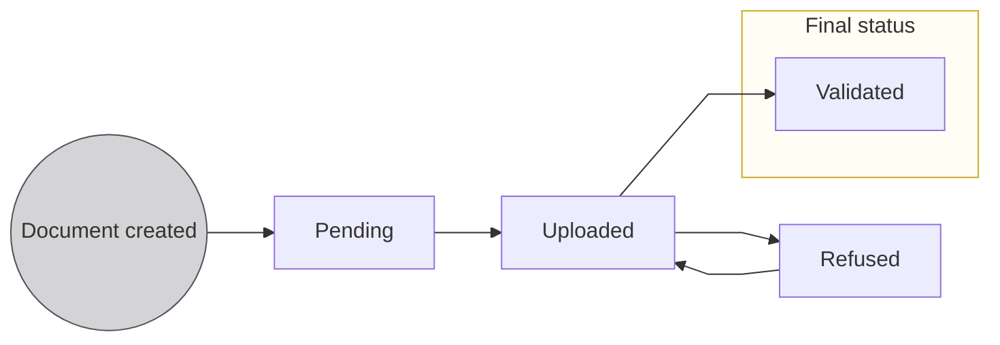
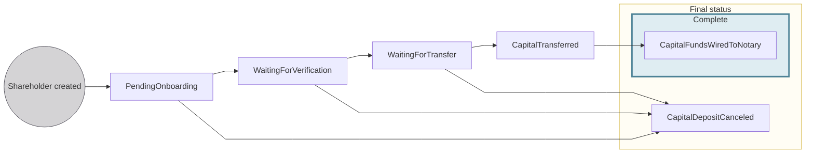
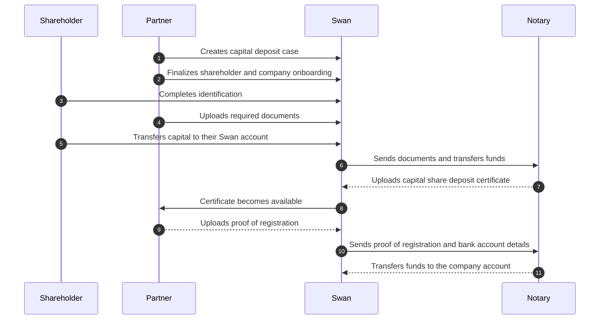

# Capital deposits

import CapitalDepositDefinition from "../definitions/_capital-deposit.mdx";

When creating a new company, you need to deposit its share capital before registering the company.

Capital deposits are currently available for companies being incorporated in France.

The capital deposit process involves several stakeholders:

- **You**, the partner using Swan
- **Your client**, including the future company and its shareholders
- **Swan** and the Swan API
- **The notary**

The main actions are:

- Create a capital deposit case
- Create the company and shareholder accounts
- Complete identity and account-holder verification
- Upload the required documents
- Transfer the capital funds
- Register the company
- Release the funds to the company account

See [Manage a capital deposit case](/topics/capital-deposits/guide-dashboard) for the Partner Dashboard flow.

## Overview {#overview}

The Partner Dashboard shows the progress of each capital deposit case. The technical guides explain how to create a case, upload documents, update information, and cancel a case.

| Guide | Description |
| --- | --- |
| [Manage a capital deposit case](/topics/capital-deposits/guide-dashboard) | Monitor and manage a case through the Partner Dashboard. |
| [Create a capital deposit case](/topics/capital-deposits/france/guide-create-case-v2) | Create a case and the associated company and shareholder onboardings through the API. |
| [Upload required documents](/topics/capital-deposits/guide-upload-documents) | Upload, replace, and monitor capital deposit documents. |
| [Update a shareholder's deposit amount](/topics/capital-deposits/guide-update-shareholder-amount) | Update the expected contribution for a shareholder. |
| [Update company information](/topics/capital-deposits/guide-update-company) | Correct company information linked to a capital deposit case. |
| [Cancel a capital deposit](/topics/capital-deposits/guide-cancel) | Cancel a case and review its cancellation reason. |

## Capital deposit case {#case}

The [`CapitalDepositCase`](https://api-reference.swan.io/objects/capital-deposit-case) API object contains the information for a capital deposit case, including:

1. Details about the future company
2. Company account information
3. Shareholder information
4. Capital deposit documents

### Case statuses {#case-statuses}

```mermaid
%%{ init: { 'flowchart': { 'curve': 'basis' } } }%%
flowchart TD
    DC([Case created]) --> WIR[WaitingForInitialRequirements]
    WIR --> PIR[PendingInternalReview]
    PIR --> WFAI[WaitingForAdditionalInformation]
    PIR --> WNSC[WaitingForNotaryShareDepositCertificate<br/>Notary reviews]
    WFAI --> PIR

    WNSC --> WRE[WaitingForRegisterExtract]
    WRE --> WNT[WaitingForNotaryTransfer<br/>Notary reviews]
    WNT -->|Approved| CO([Completed])
    WNT -.->|Rejected| WRE

    WIR -.-> CA([Canceled])
    PIR -.-> CA
    WFAI -.-> CA
    WRE -.-> CA
    WNSC -.-> CA
    WNT -.-> CA

    style DC fill:#D4D3D5,stroke:#514F59
    style CO fill:#dfedf2,stroke:#4d8296,stroke-width:3px
    style CA fill:#f5e6e6,stroke:#c74444,stroke-width:2px
    style WNSC fill:#f9f9ff,stroke:#6b6bff,stroke-dasharray: 5 5
    style WNT fill:#f9f9ff,stroke:#6b6bff,stroke-dasharray: 5 5
```

| Case status | Explanation |
| --- | --- |
| `WaitingForInitialRequirements` | The case is waiting for shareholder verification, capital transfers, document uploads, and completion of company onboarding. |
| `PendingInternalReview` | Swan is reviewing the information and documents provided. |
| `WaitingForAdditionalInformation` | Swan has requested additional information or corrections and is waiting for a response. |
| `WaitingForNotaryShareDepositCertificate` | The notary is reviewing the deposited funds and submitted documents before issuing the capital share deposit certificate. |
| `WaitingForRegisterExtract` | The partner uploads the company's KBIS for review. |
| `WaitingForNotaryTransfer` | The notary reviews the KBIS. If Swan or the notary refuses the document, the case returns to `WaitingForRegisterExtract`. |
| `Canceled` | The case was canceled before completion by the partner or Swan. A cancellation reason code is available in `CapitalDepositCaseCanceledStatusInfo`. |
| `Completed` | The notary approved the case and transferred the funds to the company account. This status confirms that the capital deposit case is complete, but it does not confirm that the company account is active. |

### Cancellation reason codes {#cancelation-reason-codes}

When a capital deposit case has the status `Canceled`, a reason code is available on the [`CapitalDepositCaseCanceledStatusInfo`](https://api-reference.swan.io/objects/capital-deposit-case-canceled-status-info) type.

:::note Backward compatibility

Capital deposit cases canceled before 2 April 2026 originally had a `null` cancellation reason at the capital deposit level and mapped to the account-level [deprecated closure reason `CapitalDepositReason`](/topics/accounts/closure/#deprecated-reasons).

As of June 2026, Swan migrated these cases to the new cancellation reason codes.

:::

| Reason code | Explanation |
| --- | --- |
| `KYCIssue` | Documents are missing or incorrect, or the requested information was not provided. |
| `ForbiddenActivity` | The company operates in a prohibited business sector. |
| `DuplicateOnboarding` | A second account was created by mistake. |
| `DeniedCountryResidency` | The company has a high-risk UBO or resident. |
| `RefusedIbanCountry` | The account holder was assigned an unsupported IBAN country. |
| `CompanyRegistrationCountryNotSupported` | The company registration country is not supported by Swan. |
| `BusinessInactiveOrNotRegistered` | The company is inactive or not registered. |
| `UnsupportedLegalForm` | The legal form cannot be onboarded by Swan. |
| `TCViolation` | The company violated the Terms and Conditions. |
| `CapitalDepositWithdrawn` | The capital deposit was withdrawn. |
| `CapitalDepositRefusedByNotary` | The notary refused the capital deposit case. |
| `ComplianceReason` | The case was canceled for compliance reasons. |
| `RegulatoryRequirement` | The case was canceled because of a regulatory requirement. |

These reason codes are derived from the same list as the [account closure reason codes](/topics/accounts/closure/#closure-reason-codes).

## Required documents {#documents}

Swan needs several documents to process a capital deposit.

Upload documents as soon as they become available. Document upload can take place in parallel with shareholder onboarding and KYC.

Documents need to meet Swan's requirements. If a document does not meet these requirements, Swan assigns it the `Refused` status and you need to upload a replacement.

See [Upload required documents](/topics/capital-deposits/guide-upload-documents) for the technical upload process.

### List of required documents {#documents-list}

The following table lists the documents that may be required. You upload some documents, Swan collects others during onboarding and identification, and the notary uploads the capital share deposit certificate.

| Stakeholder | Document | API document type | How it is collected | Attached to |
| --- | --- | --- | --- | --- |
| Individual shareholder | [Proof of address](/partnership/document-center/proof-address/) | `ProofOfIndividualAddress` | You upload it with `generateCapitalDepositDocumentUploadUrl`. | `shareholders[].documents` |
| Individual shareholder | Proof of identity | `ProofOfIdentity` | Swan collects it during identification after onboarding is finalized. | The account holder's [supporting document collection](/topics/accounts/documents/) |
| Company shareholder | Commercial registry extract issued within the last three months | `RegisterExtract` | Swan collects it during company onboarding. | The account holder's [supporting document collection](/topics/accounts/documents/) |
| Company shareholder | Proof of identity for the legal representative | `ProofOfIdentity` | Swan collects it during identification when the legal representative is the account administrator. | The account holder's [supporting document collection](/topics/accounts/documents/) |
| Future company | Draft articles of incorporation | `ArticlesOfIncorporation` | You upload it with `generateCapitalDepositDocumentUploadUrl`. | `capitalDepositCase.documents` |
| Future company | Lease agreement for the registered office | `CompanyLeaseAgreement` | You upload it with `generateCapitalDepositDocumentUploadUrl`. | `capitalDepositCase.documents` |
| Future company | Power of attorney from the legal representative to Swan | `PowerOfAttorney` | You upload it with `generateCapitalDepositDocumentUploadUrl`. | `capitalDepositCase.documents` |
| Future company | Capital share deposit certificate | `CapitalShareDepositCertificate` | The notary uploads it. | `capitalDepositCase.documents` |
| Future company | Commercial registry extract, or KBIS, issued after incorporation | `RegisterExtract` | You upload it with `generateCapitalDepositDocumentUploadUrl` after incorporation. | `capitalDepositCase.documents` |

### Registered office without a lease agreement

If the future company does not have a lease agreement as proof of its official company address, provide the documents required for its situation.

All identity documents need to be in full color and include the front and back of the document.

| Official company address | Additional documents |
| --- | --- |
| The legal representative's address | Business address affidavit from the legal representative. If the legal representative is not a shareholder, also provide their identity document and proof of address. |
| The legal representative's address, but the representative rents the property or is hosted by someone else | Business address affidavit from the host. If the legal representative is not a shareholder, also provide the legal representative's identity document, the host's identity document, and the host's proof of address. |
| Another company's office address | KBIS for the host company issued within the last three months, a business address affidavit from the host company's legal representative, and the identity document of the legal representative who provided the affidavit. |

### Document statuses {#documents-statuses}

```mermaid
%%{ init: { 'flowchart': { 'curve': 'linear' } } }%%
flowchart LR
    DC((Document created)) --> P[Pending]
    P --> U[Uploaded]
    U --> RF[Refused]
    RF --> U
    U --> V[Validated]

    subgraph F[Final status]
        V
    end

    style DC fill:#D4D3D5,stroke:#514F59
    style F fill:#fffdf4,stroke:#cca922
```

| Document status | Explanation |
| --- | --- |
| `Pending` | A place for the document has been created, but the document has not been uploaded. |
| `Uploaded` | The document was uploaded successfully. Swan reviews it and either validates or refuses it. |
| `Validated` | Swan validated the document. |
| `Refused` | The document does not meet the requirements. Review `reasonCode` for the refusal category and `reason` for the optional plain-text explanation. Both are visible in the Dashboard and available through the API. Upload a replacement document to return the status to `Uploaded`. |

## Shareholders {#shareholders}

A shareholder is an individual or legal entity that deposits funds in exchange for ownership of the future company.

To deposit funds, each shareholder opens a temporary Swan payment account.

Each shareholder needs to complete the [onboarding](/topics/onboarding/), [identification](/topics/users/identifications/), and [account-holder verification](/topics/onboarding/account-holders/#verification-process) processes.

Once the required steps are complete, the shareholder receives an IBAN to use for the capital transfer.

Shareholders need to provide proof of their residence address. Only official documents are accepted. See the list of acceptable documents in the [Partnership Document Center](/partnership/document-center/proof-address/).

### Shareholder statuses {#shareholders-statuses}

```mermaid
%%{ init: { 'flowchart': { 'curve': 'linear' } } }%%
flowchart LR
    SC((Shareholder created)) --> P[PendingOnboarding]
    P --> WV[WaitingForVerification]
    WV --> WT[WaitingForTransfer]
    WT --> CT[CapitalTransferred]
    CT --> CN[CapitalFundsWiredToNotary]

    P --> CDC[CapitalDepositCanceled]
    WV --> CDC
    WT --> CDC

    subgraph COM[Complete]
        CN
    end

    subgraph F[Final status]
        CDC
        COM
    end

    style SC fill:#D4D3D5,stroke:#514F59
    style COM fill:#dfedf2,stroke:#4d8296,stroke-width:3px
    style F fill:#fffdf4,stroke:#cca922
```

| Shareholder status | Explanation |
| --- | --- |
| `PendingOnboarding` | The shareholder was created and needs to complete onboarding before continuing. |
| `WaitingForVerification` | Account-holder verification is not complete. This status is bypassed when the account-holder status is already `Verified`. |
| `WaitingForTransfer` | The shareholder needs to transfer the full capital contribution to their Swan account. The transfer needs to come from an account held in the shareholder's name and needs to be a [SEPA Credit Transfer](/topics/payments/credit-transfers/sepa/). |
| `CapitalTransferred` | The shareholder's capital has been received, but the rest of the capital deposit case still needs to be completed. |
| `CapitalFundsWiredToNotary` | The shareholder's funds have been transferred to the notary, but the rest of the capital deposit case still needs to be completed. |
| `CapitalDepositCanceled` | The capital deposit case was canceled. If a shareholder account was already created, Swan closes the account as part of the cancellation process. |

## Transfer requirements {#transfer-requirements}

Shareholder accounts have specific transfer requirements for capital deposits.

### SEPA Credit Transfers only {#sepa-only}

:::caution

Shareholder accounts only accept [SEPA Credit Transfers](/topics/payments/credit-transfers/sepa/) for capital deposits.

International credit transfers are rejected automatically before settlement, regardless of the amount. Make sure all transfers are sent from an account held in the shareholder's name.

:::

## Sequence diagram {#diagram}

```mermaid
sequenceDiagram
    autonumber
    participant SH as Shareholder
    participant P as Partner
    participant S as Swan
    participant N as Notary

    P->>S: Creates capital deposit case
    P->>S: Finalizes shareholder and company onboarding
    SH->>S: Completes identification
    P->>S: Uploads required documents
    SH->>S: Transfers capital to their Swan account
    S->>N: Sends documents and transfers funds
    N-->>S: Uploads capital share deposit certificate
    S->>P: Certificate becomes available
    P-->>S: Uploads proof of registration
    S->>N: Sends proof of registration and bank account details
    N-->>S: Transfers funds to the company account
```

## Update a shareholder's deposit amount {#update-amount}

You can update a shareholder's deposit amount through the API.

import UpdateShareholderPrereqs from "./partials/_update-shareholder-prereqs.mdx";

Updating a shareholder's deposit amount automatically recalculates the total capital deposit amount for the case.

See [Update a shareholder's capital deposit amount](/topics/capital-deposits/guide-update-shareholder-amount).

## Update company information {#update-company}

You can update the main company information linked to a capital deposit through the API.

This allows you to correct the company name and postal address without contacting Swan Support.

import UpdateCompanyPrereqs from "./partials/_update-company-prereqs.mdx";

Updating these fields synchronizes the data across the capital deposit case and the associated account holder.

See [Update a capital deposit company](/topics/capital-deposits/guide-update-company).

## Cancel a capital deposit {#cancel}

You can cancel an ongoing capital deposit when cancellation is still available.

import CancelCase from "./partials/_cancel-case.mdx";

When a capital deposit case is canceled, associated shareholder accounts may also be closed.

See [Cancel a capital deposit](/topics/capital-deposits/guide-cancel).