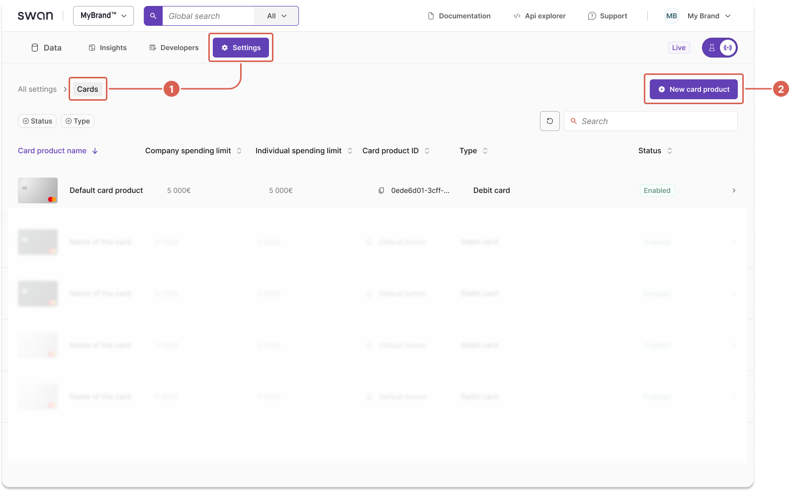

To create a new card product in the Dashboard, first select and configure the [card package](/topics/cards/card-packages/). 
Your selection determines the features, capabilities, and pricing of the card your users can access.

This guide shows you how to configure card packages on card products.

## Create a card product {#create}

1. Go to **Dashboard** > **Settings** > **Cards**.
1. Select **+ New card product**.

3. Choose the **Standard**, **Essential**, or **Premium** card package.
To offer a card with only basic features (no insurance, base spending limits, and base foreign exchange fees), select **No package**.

:::caution
This choice is permanent. You can't modify the package level once the card product is created.
:::

4. Name your new card product.
5. Toggle **Allow physical cards** to enable physical cards.
6. Select **Create**.

## Configure your card design {#configure-design}

1. To edit your card design, select **+ Create new design**.
1. Choose your card style:
    - Black or Silver (Standard and Essential)
    - Metal (Premium only)
    - Custom (available for all card products)
3. Define your logo size.
4. Upload your logo file.
5. Submit for review. 

## Card product review and validation

After configuring your card package, we'll review and validate it before it can be used.
