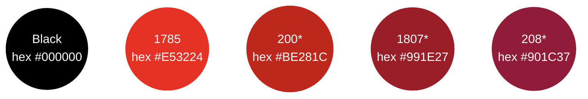
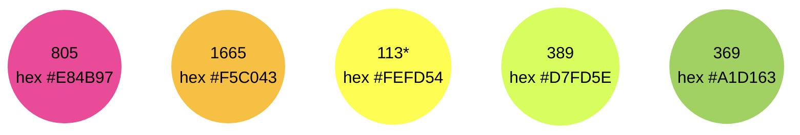
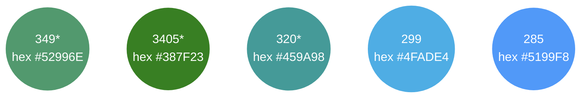

# Customize your card design

You can design a custom card for your Swan card holders.
Custom designs, like standard ones, are used for virtual, physical, and digital cards.

import CustomCardDesign from '../partials/_custom-card-timeline.mdx';

<CustomCardDesign />

## Process overview {#overview}

1. Send an email to integration@swan.io stating that you'd like to begin the custom design process. Include how many cards you'll print in the first batch (1000 minimum).
1. Swan will send you a tutorial and an Adobe Illustrator file that's ready to use.
1. Choose your **customizations**.
1. Choose your **packaging**.
1. Send your design to your Technical Account Manager.
1. Your Technical Account Manager will work with Mastercard to validate your design.
1. After your design is validated, samples of your card will be printed and delivered for final approval.
1. As soon as you approve the sample, your cards can be printed and delivered to your card holders.

import CustomCardLockedElements from '../partials/_custom-locked-elements.mdx';

:::caution Locked elements
The following elements **can't be changed**:
<CustomCardLockedElements />
:::

## Choose your customizations {#customizations}

| Element | Options |
| --- | --- |
| Chip color | <ul><li>Gold (default)</li><li>Silver (2,000 cards minimum, additional cost)</li></ul> |
| Type of plastic *(no metal available)* | <ul><li>Standard plastic</li><li>Recycled plastic 85% or 100% (adds up to 12 weeks as recycled plastic is shipped by boat to reduce the carbon footprint)</li></ul> |
| Finish | <ul><li>Matte</li><li>Gloss</li><li>Partially matte or gloss (might be referred to as *selective varnish*; additional cost)</li><li>Logo printed with brilliant effect (additional cost)</li><li>Other effects, such as metallic, fluorescent silkscreen, and more, are also available at an additional cost</li></ul> |
| Color | You can customize your color for the front, back, and edges.  <ul><li>**Dyed PVC**<ul><li>Front, back, and edges are dyed the same color </li><li>Additional cost</li></ul></li></ul><ul><li>**Edge color**<ul><li>Choose a different color for the edges</li><li>Additional cost</li></ul></li></ul><ul><li>**Face color only**<ul><li>Might be referred to as *quadri-faced color*</li><li>Front and back are dyed the same color, while the edges stay white</li><li>No additional cost</li></ul></li></ul><ul><li>**Custom magnetic band color**<ul><li>Default color is black</li><li>Choose a different color for an additional cost</li></ul></li></ul>Several colors are available. Please choose your color from the colors listed in the following section. Note that if the color you choose clashes with the Mastercard logo, the Mastercard logo will be outlined in white. |
| Text style | While the font must be Maison Neue, the styling of the text is up to you. Styling is applied to the card holder name, card number, identifier, expiry date, CVC, and the debit or business label.  <ul><li>**Durable graphics** (default, cost included)<ul><li>Durable color foil applied to card</li><li>Available in white, black, silver, or gold (other colors available but require validation)</li></ul></li></ul><ul><li>**Embossed**<ul><li>Text is raised off the card</li><li>Additional cost</li></ul></li></ul><ul><li>**Thermal printing**<ul><li>Long-lasting technique that carves the text out of the card</li><li>Additional cost</li></ul></li></ul><ul><li>**Laser**<ul><li>Long-lasting technique that burns the text into the card with a laser</li><li>Additional cost</li></ul></li></ul> |
| Additional line | <ul><li>Add an additional line to the front of your card (example: add your company name)</li><li>Line appears under the card holder name</li><li>Content must be approved</li><li>Limit: 26 characters</li></ul> |

### Colors {#customizations-colors}

Several colors are available to choose from for you custom cards.

The first number is the color code with Swan's card provider (example: 200).
The second is the approximate hexadecimal color code, for your reference only.

*Colors marked with an asterisk (\*) can't be used to dye the edges.*

## Choose your packaging {#packaging}

import Packaging from '../partials/_packaging.mdx';

<Packaging />