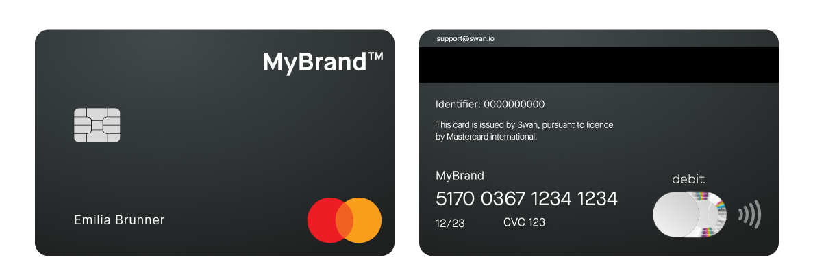

# Card design

Your card design appears several times during your cardholders' user experience.
Your design is:

- Featured in the Web Banking interface for virtual and physical cards
- Printed on physical cards
- Displayed in digital wallets

## Card product {#card-product}

import CardProductExplanation from '../partials/_card-product.mdx';

<CardProductExplanation />

## Standard card design {#standard}

Swan proposes two standard card designs that are already validated by Mastercard.

Personalize standard cards with your logo on the front of the card.
See it now in Swan's [card design studio](https://swan-io.github.io/card-design-studio/).

### Black

Black cards feature your logo in **white monochrome**.

### Silver

Silver cards feature your logo in **black monochrome**.

## Custom card design {#custom}

If the standard black or silver designs won't meet your needs, or you want customize more to your brand's style, Swan also offers [custom card designs](./guide-custom.mdx).

import CustomCardDesign from '../partials/_custom-card-timeline.mdx';

<CustomCardDesign />

Note that the following elements **can't be customized**:

import CustomCardLockedElements from '../partials/_custom-locked-elements.mdx';

<CustomCardLockedElements />

## Guides {#guides}

- [Configure your standard card](./guide-standard.mdx)
- [Design your custom card](./guide-custom.mdx)
- [Configure your logo](./guide-logo.mdx)