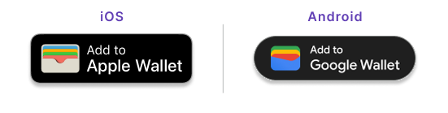
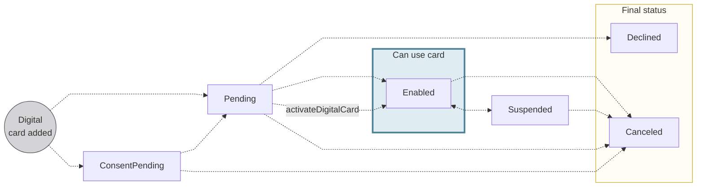

# Digital cards

import DigitalCardsDefinition from '../../definitions/_cards-digital.mdx';

> <DigitalCardsDefinition />

Swan cards are compatible with Apple Pay and Google Pay.

If you choose to allow digital cards, your cardholders can add their cards to their preferred digital wallet.
Swan recommends only digitizing virtual cards for a safer experience.

A list of digital cards is available in the `cards` query.

## Certifying your digital card integration {#integration}

You need to certify your digital card integration before your cardholders can use Apple Pay and Google Pay.

Please use our Partner Support Request form available on your Dashboard, specifying that you'd like to activate in-app provisioning for digital payments. The team will help you get started.

import CompleteProvisioningGuide from '../partials/_provisioning-guide.mdx';

<CompleteProvisioningGuide />

## Adding cards to digital wallets {#wallets}

Only [enabled virtual cards](../virtual/index.mdx#statuses) and [activated physical cards](../physical/index.mdx#statuses) can be digitized.
Virtual cards are enabled almost immediately, but make sure your cardholders activate their physical cards before trying to digitize them.

There are multiple ways to [add cards to a digital wallet](./guide-add.mdx):

1. Your cardholders can do it themselves by entering their virtual or physical card number into the digital wallet.
1. Your cardholders can use the Swan App and follow the in-app provisioning process.
1. You can initiate the in-app provisioning process through the `addDigitalCard` mutation.
1. If cardholders start manual provisioning but don't complete it, you can [help them transition to in-app provisioning](./guide-add.mdx#manual-to-inapp) using the `activateDigitalCard` mutation (requires Apple Pay and/or Google Pay certification).

## Renewing digital cards {#auto-renew}

Swan takes care of updating digital cards with Apple Pay and Google Pay.
It's a clear advantage, as this requires no action from you nor your client.

## Digital card statuses {#statuses}

| Digital card status | Explanation |
|---|---|
| `ConsentPending` | Request to add a digital card was sent with the `addDigitalCard` mutation and is waiting for the cardholder's consent  **Next steps**:<ul><li>If the cardholder consents, the status moves to `Pending`</li><li>If the cardholder doesn't consent, the status moves to `Canceled`</li><li>If you use the API to cancel the card, the status moves to `Canceled`</li></ul> |
| `Pending` | Cardholder added the card to their digital Wallet manually, or they provided consent after you added the card with the API  **Next steps**:<ul><li>If the card is added to their Wallet successfully, the status moves to `Enabled`</li><li>If the card is declined during provisioning, the status moves to `Declined`</li><li>You can use the `activateDigitalCard` mutation to help complete the provisioning process</li></ul> |
| `Enabled` | Digital card is available for use  **Next steps**:<ul><li>Cards can retain the status `Enabled` indefinitely</li><li>`Enabled` cards can also be `Suspended` and `Canceled`</li></ul> |
| `Suspended` | Digital card is suspended and not available for use  *Cards can be suspended for various reasons, including a request from you or the cardholder, or a Swan action in the case of suspicious activity.*  **Next steps**:<ul><li>Restore the card's previous status with the API</li><li>Cancel the card with the API</li></ul> |
| `Canceled` | Card is canceled, no longer available for use, and can't be reactivated |
| `Declined` | Card was declined during the provisioning process |

:::tip Transitioning from Manual to In-App Provisioning
If a digital card is stuck in `Pending` status after manual provisioning (for example, the cardholder didn't complete OTP verification), you can use the `activateDigitalCard` mutation to help them complete the process without restarting. Learn more in the [transitioning from manual to in-app provisioning guide](./guide-add.mdx#manual-to-inapp).
:::

## Troubleshooting digital card provisioning {#troubleshooting}

### Common issues and solutions

**Digital card stuck in `Pending` status**
- Check if the cardholder completed the manual provisioning process in their digital wallet.
- Use the `activateDigitalCard` mutation to help complete the provisioning.
- Verify that the `walletId` is correctly identified for the pending card.

**Cannot retrieve `walletId` for pending cards**
- This is a known limitation with Apple Pay - the platform doesn't provide access to `walletId` for pending tokens.
- For Google Pay, ensure you're using the correct filters in your query to identify pending cards.

**Certification requirements**
- Manual provisioning doesn't require additional certification.
- In-app provisioning requires certification - please use our Partner Support Request form available on your Dashboard to get started.
- **`activateDigitalCard` requires Apple Pay and/or Google Pay certification** - please open a ticket through our Partner Support Request form available on your Dashboard before implementation.

**Android vs iOS implementation differences**
- Google Pay provides better support for retrieving pending card information.
- Apple Pay has platform limitations that may affect certain provisioning flows.

## Guides {#guides}

- [Add digital cards to Apple Pay and Google Pay](./guide-add.mdx)
- [Cancel a digital card](./guide-cancel.mdx)