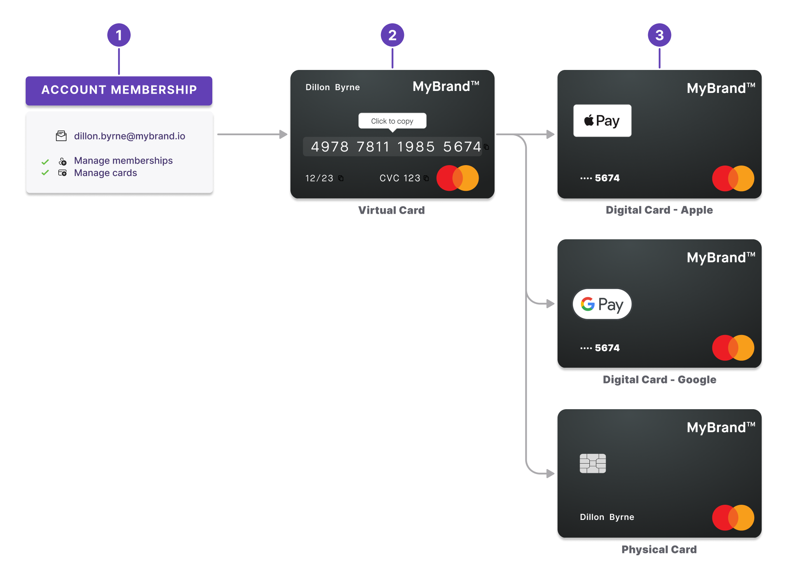
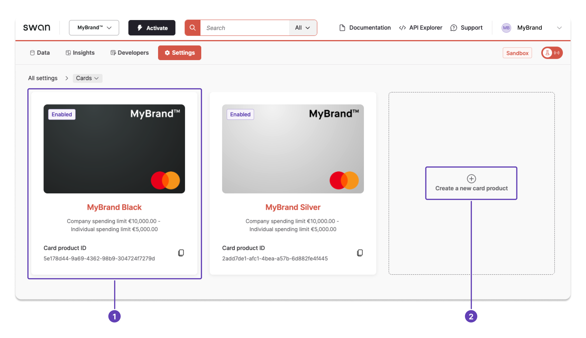
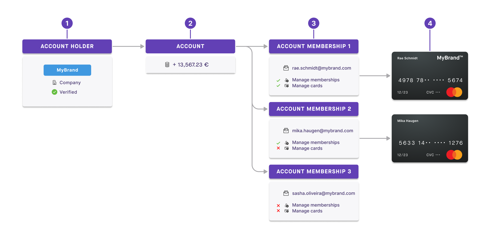
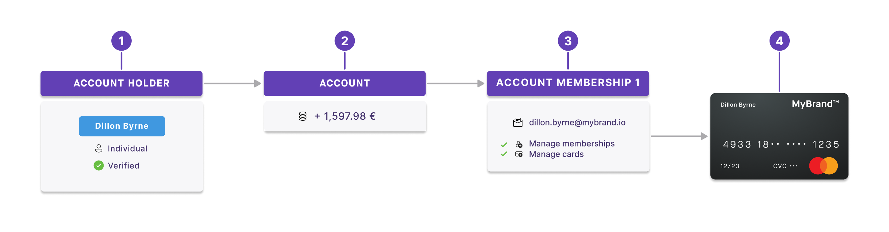

# Cards

Swan offers Mastercard debit cards to all of your account members.
Swan cards can be used everywhere Mastercard is accepted.

Individual account holders are issued consumer debit cards, while company account holders receive business debit cards.
Note that cards don't come with insurance.

## Types of cards {#types}

import VirtualCardsDefinition from '../definitions/_cards-virtual.mdx';

import PhysicalCardsDefinition from '../definitions/_cards-physical.mdx';

import DigitalCardsDefinition from '../definitions/_cards-digital.mdx';

Swan offers three types of cards.

| Card type | Description |
| --- | --- |
| [Virtual](./virtual/index.mdx) | <VirtualCardsDefinition /> |
| [Physical](./physical/index.mdx) | <PhysicalCardsDefinition /> |
| [Digital](./digital/index.mdx) | <DigitalCardsDefinition /> |

### Creation order {#types-order}

Swan is enthusiastically **virtual first** (similar to digital first), meaning the priority is on a **dematerialized user experience**.

1. Create **account memberships** before creating cards.
1. Create **virtual cards** before physical cards.
1. Create **physical** and **digital cards**. Note that physical cards aren't required to create digital cards—you can add a virtual card directly into your favorite digital wallet.

Consider the example of Kafka Tamura:

1. **Instantly**: Kafka requests and receives a virtual card, usable right away for e-commerce transactions.
1. **Day 2**: Kafka adds his virtual card to Apple Pay, digitizing the card. He uses it to make contactless payments.
1. **Day 4**: Kafka decides to add the virtual card to his Apple watch as well.
1. **Day 7**: Finally, Kafka decides to order a physical card, just in case.

## Security and consent

To keep the cards you supply secure, all card-related mutations that initiate a sensitive action require consent.
Review the list of all [sensitive operations that require consent](../consent/index.mdx#sensitive) with Swan.

## Card products {#card-product}

import CardProductExplanation from './partials/_card-product.mdx';

<CardProductExplanation />

Learn more about **designing** your card products in the [card design section](./design/index.mdx).

:::info Printing hub
The [printing hub](./physical/index.mdx#hubs), where **physical cards are printed then shipped** to your cardholders, is defined in the card product ID.
You must have one dedicated card product per hub, though the designs can be identical.
:::

### Card product settings {#settings}

You can update your card product's name and whether physical cards are allowed, plus you can block the card.

Manage card settings on your **Dashboard** > **Settings** > **Cards**.
You can (1) manage existing card products that are already validated, or (2) create a new standard card product.

## Cards and account memberships {#cards-account-memberships}

No matter how many members are attached to an account—1, 50, or 500—you can issue cards to each member.
Every member has access to the same pot of money.
Any payments made with the card are debited from the account the member belongs to.

Thus, an account membership must be created *before* adding a card for an account member.

### Multiple memberships, multiple cards {#cards-account-memberships-example-multiple}

1. MyBrand is a verified account holder with a company account.
1. As an account holder, MyBrand has one account with money in it.
1. Attached to the account are three account members: Rae, Mika, and Sasha.
    1. Each member is identified by their email address.
    1. They all have different permissions.
1. Only two members, Rae and Mika, have cards associated with their account membership. Any money spent with these cards is taken from the MyBrand company account.

### One membership, one card {#cards-account-memberships-example-one}

1. Dillon is a verified account holder with an individual account.
1. As an account holder, Dillon has one account with money in it.
1. Dillon is the only account member, identified by her email address. She has membership and card permissions automatically.
1. Dillon also has a card associated with her account membership.

## Card language {#language}

Your card's language (the language that will appear on payment terminals, for example) is usually the same as the language chosen for the Swan account.

For Swan's **no-code** and **open source** Web Banking interface, the card language is determined by the default language of the browser where the card is created.

When using the **API**, the default language is English.
You can update the default language by calling the `bindAccountMembership` mutation and adding `accept-language` to the HTTP header.
This allows the users to choose their card language.

## Card statuses {#statuses}

Card statuses depend on the type of card.
Refer to the corresponding sections for [virtual](./virtual/index.mdx#statuses), [physical](./physical/index.mdx#statuses), and [digital](./digital/index.mdx#statuses) cards.

## Guides {#guides}

- [Issue cards](./overview/guide-issue.mdx)
- [Update card product](./overview/guide-update.mdx)