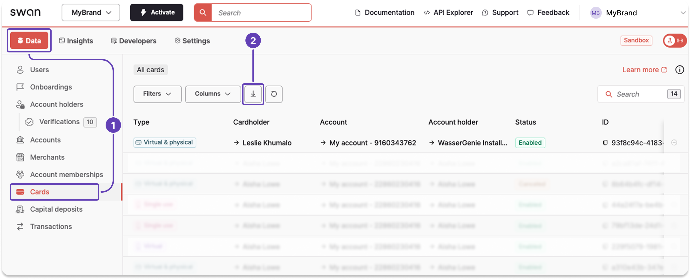

# Export card data

You can export the card data available on the Dashboard, either from your Dashboard or with the API.
Review the next steps to understand what happens after finalizing your export.

## Dashboard {#dashboard}

1. On your Dashboard, go to **Data** > **Cards**.
1. Click the **download icon** to trigger a `.csv` export.
1. A modal appears. Click **Export data** to finalize the request.



## API {#api}

1. Call the `exportCardData` mutation.
1. Add your `email`. A link to download the `.csv` export is sent to the email address you provide.
1. Add the success payload and rejections.

### Mutation {#api-mutation}

<a href="https://explorer.swan.io?query=bXV0YXRpb24gRXhwb3J0Q2FyZHMgewogIGV4cG9ydENhcmREYXRhKAogICAgaW5wdXQ6IHsKICAgICAgZW1haWw6ICIkWU9VUl9FTUFJTF9BRERSRVNTIgogICAgICBmaWx0ZXJzOiB7IHR5cGVzOiBWaXJ0dWFsLCBzdGF0dXNlczogRW5hYmxlZCB9CiAgICB9CiAgKSB7CiAgICAuLi4gb24gRXhwb3J0RGF0YVN1Y2Nlc3NQYXlsb2FkIHsKICAgICAgX190eXBlbmFtZQogICAgICBleHBvcnRJZAogICAgfQogICAgLi4uIG9uIE1heGltdW1TaW11bHRhbmVvdXNFeHBvcnRzUmVqZWN0aW9uIHsKICAgICAgX190eXBlbmFtZQogICAgICBtZXNzYWdlCiAgICB9CiAgICAuLi4gb24gTWF4aW11bURhaWx5RXhwb3J0c1JlYWNoZWRSZWplY3Rpb24gewogICAgICBfX3R5cGVuYW1lCiAgICAgIG1lc3NhZ2UKICAgIH0KICB9Cn0K&tab=api" className="explorer-badge">Open in API Explorer</a>

```graphql {4,5,10} showLineNumbers
mutation ExportCards {
  exportCardData(
    input: {
      email: "$YOUR_EMAIL_ADDRESS"
      filters: { types: Virtual, statuses: Enabled }
    }
  ) {
    ... on ExportDataSuccessPayload {
      __typename
      exportId
    }
    ... on MaximumSimultaneousExportsRejection {
      __typename
      message
    }
    ... on MaximumDailyExportsReachedRejection {
      __typename
      message
    }
  }
}
```
### Payload {#api-payload}

The payload returns the export ID.

```json {5} showLineNumbers
{
  "data": {
    "exportCardData": {
      "__typename": "ExportDataSuccessPayload",
      "exportId": "$EXPORT_ID"
    }
  }
}
```

## Next steps {#next}

import ExportNextSteps from '../../partials/_export-next-steps.mdx';

<ExportNextSteps />