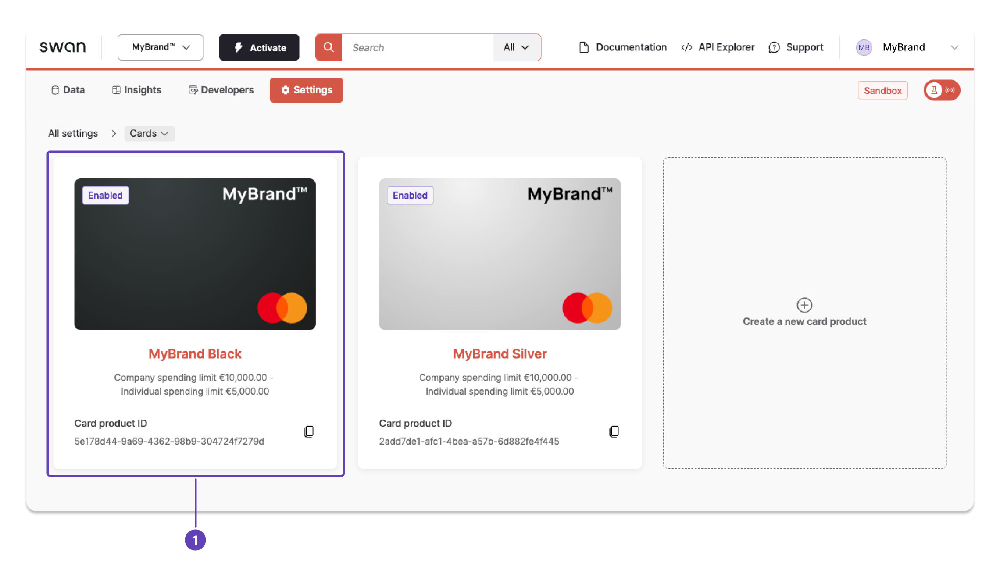
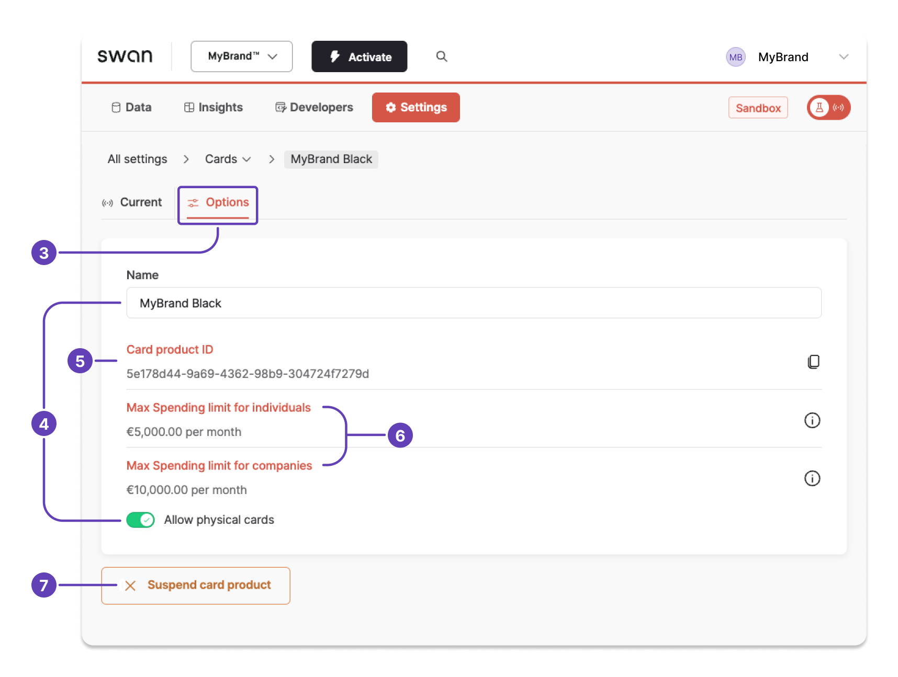

# Update card settings

Update most settings for your card product.

:::note
To understand all options for card product settings, please review the [explanatory content](../index.mdx#settings).
:::

## API guide {#guide-api}

Card product settings are **valid for all payments** linked to the card, including all virtual, physical, and digital cards.

1. Update all card settings by calling the `updateCard` mutation.
1. When updating card settings, make sure you are authenticated with a user access token associated with the correct account member.
    - Additionally, the account member must have the [membership permission](../../accounts/memberships/index.mdx#permissions) `canManageCards`.
    - The permission `canManageAccountMembership` is optional.
1. The request from this mutation returns a newly created consent resource containing the `consentUrl`.
1. The URL allows you to redirect the user making the modification to Swan's [Strong Customer Authentication](../../users/consent/index.mdx#sca).

After the consent process is completed, the card is updated and its attribute version is increased by one.

import SuspicionOfFraud from '../../partials/_card-fraud-suspicion.mdx';

<SuspicionOfFraud />

### Mutation {#mutation}

<a href="https://explorer.swan.io?query=bXV0YXRpb24gVXBkYXRlQ2FyZFRyYW5zYWN0aW9uU2V0dGluZ3MgewogIHVwZGF0ZUNhcmQoCiAgICBpbnB1dDogewogICAgICBjYXJkSWQ6ICIkWU9VUl9DQVJEX0lEIgogICAgICB3aXRoZHJhd2FsOiBmYWxzZQogICAgICBpbnRlcm5hdGlvbmFsOiBmYWxzZQogICAgICBub25NYWluQ3VycmVuY3lUcmFuc2FjdGlvbnM6IGZhbHNlCiAgICAgIGVDb21tZXJjZTogZmFsc2UKICAgICAgY29uc2VudFJlZGlyZWN0VXJsOiAiJFlPVVJfQ09OU0VOVF9VUkwiCiAgICB9CiAgKSB7CiAgICAuLi4gb24gVXBkYXRlQ2FyZFN1Y2Nlc3NQYXlsb2FkIHsKICAgICAgX190eXBlbmFtZQogICAgICBjb25zZW50IHsKICAgICAgICBjb25zZW50VXJsCiAgICAgICAgaWQKICAgICAgfQogICAgfQogICAgLi4uIG9uIEFjY291bnROb3RGb3VuZFJlamVjdGlvbiB7CiAgICAgIGlkCiAgICAgIG1lc3NhZ2UKICAgIH0KICAgIC4uLiBvbiBDYXJkTm90Rm91bmRSZWplY3Rpb24gewogICAgICBpZAogICAgICBtZXNzYWdlCiAgICB9CiAgICAuLi4gb24gQWNjb3VudE1lbWJlcnNoaXBOb3RBbGxvd2VkUmVqZWN0aW9uIHsKICAgICAgX190eXBlbmFtZQogICAgICBtZXNzYWdlCiAgICB9CiAgICAuLi4gb24gVmFsaWRhdGlvblJlamVjdGlvbiB7CiAgICAgIF9fdHlwZW5hbWUKICAgICAgbWVzc2FnZQogICAgICBmaWVsZHMgewogICAgICAgIGNvZGUKICAgICAgICBtZXNzYWdlCiAgICAgICAgcGF0aAogICAgICB9CiAgICB9CiAgfQp9Cg%3D%3D&tab=api" className="explorer-badge">Open in API Explorer</a>

```graphql {4,9} showLineNumbers
mutation UpdateCardTransactionSettings {
  updateCard(
    input: {
      cardId: "$YOUR_CARD_ID"
      withdrawal: false
      international: false
      nonMainCurrencyTransactions: false
      eCommerce: false
      consentRedirectUrl: "$YOUR_CONSENT_URL"
    }
  ) {
    ... on UpdateCardSuccessPayload {
      __typename
      consent {
        consentUrl
        id
      }
    }
  }
}
```

### Payload {#payload}

Open the `consentUrl` returned by the mutation to consent to the update.

```json {6,7} showLineNumbers
{
  "data": {
    "updateCard": {
      "__typename": "UpdateCardSuccessPayload",
      "consent": {
        "consentUrl": "$YOUR_CONSENT_URL",
        "id": "$YOUR_CONSENT_ID"
      }
    }
  }
}
```

## Dashboard {#guide-dashboard}

Update your card settings, including the name, whether physical cards are allowed for this card product, and suspending the card product.
You can also review and click-to-copy important information about the card product.

1. Go to **Dashboard** > **Settings** > **Cards**, and click the card product you'd like to update.



2. Open **Options**. (Note the first tab, **Current**, where you can [update design settings](../design/guide-standard.mdx#configure).)
1. Update the following options as needed. Changes are saved automatically.
    1. Card name.
    1. Whether you allow physical cards for this card product.
1. Click-to-copy the **card product ID** when you need it.
1. Review the **spending limits** for individuals and companies.
1. Click **Suspend card product** if you need to block this card product. Suspended card products can be reactivated by contacting Swan Support.

