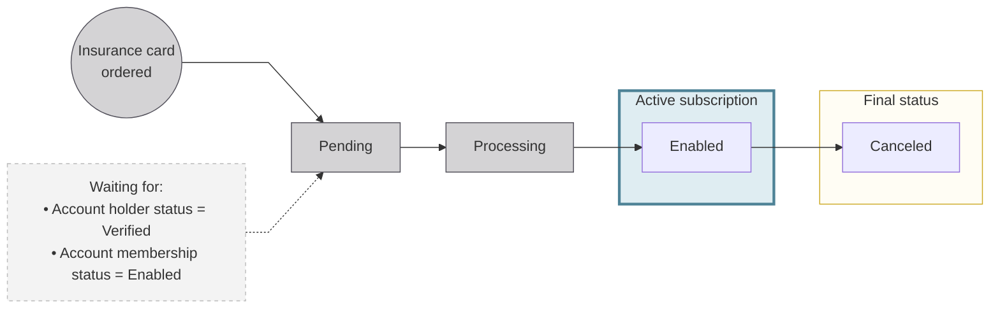
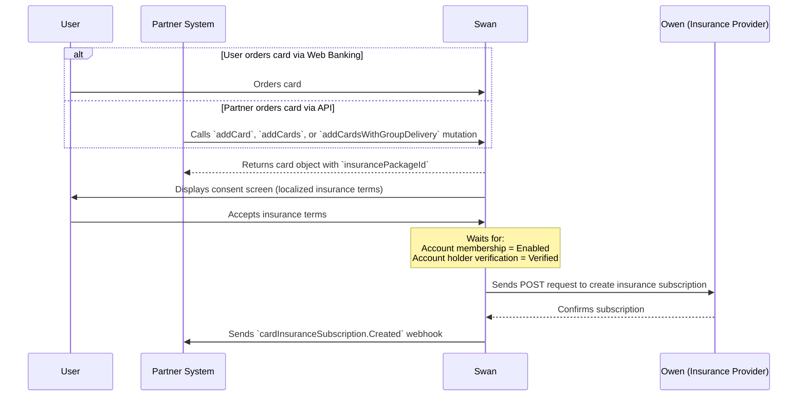

## Overview {#overview}

Swan now offers insurance packages that can be added to payment cards, providing extra protection for cardholders. Partners can choose to create cards with embedded insurance or without it.

There are three standard insurance packages available:

- **Basic**
- **Essential**
- **Premium**

Once an insurance package is assigned to a card product, all new cards created under that product will automatically include the chosen insurance by default.

:::caution No coverage for existing cards
Insurance is not retroactive. Existing cards won't be updated automatically. To add insurance, you must issue a new card.
:::

## Card insurance coverage {#insurance-coverage}

The following tables outline the card insurance coverage included with Swan cards. 

:::info Specific coverage 
Specific coverage varies by **insurance plan**. To consult the details of a card's insurance coverage, please **request the terms and conditions notice** directly from your Product Integration Manager (PIM).
:::

  
**Identity protection** 

  

| Insurance type | Explanation | Basic | Essential | Premium | Coverage limit |
|---|---|---|---|---|---|
| Loss or theft of identity documents | Reimbursement of costs for renewing identity documents (including duplicate fees, stamp duty, and identity document photos). | ✔️ | ✔️ | ✔️ | Up to €350 per year and per claim |
| Bank card fraud | Reimbursement for amounts fraudulently debited before reporting loss or theft. | ✔️ | ✔️ | ✔️ | Up to €3,000 per year |
| Phishing guarantee | Reimbursement for financial losses due to phishing (above €50). | ✔️ | ✔️ | ✔️ | Up to €1,000 per year |
  

  
**Travel insurance** 

  

| Insurance type | Explanation | Basic | Essential | Premium | Coverage limit |
|---|---|---|---|---|---|
| Travel delay (train or flight) | Reimbursement of expenses from train or flight delays of 4+ hours. |  |  | ✔️ | Up to €400 per delay |
| Delayed baggage | Reimbursement of essential purchases due to delayed baggage. |  |  | ✔️ | Up to €800 per delay |
| Lost, stolen, or damaged baggage | Reimbursement for baggage loss, theft, or damage. |  |  | ✔️ | Up to €800 per baggage, €250 per valuable item; €70 deductible per claim |
| Trip modification or cancellation | Reimbursement of non-recoverable trip costs due to valid reasons (illness, accident, summons, strike, theft, visa refusal). |  | ✔️ | ✔️ | Up to €5,000 per year |
| Travel assistance and repatriation | Medical expense reimbursement abroad and repatriation services. |  |  | ✔️ | €100,000 (medical), €2,500 (ski accident), €1,500 (repatriation of remains) |
  

  
**Car rental** 

  

| Insurance type | Explanation | Basic | Essential | Premium | Coverage limit |
|---|---|---|---|---|---|
| Rental vehicle coverage | Coverage for incidents related to rental vehicles. |  | ✔️ | ✔️ | Up to 2 incidents per year |
  

  
**Legal protection** 

  

| Insurance type | Explanation | Basic | Essential | Premium | Coverage limit |
|---|---|---|---|---|---|
| E-reputation legal protection | Legal support for identity theft, cyber-harassment, or damage to online reputation. | ✔️ | ✔️ | ✔️ | Up to €15,000 per dispute |
  

## Card insurance product configuration {#insurance-configuration}

You can assign one of the [three standard insurance packages](/topics/cards/overview/insurance-on-cards) at the card product level. 
Once set, the package is automatically linked to any new card issued from that card product.

:::info Configure your card product    
Follow the [step-by-step guide](/topics/cards/overview/guide-insurance-integration) to configure insurance on your card product.
:::

## Card insurance billing {#insurance-billing}
Pricing varies by insurance package level (Basic, Essential, Premium). Partners are billed monthly for active insurance subscriptions. 
For specific pricing details, refer to your terms and conditions or contact your Product Integration Manager (PIM).

## Insurance subscription {#insurance-subscription}

### Insurance subscription statuses {#subscription-statuses}

When a user orders a card with insurance, Swan begins the process of creating an insurance subscription with our insurance provider.

The subscription progresses through these statuses in order: **Pending** → **Processing** → **Enabled**, or **Canceled** (if the associated card is canceled).

| Status | Explanation |
|---|---|
| `Pending`| Insurance subscription is waiting for the account membership to be `Enabled`, and the account holder to be `Verified`. |
| `Processing`| The insurance subscription request is sent to the insurance provider (Owen) for adhesion. |
| `Enabled` | The insurance subscription is active and insurance is valid.   If you're subscribed to the `cardInsuranceSubscription.Created` webhook, you'll receive a notification when a subscription is `Enabled`. |
| `Canceled`| The insurance subscription is `Canceled` when the associated card is canceled. |

### Insurance subscription flow {#subscription-flow}

When a card product with insurance is ordered, Swan creates an insurance subscription (called an "adhesion" by the insurance provider). Swan automatically applies the insurance package set for the card product.

### Sequence diagram

The following diagram details a common flow of how the user, partner system (you), Swan and the insurance provider interact when ordering a new card with embedded insurance.

### Steps

1. A card is ordered by either:
   - **The user**, through their Web banking interface.
   - **You (the partner)**, through the API using one of the following mutations:  
     `addCard` (single card), `addCards` (multiple cards), or `addCardsWithGroupDelivery` (multiple cards with shared delivery).

2. An `insurancePackageId` is attributed to the card.

3. **Swan sends a consent request to your user**, and they review and **accept the insurance terms** on the consent screen. 
This screen is localized based on the account member's language.

4. After consent, **Swan creates the insurance subscription** (called an "adhesion" by our insurance provider).

:::caution
Insurance subscription creation only happens when the account membership is `Enabled` and the account holder verification status is `Verified`. The creation of a subscription may be **delayed** until these conditions are met.
:::

5. **Swan sends a** `cardInsuranceSubscription.Created` **webhook** to your system once the insurance provider confirms the subscription.

:::info Card insurance activation
Once subscribed, the insurance is automatically activated. Your user can view the insurance notice, and access the URL to the insurance claims portal through their Web banking interface.
:::

## Card insurance claims {#insurance-claims}

When an eligible event occurs, cardholders should submit a claim through the **insurance claims portal**, or by contacting **Filassistance**, depending on the type of claim.

### Reporting a card insurance claim {#report-insurance-claims}

#### Reporting through the claims portal

The insurance claims portal is available in the cardholder's Web banking interface. 
It's typically used for standard claims such as:
- Lost documents
- Travel delays
- Purchase protection
- Card fraud

To submit a claim, cardholders must:
1. Create an account in the insurance claims portal using the email linked to their Swan account.
1. Upload the required documents.
1. Track the progress of their claim in the insurance claims portal.

Our **insurance partner handles the entire claims process** after it's submitted. 
Cardholders must follow up directly through the portal. 
If compensation is approved, it's credited directly to the cardholder's Swan account.

:::info Customized claims portal    
By default, the claims management interface provided by our insurance partner is co-branded with **your logo and accent color**, like your Swan interfaces (Web Banking and consent screens).
:::

#### Reporting to Filassistance

**Filassistance** handles urgent claims such as:
- Medical emergencies  
- Repatriation  
- Hospitalisation  
- Legal assistance

These must be reported **by phone** for immediate support through these **contact numbers**:
  - From France: **01 70 36 06 59**  
  - From abroad: **(+33) 1 70 36 06 59**

Filassistance handles the entire claims process. 
If compensation is approved, it is credited directly to the cardholder's Swan account.

### Claim types and reporting process {#insurance-claims-process}

The following table outlines how to report different claim types:

  
**Identity protection**

  

| Insurance cover type | How to report | Required documents |
|---|---|---|
| Loss or theft of identity documents | - Report through the insurance claims portal - Within 30 business days | - Police report (loss or theft) - Proof of renewal costs using Swan's card |
| Bank card fraud | - Report card as lost/stolen to Swan - Within 2 business days - Then submit the incident through the insurance claims portal - Within 30 days | - Police report - Confirmation the card was reported - Proof that Swan denied coverage - Screenshot of disputed transactions |
| Phishing guarantee | - Notify Swan and report card - Within 2 business days - File police report and submit claim through the insurance claims portal - Within 2 days | - ID card - Proof that Swan denied coverage - Copy of fraudulent messages (email, SMS, etc.) |
  

  
**Travel insurance**

  

| Insurance cover type | How to report | Required documents |
|---|---|---|
| Travel delay (train or flight) | - Submit the incident through the insurance claims portal - Within 15 days | - Carrier-issued delay certificate - Receipts (meals, hotel, transport) - Proof of business travel - Travel ticket - Declaration of honor and explanation |
| Delayed baggage | - Submit the incident through the insurance claims portal - Within 15 days | - Proof of business travel - Travel ticket - Baggage check-in receipt - Receipts for essential purchases |
| Lost, stolen, or damaged baggage | - Submit the incident through the insurance claims portal - Within 15 days | - Proof of business travel - Travel ticket and baggage check-in receipt - Carrier-issued loss certificate - Inventory and receipts of lost items |
| Trip modification or cancellation | - Initiate cancellation/modification - Within 72 hours - Then submit through the insurance claims portal - Within 15 days | - Certificate of cancellation/modification - Proof of reason (medical certificate, summons, etc.) - Proof of reservation and payment with a Swan card - Proof of retained cancellation fees |
| Travel assistance and repatriation | - Contact Filassistance by phone - Within 5 days | - Medical certificates - Hospital bills - Tickets or transport proof - Description of the events |
  

  
**Car rental**

  

| Insurance cover type | How to report | Required documents |
|---|---|---|
| Rental vehicle coverage | - Submit the incident through the insurance claims portal - Within 15 days | - Rental contract - Signed vehicle condition report - Police report (if stolen) |
  

  
**Legal protection**

  

| Insurance cover type | How to report | Required documents |
|---|---|---|
| E-reputation legal protection | - Contact Filassistance by phone | - Documentation of the dispute - Proof of related expenses |
  

