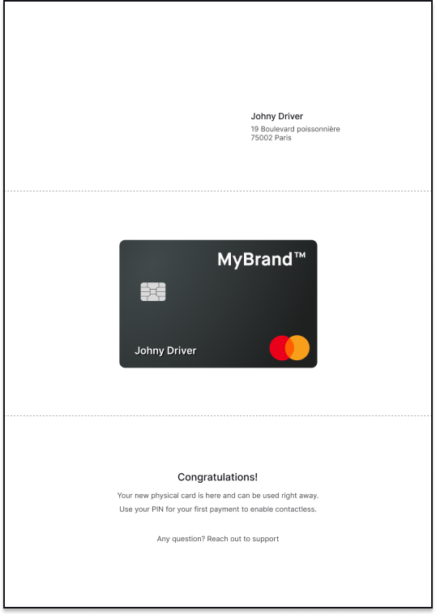

Physical cards are delivered in a standard letter format.
Upgraded packaging options are also available for both standard and custom cards.

| Type | Options |
| --- | --- |
| Standard packaging | Standard envelope with card attached to an inserted letter, *pictured* |
| Customized letter text | Customize the written content of the letter; add additional languages (additional cost) |
| Colorful paper insert | Paper used for the letter can be a color other that the standard white (additional cost) |
| Customized packaging | Use a box or flyer; can add additional time (additional cost) |

