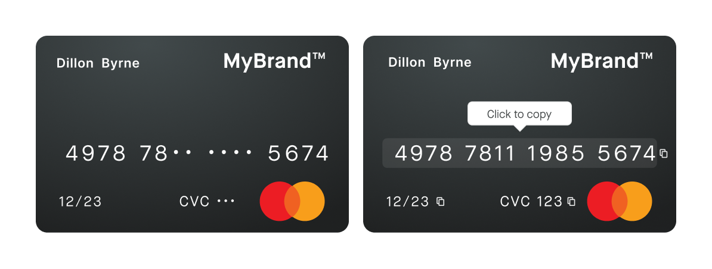

# View sensitive information

The `cardUrl` available in the `card` query leads to website that displays the card with its design and its sensitive hidden information.

Consider integrating it into your product with an iframe or a webview.
This URL is available for one hour after you query it.
After one hour, renew the query to get another `cardUrl`.

:::note Information not visible
If information fails to become visible despite having the appropriate permissions, it may remain hidden due to regulatory restrictions based on your location.
:::

## View physical card numbers {#view-number}

View the physical card numbers, which is different from the virtual card numbers, by calling the `viewPhysicalCardNumbers` mutation which returns a consent.
When you do this, make sure you are authenticated with a user access token using the name of the card's account member.
Then a `consentUrl` is returned, inviting the user to start the Strong Customer Authentication with Swan.

import AfterConsent from "../partials/_after-consent.mdx";

<AfterConsent />



:::info Store `consentId`
To avoid repeating the Strong Customer Authentication each time the client wants to reveal the card numbers, the same `consentUrl` can be called anytime for five minutes after the consent.
We advise you to store the `consentId` on your side and run a consent query to check the consent status is `Accepted` and the `updateAt` is less than five minutes, before reusing the `consentUrl`.
The `consentUrl` only works in the card holder's browser where the consent was completed.
:::

## View PIN {#view-pin}

You can display the physical card's PIN by calling the `viewPhysicalCardPinmutation` which returns a consent.
When you do this, make sure you are authenticated with a user access token using the name of the card's account member.
Then a `consentUrl` is returned which invites the user to start the Strong Customer Authentication with Swan.

If your card was created before 19:00 Central European [Summer] Time (CET/CEST), you can call the mutation starting from 19:00 the same day.
Otherwise, you'll have to wait until the next day at 19:00 to start calling the mutation.

You can check the `isPINReady` boolean (true/false) in the physical card's `statusInfo`, with `ToActivate` status.
It will be true when the PIN is available.

### Mutation

🔎 [Open the mutation in API Explorer](https://explorer.swan.io?query=bXV0YXRpb24gVmlld1BpbiB7CiAgdmlld1BoeXNpY2FsQ2FyZFBpbigKICAgIGlucHV0OiB7IGNhcmRJZDogIiRZT1VSX0NBUkRfSUQiLCBjb25zZW50UmVkaXJlY3RVcmw6ICIkWU9VUl9SRURJUkVDVF9VUkwiIH0KICApIHsKICAgIC4uLiBvbiBWaWV3UGh5c2ljYWxDYXJkUGluU3VjY2Vzc1BheWxvYWQgewogICAgICBfX3R5cGVuYW1lCiAgICAgIGNvbnNlbnQgewogICAgICAgIGNvbnNlbnRVcmwKICAgICAgfQogICAgfQogICAgLi4uIG9uIFBJTk5vdFJlYWR5UmVqZWN0aW9uIHsKICAgICAgX190eXBlbmFtZQogICAgICBtZXNzYWdlCiAgICAgIHBoeXNpY2FsQ2FyZElkZW50aWZpZXIKICAgIH0KICB9Cn0K&tab=api)

```graphql {4-5} showLineNumbers
mutation viewPin {
  viewPhysicalCardPin(
    input: { cardId: "$YOUR_CARD_ID", consentRedirectUrl: "$YOUR_REDIRECT_URL" }
  ) {
    ... on ViewPhysicalCardPinSuccessPayload {
      __typename
      consent {
        consentUrl
      }
    }
    ... on PINNotReadyRejection {
      __typename
      message
      physicalCardIdentifier
    }
  }
}
```

### Payload

Open the `consentUrl` returned by the mutation to provide consent, then view the PIN.

```json {6} showLineNumbers
{
  "data": {
    "viewPhysicalCardPin": {
      "__typename": "ViewPhysicalCardPinSuccessPayload",
      "consent": {
        "consentUrl": "$CONSENT_URL"
      }
    }
  }
}
```
