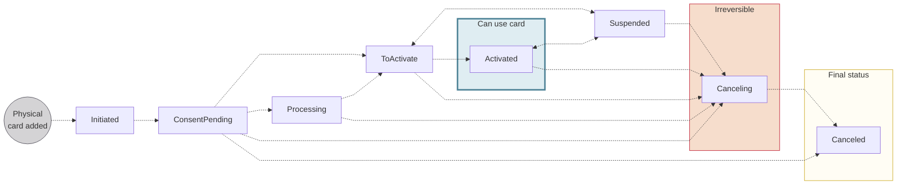
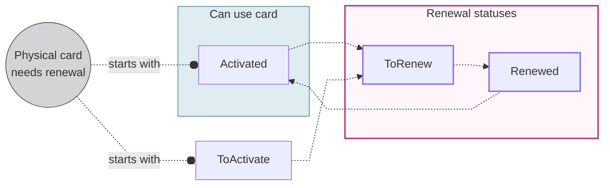

# Physical cards

import PhysicalCardsDefinition from '../../definitions/_cards-physical.mdx';

> <PhysicalCardsDefinition />

You can order a physical card for each virtual card.
Swan physical cards are typical plastic cards that can be used for swipe, chip and PIN, contactless, and online transactions.
Your [design](../design/index.mdx) will be printed on all physical cards.

## Name printed on card {#name}

The name printed on Swan cards corresponds to a cardholder's legal name, as recorded for their Swan account.

The length of the printed name (first name + last name) can't exceed **20 characters**.
If your cardholder's name is longer than 20 characters, the initial of their first name is used instead of their full first name.
If the first initial + last name combination still exceeds 20 characters, their first name plus last initial is used instead.

:::note Abbreviation example
- The name `Emilia Prommenschenkel` would be abbreviated to `E. Prommenschenkel`.
- The name `Mikah Ottovordemgentschenfelde` would be abbreviated to `Mikah O.`.
:::

### Additional line {#name-additional-line}

You can **print an additional line** of text underneath the cardholder name.
For example, you might want to include the company name on your cards.
To [print an additional line](./guide-print.mdx#print-additional-line), add the `physicalCardCustomOptions` > `additionalPrintedLine` field to any mutation used to print cards.

### Number plates {#name-number-plate}

You can use number plates instead of cardholder names if it's logical for your use case.
For example, when cards stay with a vehicle and are used exclusively to purchase fuel, number plates make sense.

Please discuss this option with your Technical Account Manager.
If your use case is approved, your Technical Account Manager can activate the feature for you.
Then, to [use number plates instead of names](./guide-print.mdx#print-number-plate), add the `physicalCardCustomOptions` > `customCardHolderName` field to any mutation used to print cards.

## Card number {#number}

Each physical card has a unique card number, different even from the virtual card added before the physical card was printed.

Swan makes the physical card's number, CVC, expiry date, and the PIN available in Web Banking.
The **card number**, **CVC**, and **PIN** are considered sensitive data and must be **masked by default**.
The cardholder must complete a **consent request** before the numbers can be unmasked.

import VirtualPhysicalCardNumbers from '../partials/_card-numbers.mdx';

:::info Virtual and physical card numbers
<VirtualPhysicalCardNumbers />
:::

## PIN (Personal Identification Number) {#pin}

Physical cards have a **four-digit PIN**, or *Personal Identification Number*.
A card's PIN is chosen or assigned when the card is printed.
After a PIN is chosen or assigned, it **can't be changed**.

The PIN for each physical card is available to the cardholder on Swan's Web Banking interface.
PINs aren't available on your Dashboard because only the cardholder should have easy access to the PIN for their card.

If a cardholder **forgets their PIN**, they can view it on your interface.
If needed, you can use the `ViewPhysicalCardPin` mutation to view the numbers yourself, which requires a user access token associated with the cardholder.
Note that if three incorrect attempts are made to enter the PIN, the card is automatically `Suspended`.

:::caution
If a cardholder shares their PIN, Swan can't take responsibility for fraud associated with that card.
:::

### Choosing a card's PIN {#pin-choose}

To allow your cardholders to **choose their PIN**, set the `choosePin` paramater to `true` when [printing physical cards](./guide-print.mdx).
You can set this paramater with the `printPhysicalCard` and `addCards` mutations.

If you don't add the `choosePin` paramater, or you set it to `false`, Swan assigns a PIN randomly.
A card's PIN **can't be changed**.

If an account member is **ordering a card for someone else**, it's recommended to use the `addCard` mutation to [add **only** the virtual card](../virtual/guide-add.mdx#add-one).
Then, the cardholder can request their own physical card and choose their PIN securely.

### PIN availability {#pin-ready}

You can view a card's PIN as soon as it's assigned during the printing process.

- If you print a physical card **before 17:00 CET/CEST** (Central European [Summer] Time), the card's PIN is available by the end of the day.
- If you print a physical card **after 17:00 CET/CEST**, the card's PIN is available by the end of the following day.
- If you allow your cardholder to **choose their PIN** (`choosePin` is `true`), add an additional 24-hour delay.

import DayTimeStandard from '../../partials/_day-time.mdx';

<DayTimeStandard />

Check the `isPINReady` boolean when [calling the `viewPhysicalCardPin` mutation](./guide-view-info.mdx#view-pin) to know if the PIN is ready.

### Incorrect PIN attempts {#pin-incorrect-attempts}

If the cardholder enters their PIN incorrectly **three times**, the physical card will be blocked (status: suspended) and no payments with the physical card can be made online or in person.

Note that a physical card blocked for three incorrect PIN attempts will have the reason `IncorrectPinCodeAttemptsExceeded` (on the `PhysicalCardSuspendedStatusInfo`).
You'll have to wait 24 hours before being able to [unblock the physical card](./guide-block-unblock.mdx).

You can continue to use both virtual and digital cards while the physical card is temporarily blocked.

## Printing and shipping hubs {#hubs}

Delivery time for physical cards depends on the type of card material you select and your cardholders' location.
It typically takes **2-5 business days** for cards to be delivered.
Please note that the delivery times listed here are estimates and aren't contractual.

Swan has **two printing hubs**: one in France and the other in Spain.
**France is Swan's default hub**.
To **choose the Spain hub**, tell your Technical Account Manager and they'll configure it.

:::info Two card products
The printing hub is defined in the [card product ID](../index.mdx#card-product).
If you'd like to ship cards out of both hubs, you need two card products: one with France as the hub, and the other with Spain.
:::

If your cardholder reports not receiving their physical card, please refer them to the [Swan Support Center](https://support.swan.io/hc/en-150/articles/5503032519837).

### 🇫🇷 France hub {#hubs-france}

The France hub prints and ships out of **Dijon, France**, and ships using either **La Poste** (France's postal service) or **DHL**.
The hub has several intended destinations:

- France
- Italy
- Northern Europe
- French overseas departments and territories (DROM-COM):
    - French Southern Territories (ATF), Saint Barthélemy (BLM), Faroe Islands (FRO), Guadeloupe (GLP), French Guiana (GUF), Saint Martin (Dutch part) (MAF), Martinique (MTQ), Mayotte (MYT), New Caledonia (NCL), French Polynesia (PYF), Réunion (REU), Saint Pierre and Miquelon (SPM), and Wallis and Futuna (WLF)

You have the option of **group** or **non-group delivery**.

| Delivery type | Destination | Shipping provider |
| --- | --- | --- |
| Group delivery | All locations | DHL |
| Tracked non-group delivery | France and DROM-COM | La Poste |
| Tracked non-group delivery | Northern Europe and unlisted locations | DHL |
| Untracked non-group delivery | Northern Europe and unlisted locations | La Poste |

### 🇪🇸 Spain hub {#hubs-spain}

The Spain hub prints and ships out of **Madrid, Spain**, and ships using either **Correos** (Spain's postal service) or **Nacex**.
The hub has two intended destinations:

- Spain
- Portugal

You have the option of **group** or **non-group delivery**.

| Delivery type | Destination | Shipping provider |
| --- | --- | --- |
| Group delivery | Spain and Portugal | Nacex ∗ |
| Tracked non-group delivery | Spain and Portugal | Correos |

∗ *If you choose the Spain hub but ship using group delivery outside of Spain or Portugal, the shipping provider is DHL.*

## Physical card statuses {#statuses}

:::warning renewal statuses
The statuses `ToRenew` and `Renewed` don't appear in the status diagram intentionally.
Refer to the [card renewal statuses](#renew-statuses) to understand how they interact with the main physical card statuses.
:::

| Physical card status | Explanation |
|---|---|
| `Initiated` | Printing a physical was launched with either the `printPhysicalCard` or `addCards` *with physical card* mutation. |
| `ConsentPending` | Request to print a physical card was received and is waiting for the cardholder's consent.  **Next steps**:<ul><li>If you used the `addCards` mutation and the cardholder consents, the status moves to `Processing`.</li><li>If you used the `printPhysicalCard` mutation and the cardholder consents, the status moves to `Activated`.</li><li>If you cancel the card with the API *before* consent, the status moves to `Canceling`.</li><li>If consent is refused or consent fails, the status moves directly to `Canceled`.</li></ul> |
| `Processing` | The card is in the process of being created with Swan's card issuing provider.  **Next steps**:<ul><li>After the card is created successfully in the card issuing provider's system, the status moves to `ToActivate`.</li><li>If you cancel the card with the API *before* the card issuing provider creates the card, the status moves to `Canceling`.</li></ul> |
| `ToActivate` | The card is being printed by Swan's card issuing provider, then delivered to the cardholder.  After the cardholder receives the physical card, they need to activate it by performing a first transaction and entering the PIN. You can also activate the card with the `activatePhysicalCard` mutation.  **Next steps**:<ul><li>If the cardholder performs the transaction successfully, or you activate the card with the API, the status moves to `ToActivate`.</li><li>If the cardholder makes **three incorrect attempts** to enter their PIN, the status moves to `Suspended`.</li></ul> |
| `Activated` | Physical card is available for use.  **Next steps**:<ul><li>Cards can retain the status `Activated` until the renewal period.</li><li>`Activated` cards can also be `Suspended` and `Canceled` (example: if three incorrect attempts are made to enter the PIN, the card is automatically `Suspended`).</li></ul> |
| `Suspended`  Also referred to as *Blocked* | Physical card is suspended and not available for use. Cardholders can still view card information and use digital cards (not virtual cards) when a physical card is `Suspended`.  *Cards can be suspended for various reasons, including a request from you or the cardholder, or a Swan action in the case of suspicious activity.*  **Next steps**:<ul><li>Restore the card's previous status with the API.</li><li>Cancel the card with the API.</li></ul> |
| `Canceling` | Card is in the process of being canceled.  **Next steps**: Card is `Canceled`. After a card is assigned the `Canceling` status, the process can't be reversed. |
| `Canceled` | Card is canceled, no longer available for use, and can't be reactivated. |

## Renewing physical cards {#renew}

Physical cards are **renewed automatically** before the expiry date.
By default, cards expire three years after the card is printed, and are renewed for an additional three years.

When a physical card is renewed, the **card numbers**, **CVV**, **identifier**, and **expiry date change**.
The four-digit **PIN doesn't change** for a continuous user experience.
If your user prefers to [choose their PIN](#pin-choose), they need to [cancel the expiring card](./guide-cancel.mdx) and order a new one.
It's not possible to choose a new PIN during renewal.

### Subscriptions {#renew-subscriptions}

After the new card is enabled, Swan uses [Mastercard's Account Billing Updater](https://developer.mastercard.com/product/automatic-billing-updater-abu/) to update the details about the tokenized card.
If a merchant adheres to Mastercard's Account Billing Updater, they receive the tokenized card's updated details automatically through this service.

Therefore, certain existing subscriptions can be transferred to the new card without any action from the cardholder.

### Card delivery {#renew-delivery}

New physical cards are shipped between the eleventh and fifteenth of the month before the card expires.
For example, if the card expires on the **last day of March**, the new card ships between **February 11-15** of the same year.

**Delivery details** are available in the `PhysicalCardRenewedStatus` object.
The estimated delivery date can be found in the `estimatedDeliveryDate` field.
You'll find the carrier and tracking number in the fields `shippingProvider` and `trackingNumber` as soon as they're available.

### Verify delivery address {#renew-address}

**10 weeks before** the original card expires, **verify the delivery address** with your cardholder.

:::info No update provided
If Swan doesn't receive updated address information at least 8 weeks before the card renews, the renewed card is shipped to the same address as the original card.
:::

| Interface | Address update method |
| --- | --- |
| Swan's Web Banking app | Cardholders confirm or update their address in the app at least 8 weeks before renewal. |
| Custom integration | Send the updated address to Swan at least 8 weeks before the card renews.  <ol><li>First, provide a way for your cardholders to verify their address. For example, this could be from your app, with a notification system, or through your own support team.</li><li>Then, send Swan the updated address with the API by calling the `confirmPhysicalCardRenewal` mutation.</li></ol> |

### Card renewal statuses {#renew-statuses}

Two statuses exist that only apply to physical card renewal: `ToRenew` and `Renewed`.

This diagram illustrates how the two renewal statuses interact with the main [physical card statuses](#statuses).
Note that renewal statuses are only accessed from the statuses `ToActivate` and `Activated`.

| Card renewal status | Explanation |
|---|---|
| `ToRenew` | Status triggered automatically 10 weeks before the card's expiry date. After this status is triggered by the Swan API, you can't stop the renewal process.  *If you or the cardholder doesn't want to renew a physical card, [cancel the card](./guide-cancel.mdx) **at least 11 weeks** before the expiry date.* |
| `Renewed` | Status triggered automatically 8 weeks before the card's expiry date. No updates to the delivery address can be made after this status is triggered. |

### Activating the new card {#renew-activate}

After the cardholder makes an in-person transaction with the new card using the Chip and PIN payment method, the new card's status changes from `Renewed` to `Activated`.
You could also [use the API](./guide-activate.mdx).

The old card is then marked `isExpired=true` because only one card can be activated at a time.
Details about expired physical cards are available in the `card` query (`card` > `physicalCard` > `previousPhysicalCards`).

## Guides {#guides}

- [Print physical cards](./guide-print.mdx)
    - Print a physical card
    - Print multiple physical cards
    - Print a custom physical card
    - Print multiple physical cards with group delivery
- [Activate physical cards](./guide-activate.mdx)
- [View sensitive information](./guide-view-info.mdx)
    - View physical card number
    - View PIN
- [Block & unblock physical cards](./guide-block-unblock.mdx)
    - Temporarily block a physical card
    - Unblock a physical card
- [Cancel physical cards](./guide-cancel.mdx)