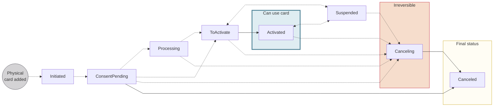
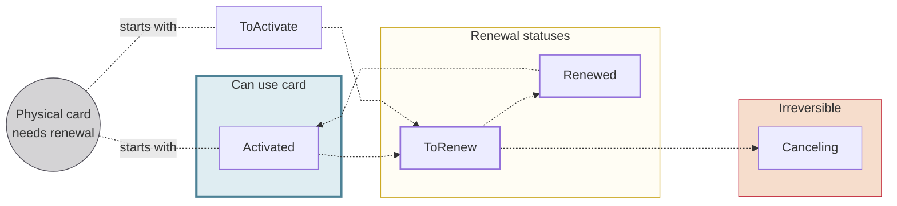

# Physical cards

import PhysicalCardsDefinition from '../../definitions/_cards-physical.mdx';

> <PhysicalCardsDefinition />

You can order a physical card for each virtual card.
Swan physical cards are typical plastic cards that can be used for swipe, chip and PIN, contactless, and online transactions.
Your [design](../design/index.mdx) will be printed on all physical cards.

## Card name {#name}

The name printed on Swan cards corresponds to a card holder's legal name, as recorded for their Swan account.

The length of the printed name (first name + last name) can't exceed **20 characters**.
If your card holder's name is longer than 20 characters, the initial of their first name is used instead of their full first name.
If the first initial + last name combination still exceeds 20 characters, their first name plus last initial is used instead.

:::note Abbreviation example
- The name `Emilia Prommenschenkel` would be abbreviated to `E. Prommenschenkel`.
- The name `Mikah Ottovordemgentschenfelde` would be abbreviated to `Mikah O.`.
:::

## Card number {#number}

Each physical card has a unique card number, different even from the virtual card added before the physical card was printed.

Swan makes the physical card's number, CVC, expiry date, and the PIN available in Web Banking.
The **card number**, **CVC**, and **PIN** are considered sensitive data and must be **masked by default**.
The card holder must complete a **consent request** before the numbers can be unmasked.

import VirtualPhysicalCardNumbers from '../partials/_card-numbers.mdx';

:::info Virtual and physical card numbers
<VirtualPhysicalCardNumbers />
:::

## PIN (Personal Identification Number) {#pin}

Physical cards have a **four-digit PIN**, or *Personal Identification Number*.
A card's PIN is chosen or assigned when the card is printed.
After a PIN is chosen or assigned, it **can't be changed**.

The PIN for each physical card is available to the card holder on Swan's Web Banking interface.
PINs aren't available on your Dashboard because only the card holder should have easy access to the PIN for their card.

If a card holder **forgets their PIN**, they can view it on your interface.
If needed, you can use the `ViewPhysicalCardPin` mutation to view the numbers yourself, which requires a user access token associated with the card holder.
Note that if three incorrect attempts are made to enter the PIN, the card is automatically `Suspended`.

:::caution
If a card holder shares their PIN, Swan can't take responsibility for fraud associated with that card.
:::

### Choosing a card's PIN {#pin-choose}

To allow your card holders to **choose their PIN**, set the `choosePin` paramater to `true` when [printing physical cards](./guide-print.mdx).
You can set this paramater with the `printPhysicalCard` and `addCards` mutations.

If you don't add the `choosePin` paramater, or you set it to `false`, Swan assigns a PIN randomly.
A card's PIN **can't be changed**.

If an account member is **ordering a card for someone else**, it's recommended to use the the `addCard` mutation to [add **only the virtual card**](../virtual/guide-add.mdx#add-one).
Then, the card holder can request their own physical card and choose their PIN securely.

### Incorrect PIN attempts {#pin-incorrect-attempts}

If the card holder enters their PIN incorrectly **three times**, the physical card will be blocked (status: suspended) and no payments with the physical card can be made online or in person.

Note that a physical card blocked for three incorrect PIN attempts will have the reason `IncorrectPinCodeAttemptsExceeded` (on the `PhysicalCardSuspendedStatusInfo`).
You'll have to wait 24 hours before being able to [unblock the physical card](./guide-block-unblock.mdx).

You can continue to use both virtual and digital cards.

## Printing and shipping hubs {#hubs}

Delivery time for physical cards depends on the type of card material you select and your card holders' location.
It typically takes **2-5 business days** for cards to be delivered.
Please note that the delivery times listed here are estimates and aren't contractual.

Swan has **two printing hubs**: one in France and the other in Spain.
**France is Swan's default hub**.
To **choose the Spain hub**, tell your Technical Account Manager and they'll configure it.

:::info Two card products
The printing hub is defined in the [card product ID](../index.mdx#card-product).
If you'd like to ship cards out of both hubs, you need two card products: one with France as the hub, and the other with Spain.
:::

If your card holder reports not receiving their physical card, please refer them to the [Swan Support Center](https://support.swan.io/hc/en-150/articles/5503032519837).

### 🇫🇷 France hub {#hubs-france}

The France hub prints and ships out of **Dijon, France**, and ships using either **La Poste** (France's postal service) or **DHL**.
The hub has several intended destinations:

- France
- Northern Europe
- French overseas departments and territories (DROM-COM):
    - French Southern Territories (ATF), Saint Barthélemy (BLM), Faroe Islands (FRO), Guadeloupe (GLP), French Guiana (GUF), Saint Martin (Dutch part) (MAF), Martinique (MTQ), Mayotte (MYT), New Caledonia (NCL), French Polynesia (PYF), Réunion (REU), Saint Pierre and Miquelon (SPM), and Wallis and Futuna (WLF)

You have the option of **group** or **non-group delivery**.

| Delivery type | Destination | Shipping provider |
| --- | --- | --- |
| Group delivery | All locations | DHL |
| Tracked non-group delivery | France and DROM-COM | La Poste |
| Tracked non-group delivery | Northern Europe and unlisted locations | DHL |
| Untracked non-group delivery | Northern Europe and unlisted locations | La Poste |

### 🇪🇸 Spain hub {#hubs-spain}

The Spain hub prints and ships out of **Madrid, Spain**, and ships using either **Correos** (Spain's postal service) or **Nacex**.
The hub has two intended destinations:

- Spain
- Portugal

You have the option of **group** or **non-group delivery**.

| Delivery type | Destination | Shipping provider |
| --- | --- | --- |
| Group delivery | Spain and Portugal | Nacex ∗ |
| Tracked non-group delivery | Spain and Portugal | Correos |

∗ *If you choose the Spain hub but ship using group delivery outside of Spain or Portugal, the shipping provider is DHL.*

## Physical card statuses {#statuses}

:::info renewal statuses
The statuses `ToRenew` and `Renewed` don't appear in the status diagram intentionally.
Please refer to the [section on renewing cards](#renew) for more details about these statuses.
:::

| Physical card status | Explanation |
|---|---|
| `Initiated` | Printing a physical was launched with either the `printPhysicalCard` or `addCards` *with physical card* mutation. |
| `ConsentPending` | Request to print a physical card was received and is waiting for the card holder's consent.  **Next steps**:<ul><li>If you used the `addCards` mutation and the card holder consents, the status moves to `Processing`.</li><li>If you used the `printPhysicalCard` mutation and the card holder consents, the status moves to `Activated`.</li><li>If you cancel the card with the API *before* consent, the status moves to `Canceling`.</li><li>If consent is refused or consent fails, the status moves directly to `Canceled`.</li></ul> |
| `Processing` | The card is in the process of being created with Swan's card issuing provider.  **Next steps**:<ul><li>After the card is created successfully in the card issuing provider's system, the status moves to `ToActivate`.</li><li>If you cancel the card with the API *before* the card issuing provider creates the card, the status moves to `Canceling`.</li></ul> |
| `ToActivate` | The card is being printed by Swan's card issuing provider, then delivered to the card holder.  After the card holder receives the physical card, they need to activate it by performing a first transaction and entering the PIN. You can also activate the card with the `activatePhysicalCard` mutation.  **Next steps**:<ul><li>If the card holder performs the transaction successfully, or you activate the card with the API, the status moves to `ToActivate`.</li><li>If the card holder makes **three incorrect attempts** to enter their PIN, the status moves to `Suspended`.</li></ul> |
| `Activated` | Physical card is available for use.  **Next steps**:<ul><li>Cards can retain the status `Activated` until the renewal period.</li><li>`Activated` cards can also be `Suspended` and `Canceled` (example: if three incorrect attempts are made to enter the PIN, the card is automatically `Suspended`).</li></ul> |
| `Suspended`  Also referred to as *Blocked* | Physical card is suspended and not available for use. Card holders can still view card information and use digital cards (not virtual cards) when a physical card is `Suspended`.  *Cards can be suspended for various reasons, including a request from you or the card holder, or a Swan action in the case of suspicious activity.*  **Next steps**:<ul><li>Restore the card's previous status with the API.</li><li>Cancel the card with the API.</li></ul> |
| `Canceling` | Card is in the process of being canceled.  **Next steps**: Card is `Canceled`. After a card is assigned the `Canceling` status, the process can't be reversed. |
| `Canceled` | Card is canceled, no longer available for use, and can't be reactivated. |
| `ToRenew` | Card needs to be renewed. |
| `Renewed` | Card is renewed. The status returns to `Activated` after the first transaction is made with the new card. |

## Renewing physical cards {#renew}

Physical cards are renewed automatically before the expiry date, which, by default, is three years after adding the card.

About six weeks before the expiry date, the status of the physical card changes to `ToRenew` with the delivery details available in the `PhysicalCardRenewedStatus` object.
The estimated date of delivery can be found in the `estimatedDeliveryDate` field.
You'll find the carrier and tracking number in the fields `shippingProvider` and `trackingNumber` as soon as they're available.

When a physical card is renewed, the card numbers change but the four-digit PIN remains the same for a continuous user experience.

## Guides {#guides}

- [Print physical cards](./guide-print.mdx)
    - Print a physical card
    - Print multiple physical cards
    - Print a custom physical card
    - Print multiple physical cards with group delivery
- [Activate physical cards](./guide-activate.mdx)
- [View sensitive information](./guide-view-info.mdx)
    - View physical card number
    - View PIN
- [Block & unblock physical cards](./guide-block-unblock.mdx)
    - Temporarily block a physical card
    - Unblock a physical card
- [Cancel physical cards](./guide-cancel.mdx)