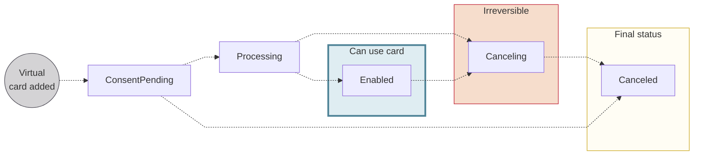

# Virtual cards

import VirtualCardsDefinition from '../../definitions/_cards-virtual.mdx';

***

**Virtual cards** *<VirtualCardsDefinition />*

***

Whenever you issue a new card, a virtual card number is **created and enabled instantly**, and the card holder can start using it online right away.
The virtual card must exist before a physical card can be printed or a virtual card added to a digital wallet.

After adding a virtual card, you can update that card, view sensitive card information, and cancel or deactivate the card.

## Card number & PIN {#number-pin}

Each virtual card has a unique card number, different even from a physical card added at the same time.
**Virtual cards don't have a PIN** (Personal Identification Number).

Swan makes the virtual card's number, CVC, and expiry date available in Web Banking.
The **card number** and **CVC** are considered sensitive data and must be **masked by default**.
The card holder must complete a **consent request** before the numbers can be unmasked.

import VirtualPhysicalCardNumbers from '../partials/_card-numbers.mdx';

:::info Virtual & physical card numbers
<VirtualPhysicalCardNumbers />
:::

## Single-use virtual cards {#suv}

Single-use virtual (SUV) cards can either be used once or for one dedicated merchant.
Therefore, you can consider SUV card use like this: they're for (a) one time, or (b) one place.

Because of their very limited scope, users can **avoid [3-D Secure (3DS) consent](https://docs.swan.io/help/faq/cards/what-is-3ds-and-when-users-need-to-use-it)** when paying with SUV cards.
SUV cards can be either **one-off** or **recurring**.

### One-off {#suv-one-off}

One-off SUV cards, in theory, work one time for one transaction.
It's not that simple, however, because some merchants send multiple authorizations for a single debit.
Pre-authorization is a good example, as the merchant pre-authorizes an amount, and then a separate transaction is created for the actual debit.

Ideally, the card issuer (you or your customer) should cancel one-off SUV cards after the expected debit has been used.
Note that setting a spending limit is mandatory.
Consider setting the expected debit amount as the spending limit, rendering the card unusable after that limit is reached.

For one-off cards, the `AccountHolderSpendingLimit.period` is `Always`.

### Recurring {#suv-recurring}

You can think of recurring SUV cards as single *merchant* virtual cards.
The `AccountHolderSpendingLimit.period` is **not** `Always`.

When the card holder uses a recurring SUV card for the first time, Swan restricts the card to the merchant ID that triggered the authorization.

If the card is used with the same merchant, the merchant ID matches and the transaction can go through.
However, if the card holder tries to use the card elsewhere, the transaction will be rejected because the merchant IDs don't match.

## Virtual card statuses {#statuses}

| Virtual card status | Explanation |
|---|---|
| `ConsentPending` | Virtual card was added and is waiting for the card holder's consent  **Next steps**:<ul><li>If consent is refused or fails, the status moves directly to `Canceled`</li><li>Otherwise, the status moves to `Processing`</li></ul> |
| `Processing` | Consent has been received and the card is being prepared  Status used uniquely when adding multiple virtual cards (`addCards` mutation) |
| `Enabled` | Virtual card is available for use |
| `Canceling` | Card is in the process of being canceled  After a card is assigned the `Canceling` status, the process can't be reversed |
| `Canceled` | Card is canceled, no longer available for use, and can't be reactivated |

## Guides {#guides}

- [Add virtual cards](./guide-add.mdx)
    - Add a virtual card
    - Add multiple virtual cards
    - Add a single-use virtual card
- [View sensitive information](./guide-view-info.mdx)
    - View virtual card numbers
- [Cancel (deactivate) virtual cards](./guide-cancel.mdx)