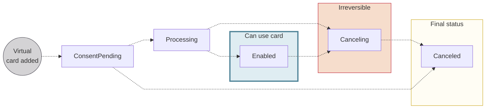

import AddCardsUseCases from '../partials/_add-cards-use-cases.mdx';
import AddCardsAlert from '../partials/_adding-cards-use-case-alert.mdx';

# Virtual cards

import VirtualCardsDefinition from '../../definitions/_cards-virtual.mdx';

> <VirtualCardsDefinition />

Whenever you issue a new card, a virtual card number is **created and enabled instantly**, and the cardholder can start using it online right away.
The virtual card must exist before a physical card can be printed or a virtual card added to a digital wallet.

A virtual card represents the card contract for all associated cards.
After adding a virtual card, you can update that card, view sensitive card information, and cancel or deactivate the card.
If you deactivate a virtual card, all physical and digital cards attached to it are also deactivated.

## Adding virtual cards with the API {#mutations}

You can use one of several mutations to add virtual cards with the API.

| Mutation | Use case | Guide |
| --- | --- | --- |
| [`addCard`](https://api-reference.swan.io/mutations/add-card/) | Add one virtual card for one account member. | [Add a virtual card](./guide-add.mdx#add-one) |
| [`addCards`](https://api-reference.swan.io/mutations/add-cards/) | <AddCardsUseCases /> | [Add multiple virtual cards](./guide-add.mdx#add-multiple)  [Print physical cards when adding virtual cards](./guide-add.mdx#print-with-virtual) |
| [`addSingleUseVirtualCard`](https://api-reference.swan.io/mutations/add-single-use-virtual-card/) | Add one single-use virtual card for one account member. | [Add a single-use virtual card](./guide-add.mdx#add-suv-one) |
| [`addSingleUseVirtualCards`](https://api-reference.swan.io/mutations/add-single-use-virtual-cards/) | Add single-use virtual cards for multiple account members. ∗ | [Add single-use virtual cards](./guide-add.mdx#add-suv-multiple) |

<AddCardsAlert />

## Card number & PIN {#number-pin}

Each virtual card has a unique card number, different even from a physical card added at the same time.
**Virtual cards don't have a PIN** (Personal Identification Number).

Swan makes the virtual card's number, CVC, and expiry date available in Web Banking.
The **card number** and **CVC** are considered sensitive data and must be **masked by default**.
The cardholder must complete a **consent request** before the numbers can be unmasked.

import VirtualPhysicalCardNumbers from '../partials/_card-numbers.mdx';

:::info Virtual & physical card numbers
<VirtualPhysicalCardNumbers />
:::

## Single-use virtual cards {#suv}

Single-use virtual (SUV) cards can either be used once or for one dedicated merchant.
Therefore, you can consider SUV card use like this: they're for (a) one time, or (b) one place.

Because of their very limited scope, users can **avoid [3-D Secure (3DS) consent](../../payments/cards/index.mdx#3ds)** when paying with SUV cards.
SUV cards can be either **one-off** or **recurring**.

### One-off {#suv-one-off}

One-off SUV cards, in theory, work one time for one transaction.
It's not that straightforward, however, because some merchants send multiple authorizations for a single debit.
Pre-authorization is a good example, as the merchant pre-authorizes an amount, and then a separate transaction is created for the actual debit.

Ideally, the card issuer (you or your customer) should cancel one-off SUV cards after the expected debit has been used.
Note that setting a spending limit is mandatory.
Consider setting the expected debit amount as the spending limit, rendering the card unusable after that limit is reached.

For one-off cards, the `AccountHolderSpendingLimit.period` is `Always`.

:::warning
**One-off SUV cards automatically expire 30 days after creation**. This applies when `SpendingLimitPeriod` is set to `Always` in the [`addSingleUseVirtualCard`](https://api-reference.swan.io/mutations/add-single-use-virtual-card/) and [`addSingleUseVirtualCards`](https://api-reference.swan.io/mutations/add-single-use-virtual-cards/) mutations.

Swan automatically sets the `cardContractExpiryDate` to 30 days from creation when the spending limit period is `Always`.
:::

### Recurring {#suv-recurring}

You can think of recurring SUV cards as single *merchant* virtual cards.
The `AccountHolderSpendingLimit.period` is **not** `Always`.

When the cardholder uses a recurring SUV card for the first time, Swan restricts the card to the merchant ID that triggered the authorization.

If the card is used with the same merchant, the merchant ID matches and the transaction can go through.
However, if the cardholder tries to use the card elsewhere, the transaction is rejected because the merchant IDs don't match.

## Cancellation of virtual cards {#cancel}

Canceling a virtual card is an **irreversible action** that immediately and permanently invalidates the card.
Cancellation impacts the entire card contract, which includes the virtual card and any associated physical and digital cards.
**Consent isn't required** to cancel cards.
When cancellation is complete, you're no longer billed for the card.

If you don't want to cancel the entire card contract, you can cancel just a [physical](../physical/guide-cancel.mdx) or [digital](../digital/guide-cancel.mdx) card instead.

You can cancel virtual cards [with the API](./guide-cancel.mdx).
If you use Swan's Web Banking interface, cardholders can [cancel (permanently block) their cards](https://support.swan.io/hc/en-150/articles/18538920070045-Block-your-card) independently.

## Virtual card statuses {#statuses}

*These statuses also represent the status of the Swan card contract.*

| Virtual card status | Explanation |
|---|---|
| `ConsentPending` | Virtual card was added and is waiting for the cardholder's consent.  **Next steps**:<ul><li>If consent is refused or fails, the status moves directly to `Canceled`.</li><li>Otherwise, the status moves to `Processing`.</li></ul> |
| `Processing` | Consent has been received and the card is being prepared. This status only applies when adding multiple virtual cards (`addCards` mutation). |
| `Enabled` | Virtual card is available for use. |
| `Canceling` | Card is in the process of being canceled. After a card is assigned the `Canceling` status, the process can't be reversed. |
| `Canceled` | Card is canceled, no longer available for use, and can't be re-enabled. |

## Guides {#guides}

- [Add virtual cards](./guide-add.mdx)
    - Add a virtual card
    - Add multiple virtual cards
    - Add a single-use virtual card
- [View sensitive information](./guide-view-info.mdx)
    - View virtual card numbers
- [Cancel (permanently block) virtual cards](./guide-cancel.mdx)