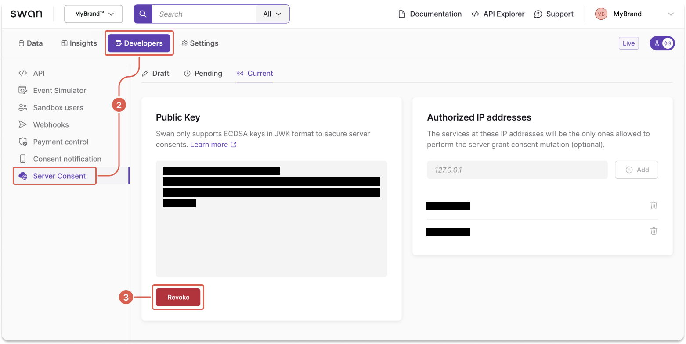

# Implement server-to-server (S2S) consent

[Server-to-server (S2S) consent](./index.mdx#s2s) **bypasses direct user intervention**, easing the consent process for bulk actions required by your integrations.

## Step 1: Generate your keys {#generate}

Use your browser's cryptography API to generate your key pair according to the [required algorithm](./index.mdx#s2s-cryptography).

```js title="Request" showLineNumbers
await crypto.subtle.generateKey({ name: "ECDSA", namedCurve: "P-256" }, true, ["sign", "verify"])
  .then(async ({ publicKey, privateKey }) => ({
    publicKey: await crypto.subtle.exportKey("jwk", publicKey),
    privateKey: await crypto.subtle.exportKey("jwk", privateKey),
  }))
  .then(keys => ({
    publicKey: JSON.stringify(keys.publicKey),
    privateKey: JSON.stringify(keys.privateKey),
}));
```

The request generates a response similar to the following sample.
The keys in the sample aren't valid, but they do follow the required algorithm.

```js title="Sample keys" showLineNumbers
{"publicKey":{"crv":"P-256","ext":true,"key_ops":["verify"],"kty":"EC","x":"6aMDs-I7qxo3BGqpoQ5Ge5gYqeSqEhWW0h9zTtkpaCg","y":"_FzMHTH96EFVrBt7OKtuCNu0SxY5muVrYJoH0j7gZ0I"},
"privateKey":{"crv":"P-256","d":"uqkeipukPX8kxuhRsijxoGcPjURM7UV6qSvaHJ2Q22I","ext":true,"key_ops":["sign"],"kty":"EC","x":"6aMDs-I7qxo3BGqpoQ5Ge5gYqeSqEhWW0h9zTtkpaCg","y":"_FzMHTH96EFVrBt7OKtuCNu0SxY5muVrYJoH0j7gZ0I"}}
```

You can also use various libraries and packages to generate keys that follow the cryptographic standards.

## Step 2: Install your public key {#install-public}

Store your public key on your Dashboard to use it for server-to-server consent.

1. Go to **Dashboard** > **Developers** > **Server Consent**.
1. Enter your public key into the text area.
1. Optionally, add authorized IP addresses.
1. Click **Save**.

:::info Installing in Live
If you're installing a key in your **Live environment**, there's an additional step.

After you save your public key, Swan sends a text message to your [project's legal representative](./index.mdx#s2s-project-legal-rep) to consent to adding S2S consent, which includes the first and last name of person installing the key and the key to review.
:::


## Step 3: Consent using your private key {#consent-private}

Now that you have a private key stored securely on your server and a public key installed in your Swan Dashboard, you can use the keys to grant S2S consent.

:::tip Impersonation
If the user access token attributed to your [project's legal representative](./index.mdx#s2s-project-legal-rep) expires and interrupts your process, consider [impersonating the legal rep with a project access token](../authentication/guide-impersonate.mdx) instead.
:::

### 3.1 Get consent challenge {#consent-private-challenge-get}

To sign your first server-to-server consent, complete the following actions:

1. Request any [sensitive operation](./index.mdx#sensitive) that requires consent.
1. In the payload response, Swan provides a consent `challenge`.

```json {8} showLineNumbers
{
  "data": {
    "consents": {
      "edges": [
        {
          "node": {
            "id": "$YOUR_CONSENT_ID",
            "challenge": "$YOUR_CONSENT_CHALLENGE",
            "purpose": "AddCard",
            "status": "Created"
          }
        }
      ]
    }
  }
}
```

### 3.2 Sign consent challenge {#consent-private-challenge-sign}

Next, sign the `challenge` using the following script, the provided library, and your private key.

```js showLineNumbers
await signAndExportJwtToken("$YOUR_PRIVATE_KEY_JWK", {
   header: { alg: "ES256", typ: "JWT" },
   payload: { challenge: "$YOUR_CONSENT_CHALLENGE" },
});
```

```js title="Library to sign consent challenge" showLineNumbers
function toBase64url(message, toStringify) {
  let buffer = toStringify ? JSON.stringify(message) : message;
  if (typeof buffer === "string") {
    const textEncoder = new TextEncoder("utf-8");
    buffer = textEncoder.encode(buffer);
  }
  const bitString = String.fromCodePoint(...buffer);
  return window
    .btoa(bitString)
    .replace(/=/gi, "")
    .replace(/\//gi, "_")
    .replace(/\+/gi, "-");
}
function getMessage(composer) {
  return `${toBase64url(composer.header, true)}.${toBase64url(
    composer.payload,
    true
  )}`;
}
function toBuffer(message) {
  return new TextEncoder().encode(message);
}
async function signAndExportJwtToken(jwtPrivateKey, composer) {
  const jsonPrivateKey = JSON.parse(jwtPrivateKey);
  const privateKey = await crypto.subtle.importKey(
    "jwk",
    jsonPrivateKey,
    {
      name: "ECDSA",
      namedCurve: jsonPrivateKey.crv,
    },
    false,
    ["sign"]
  );

  // ---
  const message = getMessage(composer);
  const signatureBuffer = await crypto.subtle.sign(
    {
      name: privateKey.algorithm.name,
      hash: privateKey.algorithm.namedCurve.replace(/P/gi, "SHA"),
    },
    privateKey,
    toBuffer(message)
  );

  // ---
  const signatureUint8 = new Uint8Array(signatureBuffer);
  return `${message}.${toBase64url(signatureUint8)}`;
}
```

### 3.3 Grant S2S consent {#consent-private-grant}

After signing your consent `challenge`, finalize granting S2S consent for your project.

1. Call the [`grantConsentWithServerSignature` mutation](https://api-reference.swan.io/mutations/grant-consent-with-server-signature/).
1. Add your consent ID and signed consent challenge.
1. Add a success payload and rejections.

🔎 [Open the mutation in API Explorer](https://explorer.swan.io?query=bXV0YXRpb24gR3JhbnRTMnMgewogIGdyYW50Q29uc2VudFdpdGhTZXJ2ZXJTaWduYXR1cmUoCiAgICBpbnB1dDogewogICAgICBjb25zZW50SWQ6ICIkWU9VUl9DT05TRU5UX0lEIgogICAgICBzaWduYXR1cmU6ICIkWU9VUl9TSUdORURfQ09OU0VOVF9DSEFMTEVOR0UiCiAgICB9CiAgKSB7CiAgICAuLi4gb24gR3JhbnRDb25zZW50V2l0aFNlcnZlclNpZ25hdHVyZVN1Y2Nlc3NQYXlsb2FkIHsKICAgICAgX190eXBlbmFtZQogICAgICBjb25zZW50IHsKICAgICAgICBjb25zZW50VXJsCiAgICAgIH0KICAgIH0KICAgIC4uLiBvbiBDb25zZW50Tm90Rm91bmRSZWplY3Rpb24gewogICAgICBfX3R5cGVuYW1lCiAgICAgIGNvbnNlbnRJZAogICAgICBtZXNzYWdlCiAgICB9CiAgICAuLi4gb24gTm90UmVhY2hhYmxlQ29uc2VudFN0YXR1c1JlamVjdGlvbiB7CiAgICAgIGN1cnJlbnRTdGF0dXMKICAgICAgdW5yZWFjaGFibGVTdGF0dXMKICAgICAgbWVzc2FnZQogICAgfQogICAgLi4uIG9uIEZvcmJpZGRlblJlamVjdGlvbiB7CiAgICAgIF9fdHlwZW5hbWUKICAgICAgbWVzc2FnZQogICAgfQogICAgLi4uIG9uIENvbnNlbnRUeXBlTm90U3VwcG9ydGVkQnlTZXJ2ZXJDb25zZW50UmVqZWN0aW9uIHsKICAgICAgX190eXBlbmFtZQogICAgICBtZXNzYWdlCiAgICB9CiAgICAuLi4gb24gU2VydmVyQ29uc2VudE5vdEFsbG93ZWRGb3JDb25zZW50T3BlcmF0aW9uUmVqZWN0aW9uIHsKICAgICAgX190eXBlbmFtZQogICAgICBtZXNzYWdlCiAgICB9CiAgICAuLi4gb24gUHJvamVjdE5vdEZvdW5kUmVqZWN0aW9uIHsKICAgICAgX190eXBlbmFtZQogICAgICBtZXNzYWdlCiAgICB9CiAgICAuLi4gb24gU2VydmVyQ29uc2VudE5vdEFsbG93ZWRGb3JQcm9qZWN0UmVqZWN0aW9uIHsKICAgICAgX190eXBlbmFtZQogICAgICBtZXNzYWdlCiAgICB9CiAgICAuLi4gb24gU2VydmVyQ29uc2VudFByb2plY3RTZXR0aW5nc05vdEZvdW5kUmVqZWN0aW9uIHsKICAgICAgX190eXBlbmFtZQogICAgICBtZXNzYWdlCiAgICB9CiAgICAuLi4gb24gU2VydmVyQ29uc2VudFByb2plY3RDcmVkZW50aWFsTWlzc2luZ1JlamVjdGlvbiB7CiAgICAgIF9fdHlwZW5hbWUKICAgICAgbWVzc2FnZQogICAgfQogICAgLi4uIG9uIFNlcnZlckNvbnNlbnRQcm9qZWN0Q3JlZGVudGlhbE5vdEZvdW5kUmVqZWN0aW9uIHsKICAgICAgX190eXBlbmFtZQogICAgICBtZXNzYWdlCiAgICB9CiAgICAuLi4gb24gU2VydmVyQ29uc2VudENyZWRlbnRpYWxzTm90VmFsaWRPck91dGRhdGVkUmVqZWN0aW9uIHsKICAgICAgX190eXBlbmFtZQogICAgICBtZXNzYWdlCiAgICB9CiAgICAuLi4gb24gU2VydmVyQ29uc2VudFNpZ25hdHVyZU5vdFZhbGlkUmVqZWN0aW9uIHsKICAgICAgX190eXBlbmFtZQogICAgICBtZXNzYWdlCiAgICB9CiAgfQp9Cg%3D%3D&tab=api)

```graphql {4-5} showLineNumbers
mutation GrantS2s {
  grantConsentWithServerSignature(
    input: {
      consentId: "$YOUR_CONSENT_ID"
      signature: "$YOUR_SIGNED_CONSENT_CHALLENGE"
    }
  ) {
    ... on GrantConsentWithServerSignatureSuccessPayload {
      __typename
      consent {
        consentUrl
      }
    }
    ... on ConsentNotFoundRejection {
      __typename
      consentId
      message
    }
  }
}
```

```json {6-7} title="Payload" showLineNumbers
{
  "data": {
    "grantConsentWithServerSignature": {
      "__typename": "GrantConsentWithServerSignatureSuccessPayload",
      "consent": {
        "id": "$YOUR_CONSENT_ID",
        "status": "Accepted"
      }
    }
  }
}
```

## Step 4: Replace or revoke your public key {#replace-revoke}

You can replace or revoke an installed public key at any time.

import ReplacePublicKey from './_s2s-replace-key.mdx';

<ReplacePublicKey />

1. Before replacing your existing public key, make sure to **pause all operations and consents** that are using S2S consent.
1. Go to **Dashboard** > **Developers** > **Server Consent**.
1. Click **Revoke**.
1. To install a new public key, **follow the guide** on this page to generate and install your new keys and consent with the new key pair.



:::caution
If you revoke or remove your key without installing a new one, Swan automatically rejects all new S2S consent requests.
You can't reuse a revoked public key in the Live environment.
:::