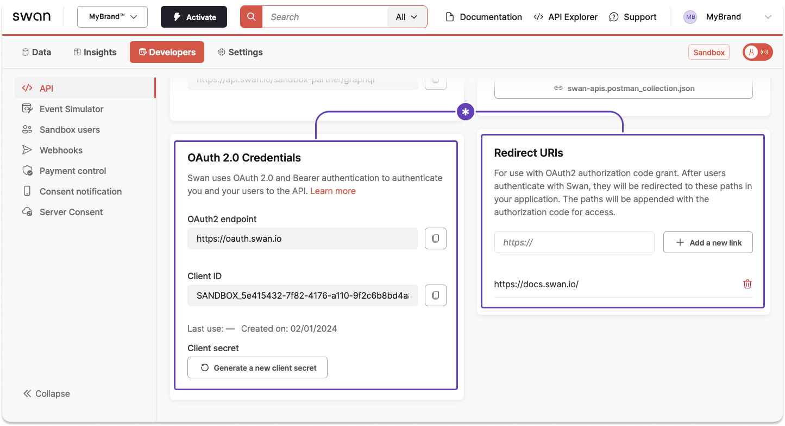

# Sandbox quickstart

Start exploring the Sandbox—fast. 🔥

:::note Steps 1-3
The first three steps might feel familiar; they're the same in the [step-by-step guide](./step-by-step.mdx) to explore Swan.
:::

## Step 1: Get access to Swan {#swan-access}

import GetSwanAccess from './partials/_swan-access.mdx';

<GetSwanAccess />

:::info Quickest path
In this quickstart guide, you'll take the quickest path to action.
You do have [other options](./choose-integration.mdx) that allow for more customization and control over the user experience.
:::

## Step 2: Connect with your mobile device {#connect}

import ConnectWithMobile from './partials/_connect-mobile.mdx';

<ConnectWithMobile />

## Step 3: Create your project {#project}

import CreateProject from './partials/_create-project.mdx';

<CreateProject />

## Step 4: Get set up for the API {#api}

Go to **Dashboard** > **Developers** > **API** to get your [OAuth 2.0 credentials](../../developers/using-api/authentication/index.mdx) and [add your redirect URIs](../../developers/using-api/authentication/index.mdx#tokens-user-uri).

## Step 5: Add your first account {#account}

1. Create an onboarding link to onboard an [individual](../onboarding/individual/guide-create.mdx) or [company](../onboarding/company/guide-create.mdx) account holder.
1. Log into Swan's provided Web Banking app. Get the link from your **Dashboard** > **Settings** > **Web Banking**, in the section titled **URLs**.

## Step 6: Validate your account {#validate}

1. Complete [identification](../users/identifications/index.mdx).
1. Verify the [account holder](../onboarding/account-holders/index.mdx#verification-process).
1. Submit [supporting documents](../accounts/documents/index.mdx) if required.

## Step 7: Execute your first payment {#payment}

1. Credit your account. In the Sandbox, you'll do this with fake money through the [Event Simulator](../../developers/tools/event-simulator.mdx).
    - [Follow the example](../../developers/tools/event-simulator.mdx#example) on the simulator page to receive an incoming transfer to add fake money to your new Swan account.
1. Use your new fake funds to [initiate a SEPA Credit Transfer](../payments/credit-transfers/sepa/guide-initiate-ct.mdx).
1. Use the Event Simulator to book the transfer. Go to **Dashboard** > **Developers** > **Event Simulator**, choose **book an outgoing transfer**, and enter the required information.

:::tip Swan is happy to have you here.

- The world of Swan is now your oyster.
    - Explore the documentation to see all Swan offers.
    - Discover more in the Event Simulator and the [API Explorer](../../developers/tools/api-explorer.mdx).
- If you're not in communication with Swan (yet), feel free to [submit this form](https://www.swan.io/talk-to-expert) for more information.
- If you already have dedicated account managers, please contact them with any questions.

**Happy building!**
:::